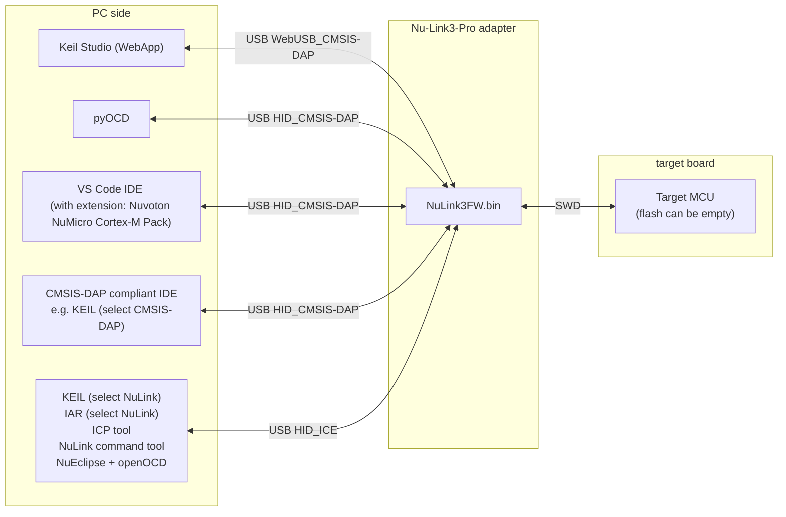
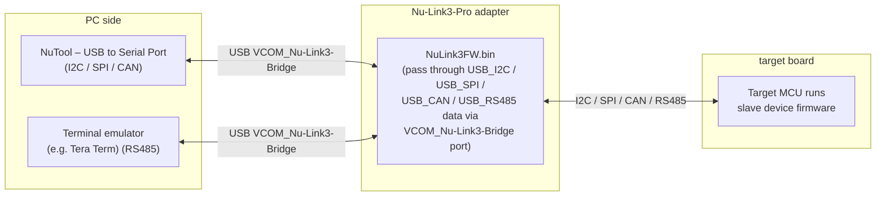
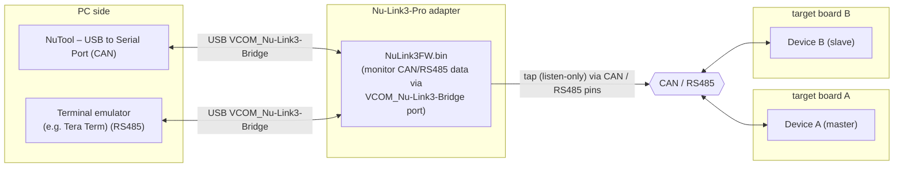
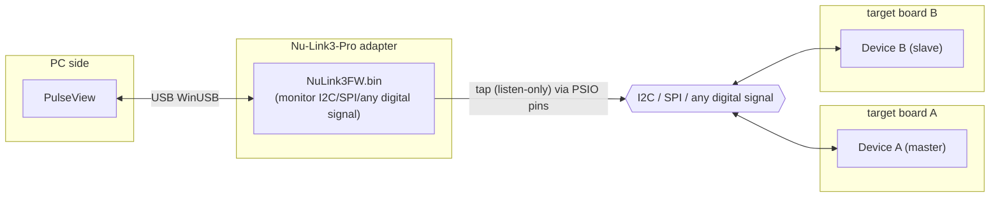
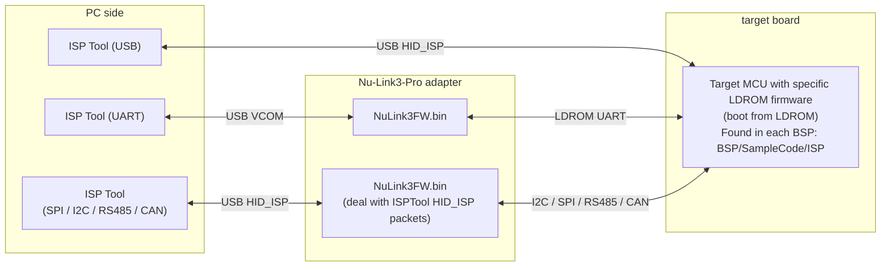
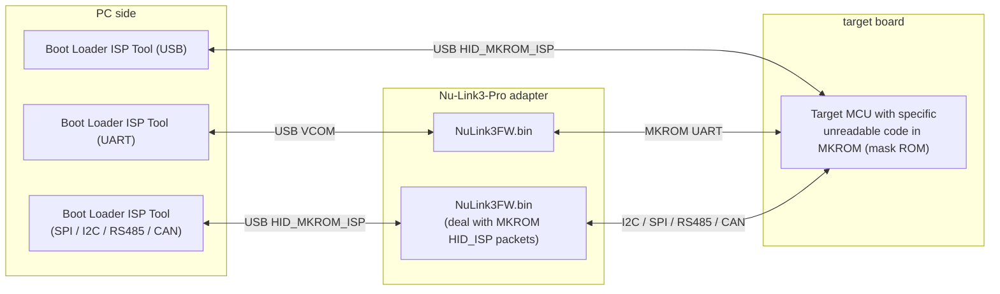

## Nu-Link3-Pro Features

The Nu-Link3-Pro offers complete programming and debugging support for all NuMicro® microcontrollers. This chapter outlines its features:

### Programming and Debugging Support

- Compatible with all NuMicro® Family microcontrollers, enabling seamless programming and debugging across multiple device types.
- Serial Wire Debug (SWD) support enables fast and effective debugging processes.
- Selectable SWD output voltages, including 1.8 V, 2.5 V, 3.3 V, and 5.0 V, ensuring adaptability to various hardware requirements.
- Supports ICP for efficient microcontroller programming directly on the circuit board.
- ICP Programming Tool with robust image file protection to safeguard firmware integrity during programming.
- Drag & drop Flash programming for user-friendly and rapid firmware updates.
- Accepts image file storage via USB flash drive, SD card, and SPI Flash, offering flexibility in source media.
- Features an automatic IC programming system connector (Control Bus) for streamlined integration.
- It can be powered by USB Type-C or through the target system via the SWD interface, enhancing deployment options.
- Provides an ISP Programming Tool for efficient and reliable in-system programming.
- Allows multiple bridge connections for ISP functions, including I2C/I3C, SPI, CAN, UART, and RS-485 interfaces.

### Advanced Debugging and Analysis

- Supports multiple debug interfaces and tools, catering to various development needs.
- Embedded Trace Macrocell (ETM) capability at speeds up to 110 MHz, allowing detailed trace analysis.
- Features unlimited breakpoints and step execution for in-depth troubleshooting.
- Compatible with Arm PyOCD for enhanced debugging and automation.
- Supports multi-interfaces analyzer, enabling monitoring of SPI, I2C/I3C, CAN, and RS-485 signals.
- Provides a virtual COM port via USB for convenient serial communication.

### System Overview

The following diagrams illustrate the various roles Nu-Link3-Pro can play in your development workflow:

#### Debugging — SWD Debug Probe

#### Bridging — Normal Mode (Master)

#### Monitoring — CAN / RS485 Bus

#### Monitoring — Logic Analyzer 

#### Programming — ISP via LDROM

#### Programming — ISP via MKROM (Mask ROM)

### Driver Installation

For Windows operating systems, please download and install the [Nu-Link_USB_Driver](https://www.nuvoton.com/resource-download.jsp?tp_GUID=SW1120201207161057)

### Nu-Link3-Pro Firmware 

**Nu-Link firmware binary files can be found on the [Releases page](https://github.com/OpenNuvoton/Nuvoton_Tools/releases) on GitHub.**

**Requirement: Nu-Link3 needs v3.22.7946r or above**

Users can reprogram Nu-Link3 with another .bin file using the following instructions (Windows OS):

1. Press the button on Nu-Link3 and plug in the USB cable.
2. The "Nu-Link3" disk will appear. (If you see the disk name as "NuMicro MCU", it will upgrade the target device firmware instead of Nu-Link3 itself.)
3. Drag and drop the Nu-Link3 firmware .bin file into the disk.
4. Re-plug the USB cable and it's done.

### Configuration Options

You will see some options in NU_CFG.TXT:

* Open the NU_CFG.TXT file in the pop-up "NuMicro MCU" disk  

  

* Set `POWER-MODE` for SWD output voltage level (mainly for CMSIS-DAP interface use).

* Set `CMSIS-DAP=1`; Enables CMSIS-DAP. This is the default setting.
* Set `CMSIS-DAP=0`; Disables CMSIS-DAP. Use this if the interface interferes with other operations.

* Set `BUTTON-MODE=0`; This is the default setting. Offline programming via SWD pins.
* Set `BUTTON-MODE=1`; Offline ISP programming via BRIDGE pins (UART, I2C, I3C, SPI, CAN FD, RS-485, USB-HID).
* Set `BUTTON-MODE=2`; Custom offline programming via MicroPython. Nu-Link3-Pro will run MAIN.PY on the microSD card.