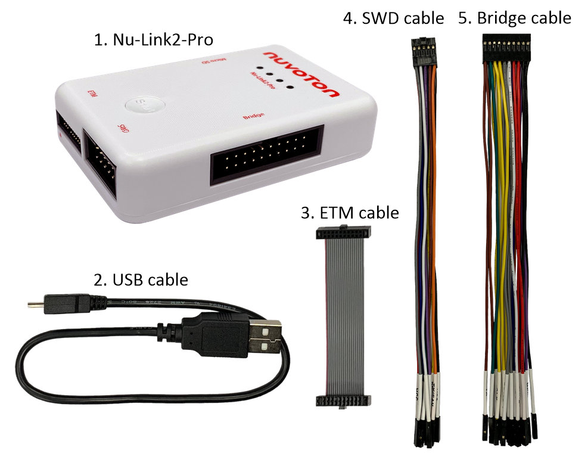
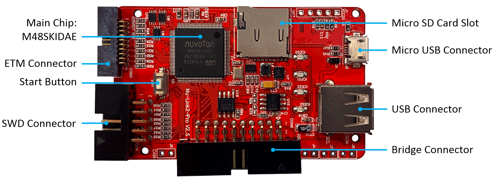
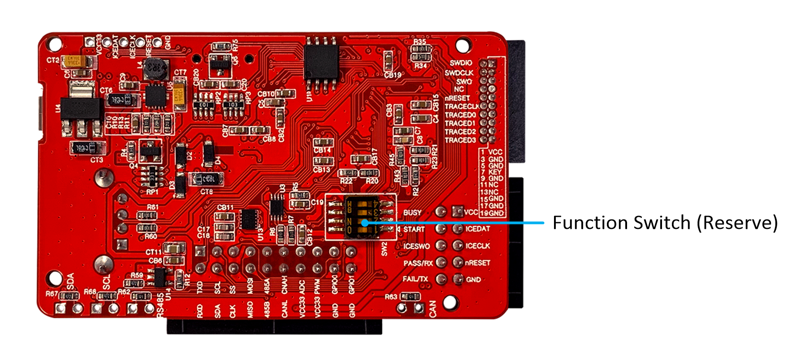
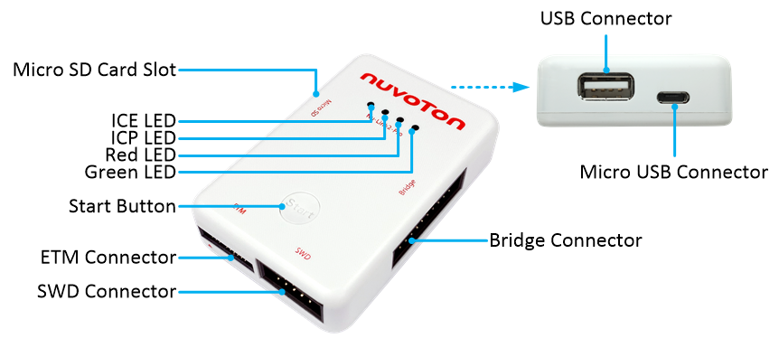

## Nu-Link2-Pro Package Contents

- Nu-Link2-Pro main body (2952mil x 1968mil x 688mil)

- USB cable (0.3m, high-speed, Micro-B)

- ETM cable (50-mil 20-pin IDC flat cable with 50-mil 20-pin connectors)

- SWD cable (100-mil 10-pin squid cable with 10 x 100-mil sockets)

- Bridge cable (100-mil 20-pin squid cable with 20 x 100-mil sockets)

### Nu-Link2-Pro PCBA

#### Front View

The following lists components and connectors from the front view:

- Main Chip: M48SKIDAE

- Micro SD Card Slot

- Micro USB Connector

- USB Connector

- Bridge Connector

- SWD Connector

- Start Button

- ETM Connector

#### Rear View

The following lists components and connectors from the rear view:

- Function Switch (Some commercial PC will block mass storage function
  by IT department, user can disable Nu-Link2-Pro mass storage function
  by switch \#4 after firmware version 7246)

### Nu-Link2-Pro Connectors

The following lists of function brief description

- USB Connector (CON5)

  - USB Flash Drive for ICP Offline Programming

- Micro USB Connector (J2)

  - Micro USB port of a PC to debug and program target chips through the
    development software tool

- Bridge Connector (CON6)

  - UART (also use as LIN Transmission Interface)

  - I2C Transmission Interface

  - SPI Transmission Interface

  - RS-485 Transmission Interface

  - CAN BUS Transmission Interface

  - PWM/Capture

  - ADC

  - GPIO

- SWD Connector (CON4)

  - SWD Host Interface

  - ICP Offline Programming

  - Virtual COM by UART

  - Automatic IC Programming

- ETM Connector (CON3)

  - ETM Interface

  - SWD Host Interface

- Start Button (SW1)

  - Click this button to proceed with offline programming

- Micro SD Card Slot

  - Save bin file for ICP Offline Programming

#### Status LED (ICES0, ICES1, ICES2, ICES3)

| **Nu-Link2-Pro Operation Status** | **Status LED** |  |  |  |
|----|:--:|:--:|:--:|:--:|
|  | **ICE** | **ICP** | **Red** | **Green** |
| Boot | Flash×3 | Flash×3 | Flash×3 | Flash×3 |
| One Nu-Link2-Pro selected to connect | Flash×3 | Flash×3 | Flash×3 | On |
| ICE Online (Not connected with a target chip) | On | \- | Flash×3 | Flash×3 |
| ICE Online (Connected with a target chip) | On | \- | \- | On |
| ICE Online (Failed to connect with a target chip) | On | Any | Flash | On |
| During Offline Programming | \- | On | \- | Flash |
| Offline Programming Completed | On | \- | \- | \- |
| Offline Programming Completed (Auto mode) | On | On | \- | \- |
| Offline Programming Failed | On | Flash | \- | \- |

Table: Comparison of Status LED Indicators

