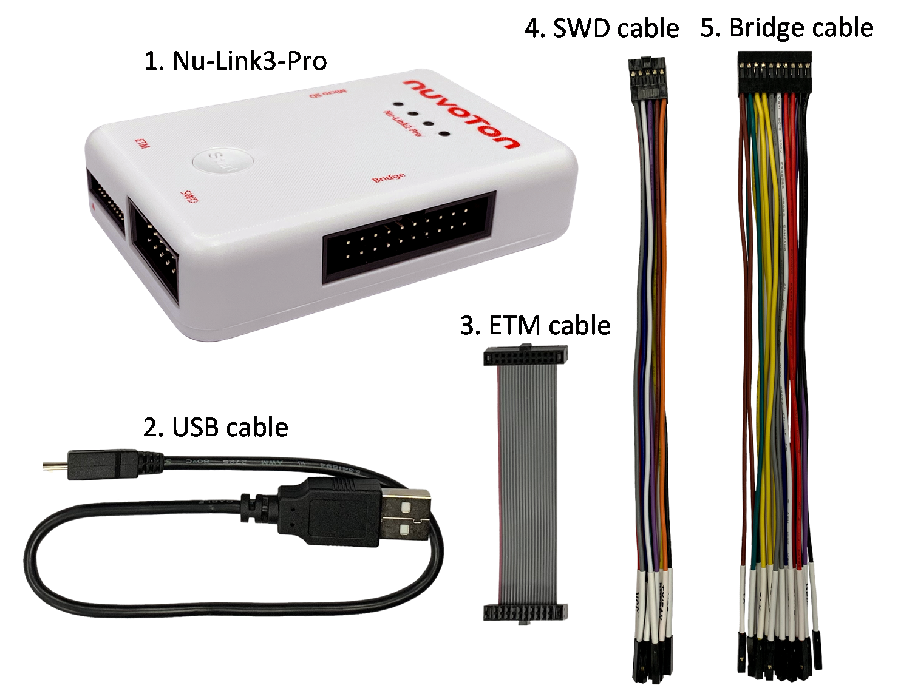
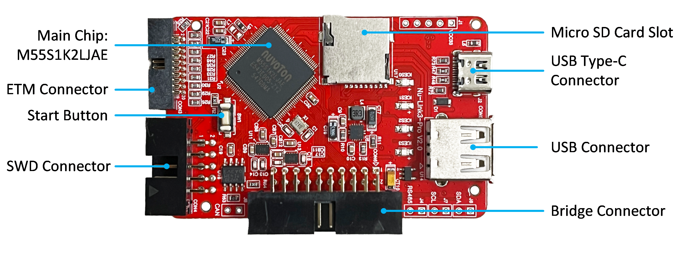
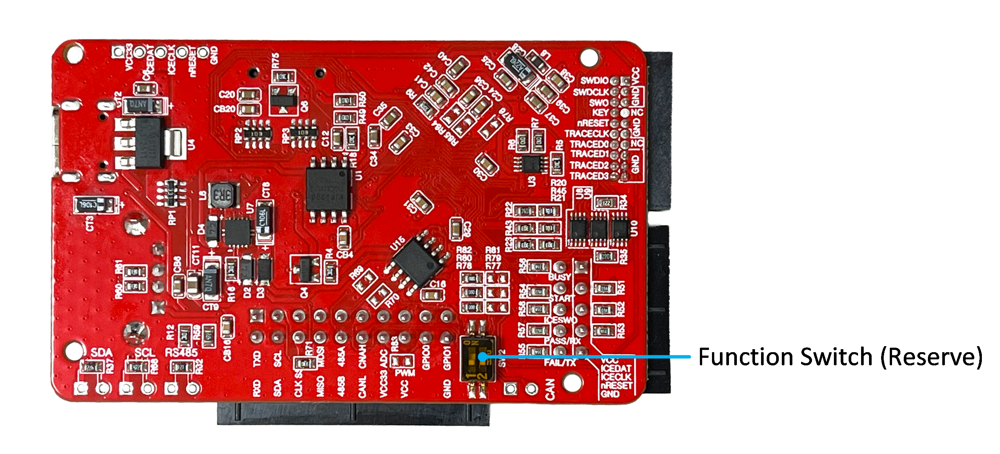
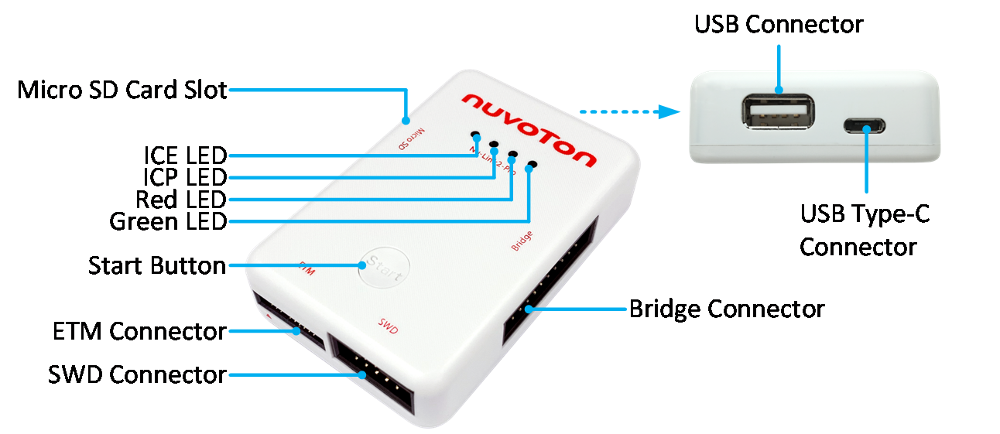

## Package Contents

*Figure: Nu-Link3-Pro Full Package Contents*

The Nu-Link3-Pro full package contains:

- Nu-Link3-Pro main body (2952mil x 1968mil x 688mil)
- USB cable (0.3m, high-speed, USB Type-C)
- ETM cable (50-mil 20-pin IDC flat cable with 50-mil 20-pin connectors)
- SWD cable (100-mil 10-pin squid cable with 10 x 100-mil sockets)
- Bridge cable (100-mil 20-pin squid cable with 20 x 100-mil sockets)

---

## Nu-Link3-Pro PCBA

### Front View

*Figure: Front View of Nu-Link3-Pro PCBA*

The following lists components and connectors from the front view:

- Main Chip: M55S1K2LJAE
- Micro SD Card Slot
- USB Type-C Connector
- USB Connector
- Bridge Connector
- SWD Connector
- Start Button
- ETM Connector

### Rear View

*Figure: Rear View of Nu-Link3-Pro PCBA*

The following lists components and connectors from the rear view:

- Function Switch (Reserved)

---

## Nu-Link3-Pro Overview

*Figure: Nu-Link3-Pro Connector and Function Overview*

### Connectors and Functions

#### USB Type-C Connector (J2)
- USB Type-C port of a PC to debug and program target chips through the development software tool

#### Bridge Connector (CON6)
- UART (Used for Offline ISP)
- I3C Transmission Interface
- SPI Transmission Interface
- RS-485 Transmission Interface
- CAN BUS Transmission Interface
- PWM/Capture
- PSIO
- ADC
- GPIO

#### SWD Connector (CON4)
- SWD Host Interface
- ICP Offline Programming
- Virtual COM by UART (Used for Online ISP)
- Automatic IC Programming

#### ETM Connector (CON3)
- ETM Interface
- SWD Host Interface

#### USB Connector (CON5)
- USB Flash Drive for ICP Offline Programming

#### Micro SD Card Slot
- Save bin file for ICP Offline Programming

#### Start Button (SW1)
- Click this button to proceed with offline programming

#### Status LED (ICES0, ICES1, ICES2, ICES3)
- Display the operation status of the Nu-Link3-Pro

---

## Status LEDs

| Nu-Link3-Pro Operation Status | ICE | ICP | Red | Green |
|-------------------------------|:---:|:---:|:---:|:-----:|
| Boot | Flash×3 | Flash×3 | Flash×3 | Flash×3 |
| One Nu-Link3-Pro selected to connect | Flash×3 | Flash×3 | Flash×3 | On |
| ICE Online (Not connected with a target chip) | On | - | Flash×3 | Flash×3 |
| ICE Online (Connected with a target chip) | On | - | - | On |
| ICE Online (Failed to connect with a target chip) | On | Any | Flash | On |
| During Offline Programming | - | On | - | Flash |
| Offline Programming Completed | On | - | - | - |
| Offline Programming Completed (Auto mode) | On | On | - | - |
| Offline Programming Failed | On | Flash | - | - |

*Table: Status LEDs Difference List*
