## Nu-Link3-Pro Connection

### Extension Connectors

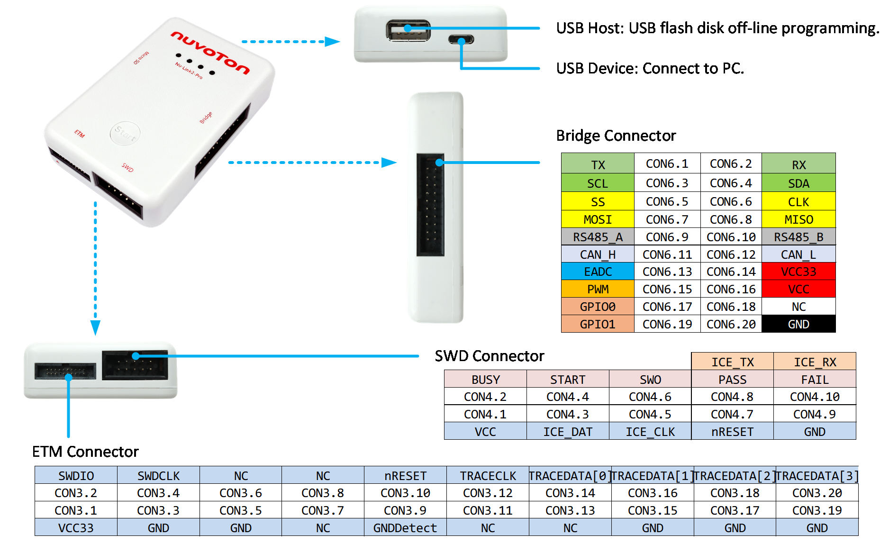

The Nu-Link3-Pro mainly contains USB, USB Type-C, Bridge interface, ETM interface and SWD interface. Users can freely select a suitable interface for debugger and programmer.

---

### SWD Interface Pin Definition and Function Connection

| Pin Name | Pin Number | Pin Description |
|----------|------------|-----------------|
| VCC | CON4.1 | Target Board voltage supply. The Nu-Link3-Pro supports the wide voltage programming function, by ICP tool can adjust the SWD port voltage as 1.8V, 3.3V, 2.5V or 5.0V.|
| BUSY | CON4.2 | "BUSY" is Control Bus signals for IC Programmer.  |
| ICE_DAT | CON4.3 | Serial Wired Debugger Data pin |
| START | CON4.4 | "START" is Control Bus signals for IC Programmer.  |
| ICE_CLK | CON4.5 | Serial Wired Debugger Clock pin |
| SWO | CON4.6 | Single-Wire Trace and Monitoring |
| /RESET | CON4.7 | IC reset pin, Nu-Link3-Pro will automatically reset the target IC during the programming process. |
| PASS/RX | CON4.8 | "PASS" is Control Bus signals for IC Programmer. Also UART RX for Virtual COM (Used for Online ISP).  |
| GND | CON4.9 | Ground |
| FAIL/TX | CON4.10 | "FAIL" is Control Bus signals for IC Programmer. Also UART TX for Virtual COM (Used for Online ISP).  |

Table: SWD Interface Pin Definition and Description

#### ICE Programming Connection

The Nu-Link3-Pro provides ICE function to Programming and debugging on PC.

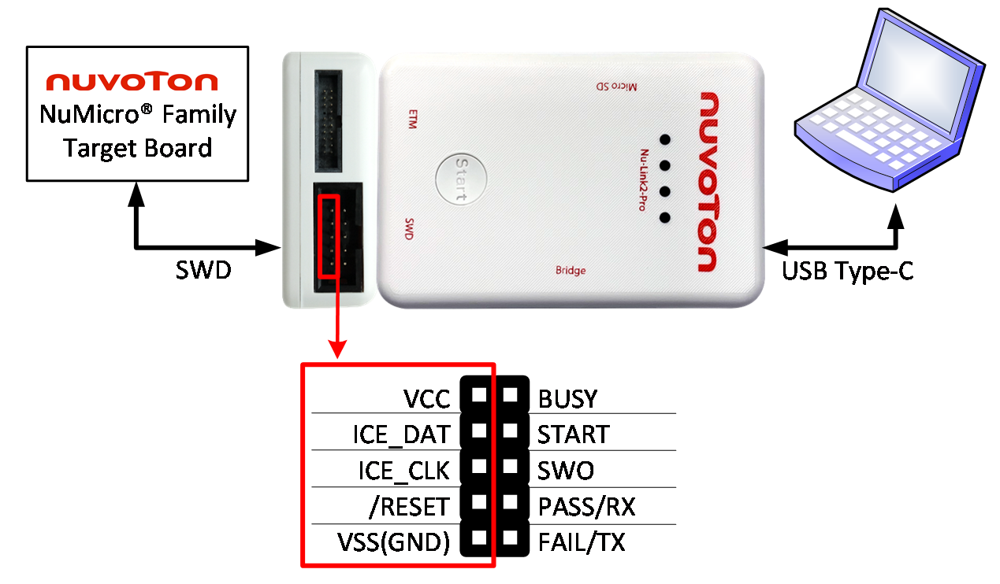

| Pin Name | Pin Number | Pin Corresponding to the Target Board |
|----------|------------|---------------------------------------|
| VCC | CON4.1 | VCC |
| ICE_DAT | CON4.3 | ICE_DAT |
| ICE_CLK | CON4.5 | ICE_CLK |
| /RESET | CON4.7 | /RESET |
| VSS(GND) | CON4.9 | VSS(GND) |

Table: SWD Interface Corresponding Pin for ICE

#### Virtual COM Connection

The Nu-Link3-Pro provides virtual COM port (VCOM) function to print out messages on PC, and the Virtual COM transmission data by UART0. The UART here is also used by default for Online ISP.

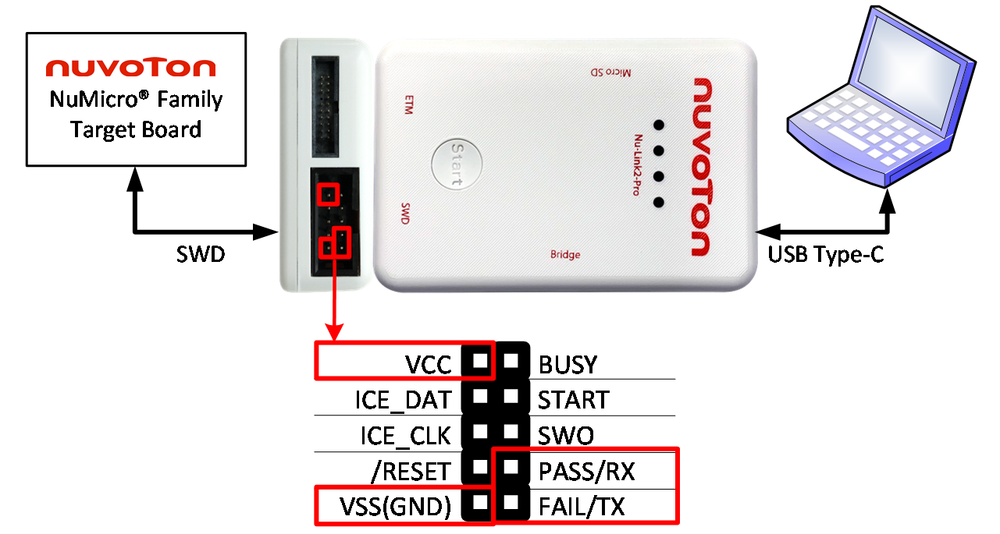

| Pin Name | Pin Number | Pin Corresponding to the Target Board |
|----------|------------|---------------------------------------|
| VCC | CON4.1 | VCC |
| PASS/RX | CON4.8 | UART_RX |
| VSS(GND) | CON4.9 | VSS(GND) |
| FAIL/TX | CON4.10 | UART_TX |

Table: SWD Interface Corresponding Pin for Virtual COM

#### Automatic IC Programming Connection

The Nu-Link3-Pro provides Automatic IC Programming function to mass production. For details about Control Bus signals, please refer to [section 7.3](../07_appendix/02_nu-link3-pro.md#73-automatic-ic-programming-system).

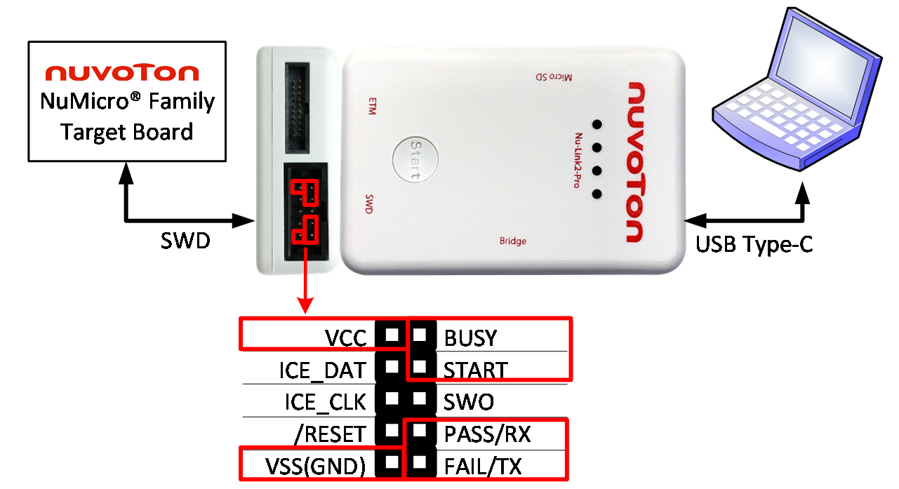

#### SWO Debug Connection

The Nu-Link3-Pro supports SWO (Serial Wire Output) for trace and monitoring functions.

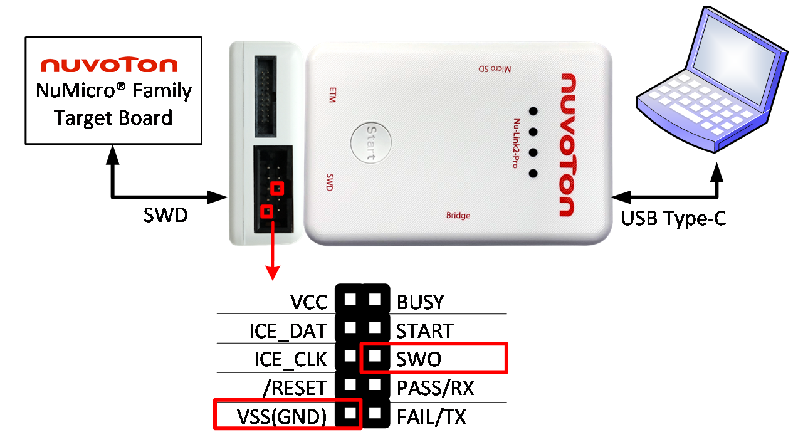

---

### Bridge Interface

| Pin Name | Pin Number | Pin Description |
|----------|------------|-----------------|
| TXD | CON6.1 | Data transmitter output pin for UART (Used for Offline ISP) |
| RXD | CON6.2 | Data receiver input pin for UART (Used for Offline ISP) |
| SCL | CON6.3 | I2C/I3C clock |
| SDA | CON6.4 | I2C/I3C data input/output |
| SS | CON6.5 | SPI slave select |
| CLK | CON6.6 | SPI serial clock |
| MOSI | CON6.7 | SPI MOSI (Master Out, Slave In) |
| MISO | CON6.8 | SPI MISO (Master In, Slave Out) |
| RS-485A | CON6.9 | RS-485 Data plus signal |
| RS-485B | CON6.10 | RS-485 Data minus signal |
| CANH | CON6.11 | CAN BUS Data plus signal |
| CANL | CON6.12 | CAN BUS Data minus signal |
| ADC | CON6.13 | ADC analog input signal |
| VCC33 | CON6.14 | Target Board voltage supply. The Nu-Link3-Pro Bridge VCC only supports 3.3V. |
| PWM | CON6.15 | PWM output/Capture input |
| VCC | CON6.16 | Target Board voltage supply. The Nu-Link3-Pro Bridge VCC support 1.8V, 2.5V, 3.3V and 5.0V. |
| GPIO0 | CON6.17 | General Purpose I/O 0 |
| NC | CON6.18 | NC |
| GPIO1 | CON6.19 | General Purpose I/O 1 |
| GND | CON6.20 | Ground |

Table: Bridge Interface Pin Definition and Description

#### UART Connection

This connection is also used by default for Offline ISP.

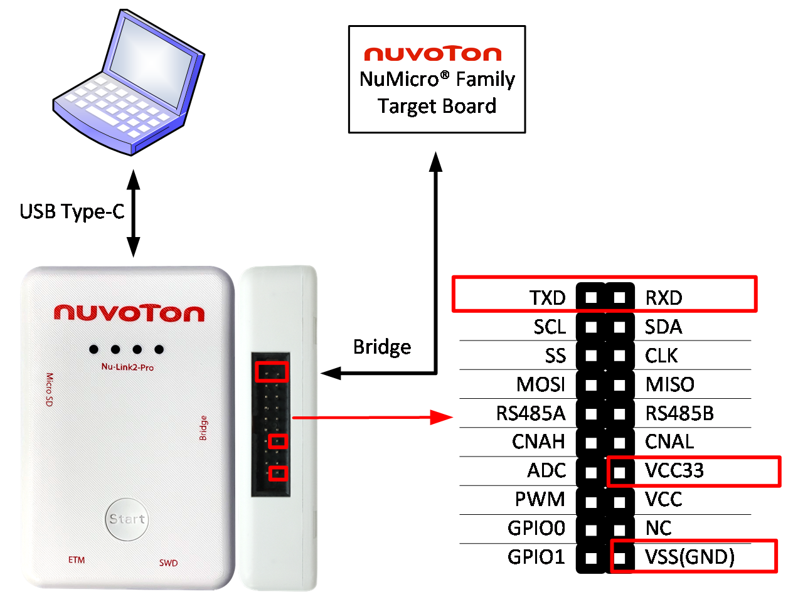

#### I2C/I3C Connection

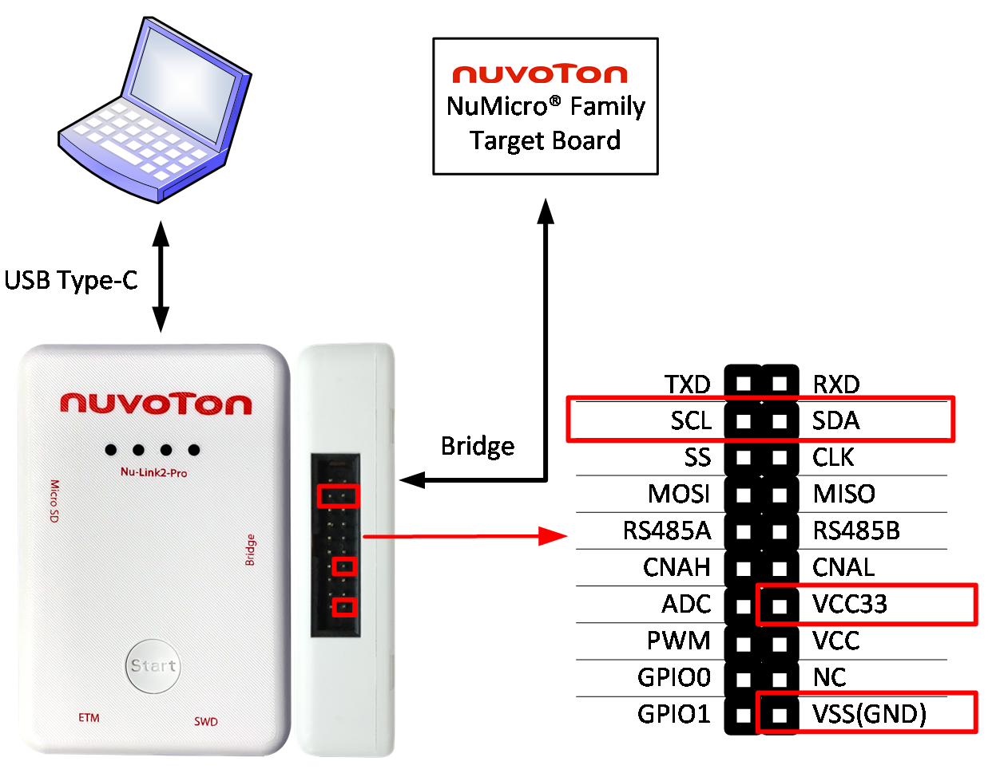

#### SPI Connection

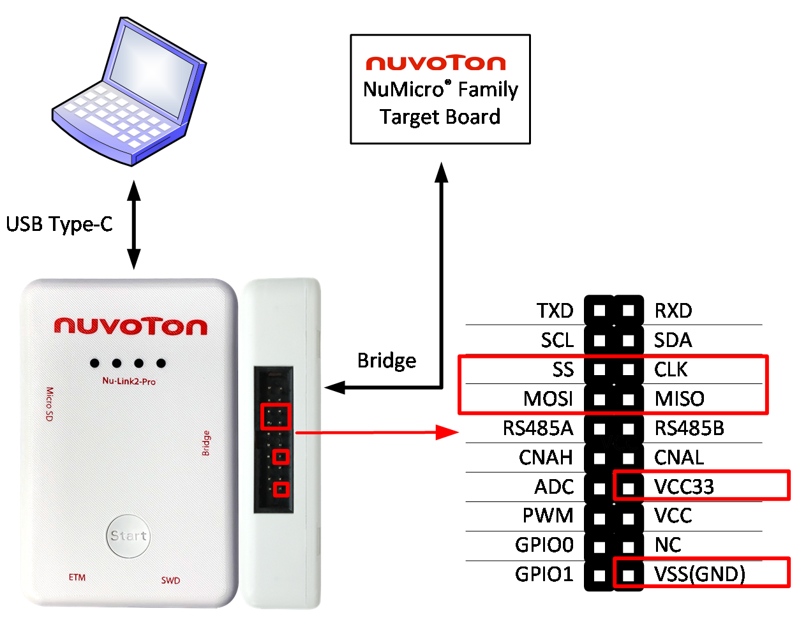

#### RS-485 Connection

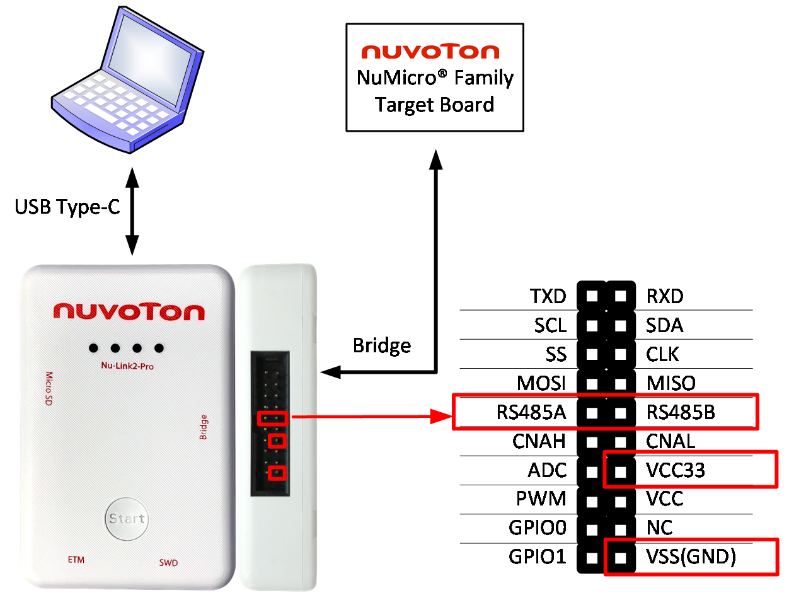

#### CAN BUS Connection

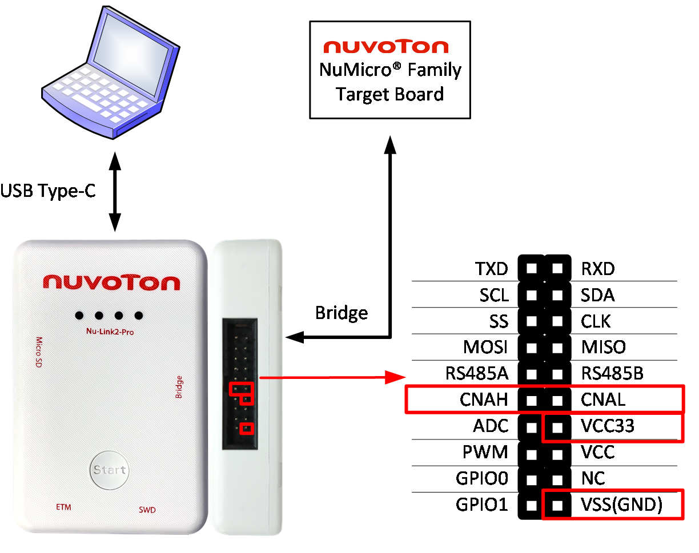

#### PWM and Capture

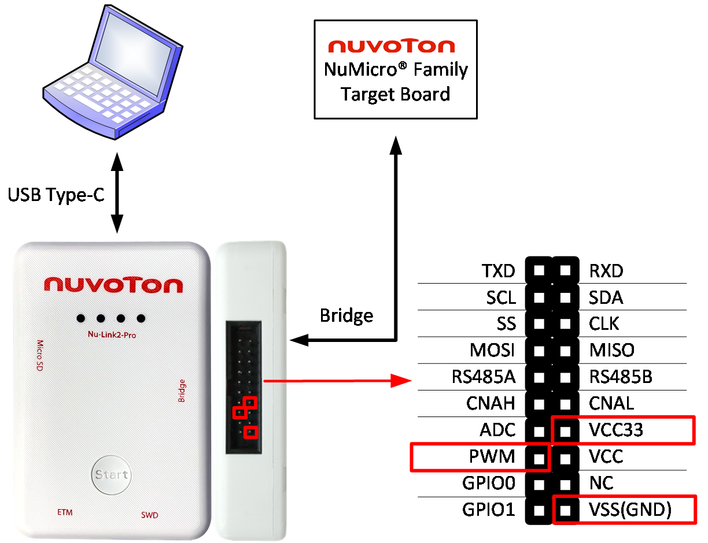

#### ADC Connection

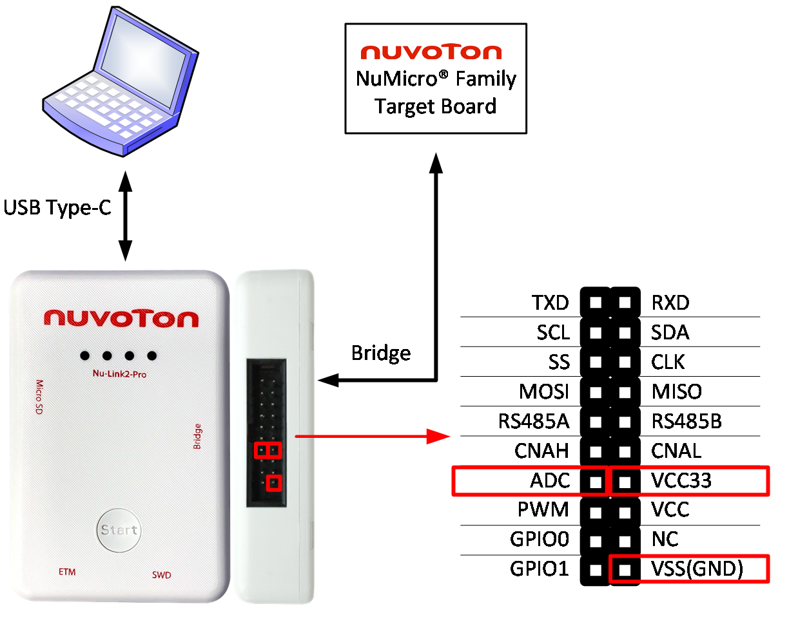

#### GPIO Connection

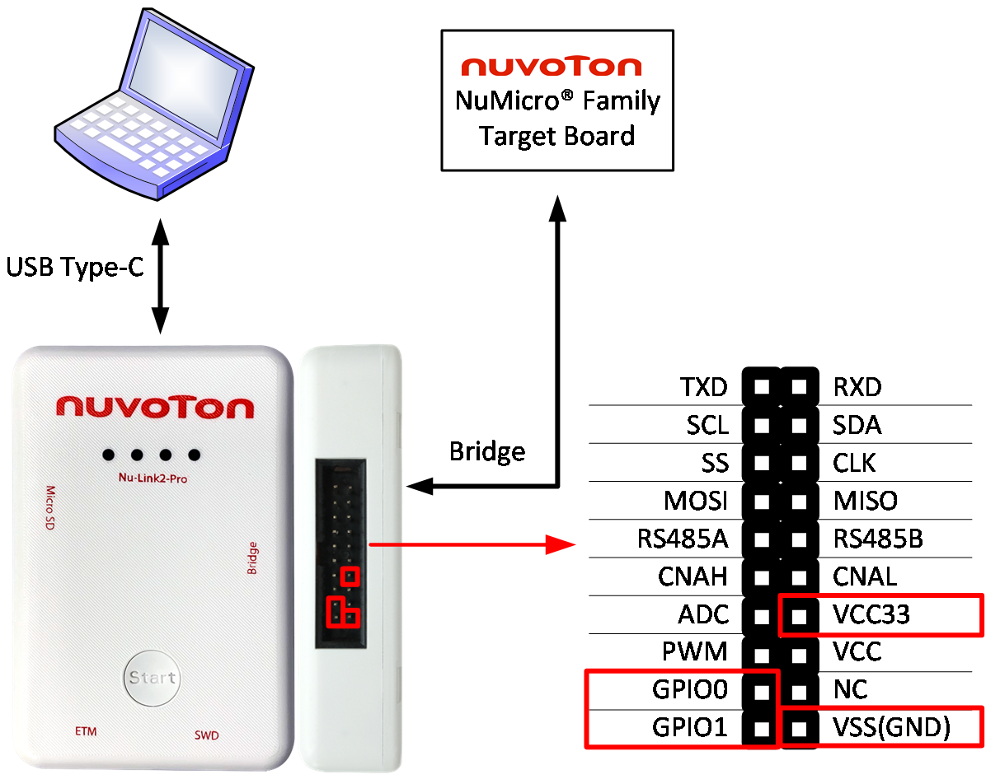

---

### ETM Interface Pin Definition and Function Connection

| Pin Name | Pin Number | Pin Description |
|----------|------------|-----------------|
| VCC | CON3.1 | Target Board voltage supply. |
| SWDIO | CON3.2 | Serial Wired Debugger Data pin |
| GND | CON3.3 | Ground |
| SWDCLK | CON3.4 | Serial Wired Debugger Clock pin |
| GND | CON3.5 | Ground |
| SWO | CON3.6 | SWO |
| NC | CON3.7 | NC |
| JTAG | CON3.8 | JTAG |
| GND | CON3.9 | Ground |
| /RESET | CON3.10 | IC reset pin, Nu-Link3-Pro will automatically reset the target IC during the programming process. |
| NC | CON3.11 | NC |
| TRACECLK | CON3.12 | ETM trace clock pin. |
| NC | CON3.13 | Ground |
| TRACEDATA[0] | CON3.14 | ETM trace data output pin. |
| GND | CON3.15 | Ground |
| TRACEDATA[1] | CON3.16 | ETM trace data output pin. |
| GND | CON3.17 | Ground |
| TRACEDATA[2] | CON3.18 | ETM trace data output pin. |
| GND | CON3.19 | Ground |
| TRACEDATA[3] | CON3.20 | ETM trace data output pin. |

Table: ETM Interface Pin Definition and Description

#### SWD and ETM Connection

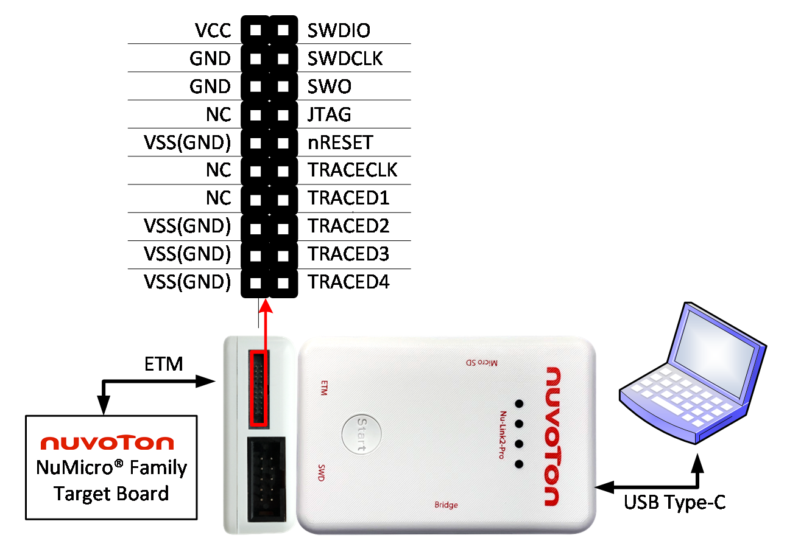

### ICP Offline Programming Function Connection

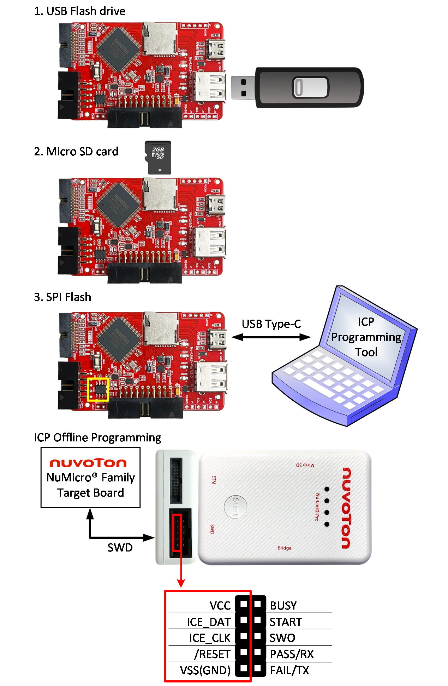{ width=80% }

