## Extension Connectors

The figure below shows the Nu-Link2-Pro definition pin of each connector.
The Nu-Link2-Pro mainly contains USB, Micro USB, Bridge interface, ETM
interface and SWD interface. User can freely select a suitable interface
for debugger and programmer.

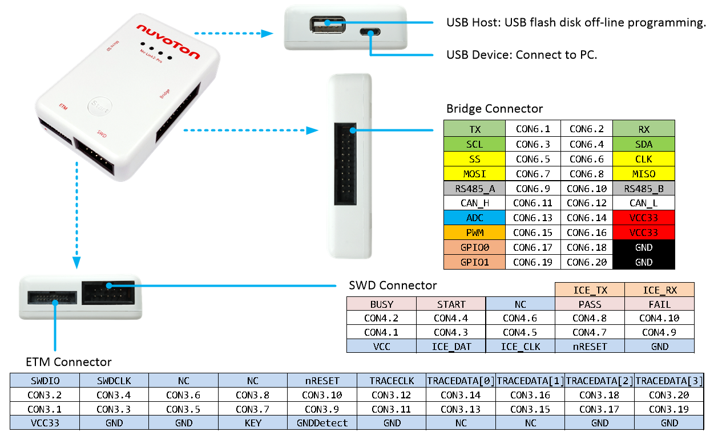

#### Figure: Pin Definition of Nu-Link2-Pro Connectors

## SWD Interface

The table below shows SWD interface pin definition and description. The
Nu-Link2-Pro provides a SWD interface connector with a 100-mil 10-pin
cable. The SWD supports ICE Programming, Virtual COM and automatic IC
Programming. The following sections will introduce the definition of the
SWD interface pin and the connection of each function.

| **Pin Name** | **Pin Number** | **Pin Description** |
|----|----|:---|
| VCC | CON4.1 | Target Board voltage supply. The Nu-Link2-Pro supports the wide voltage programming function, by ICP tool can adjust the SWD port voltage as 1.8V, 3.3V, 2.5V or 5.0V. For detailed adjustment method, please refer to section 4.3. |
| BUSY | CON4.2 | “BUSY” is Control Bus signals for IC Programmer. For details, please refer to section 6.3. |
| ICE_DAT | CON4.3 | Serial Wire Debug data pin |
| START | CON4.4 | “START” is Control Bus signal for IC Programmer. For details, please refer to section 6.3. |
| ICE_CLK | CON4.5 | Serial Wire Debug clock pin |
| NC | CON4.6 | NC |
| /RESET | CON4.7 | IC reset pin, Nu-Link2-Pro will automatically reset the target IC during the programming process. |
| PASS/RX | CON4.8 | “PASS” is Control Bus signals for IC Programmer. For details, please refer to section 6.3. |
| GND | CON4.9 | Ground |
| FAIL/TX | CON4.10 | “FAIL” is Control Bus signals for IC Programmer. For details, please refer to section 6.3. |

#### Table: SWD Interface Pin Definition and Description

### ICE Programming Connection

The Nu-Link2-Pro provides ICE function to Programming and debugging on
PC. The ICE connection pins are VCC(CON4.1), ICE_DAT(CON4.3),
ICE_CLK(CON4.5), /RESET(CON4.7) and VSS(CON4.9). The diagram below presents
how to connect the target board to use ICE and the following table shows the pin
corresponding to the target board.

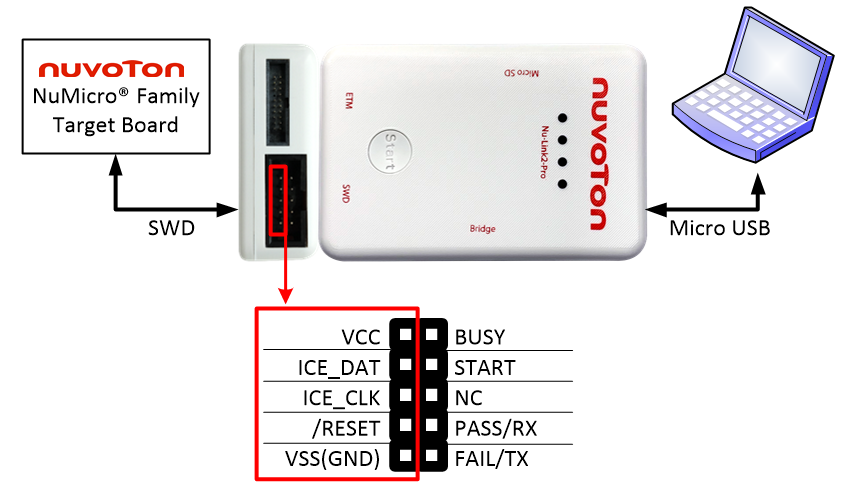

#### Figure: SWD Interface Connection Diagram for ICE

| **Pin Name** | **Pin Number** | **Pin Corresponding to the Target Board** |
|--------------|----------------|:------------------------------------------|
| VCC          | CON4.1         | VCC                                       |
| ICE_DAT      | CON4.3         | ICE_DAT                                   |
| ICE_CLK      | CON4.5         | ICE_CLK                                   |
| /RESET       | CON4.7         | /RESET                                    |
| VSS(GND)     | CON4.9         | VSS(GND)                                  |

#### Table: SWD Interface Corresponding Pin for ICE

### Virtual COM Connection 

The Nu-Link2-Pro provides virtual COM port (VCOM) function to print out
messages on PC, and the Virtual COM transmission data by UART0. The
connection pins are VCC (CON4.1), VSS (CON4.9), TX (CON4.8) and RX
(CON4.10). The diagram below presents how to connect the target board to use
VCOM and the following table shows the pin corresponding to the target board.

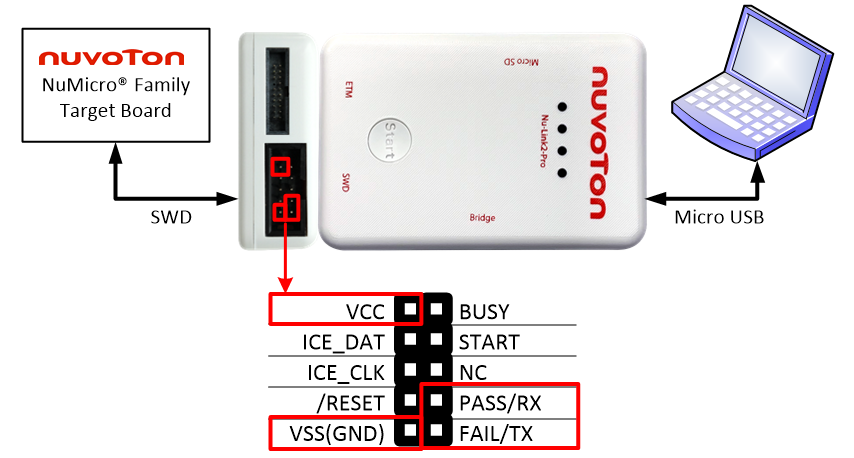

#### Figure: SWD Interface Connection Diagram for Virtual COM

| **Pin Name** | **Pin Number** | **Pin Corresponding to the Target Board** |
|--------------|----------------|:------------------------------------------|
| VCC          | CON4.1         | VCC                                       |
| PASS/RX      | CON4.8         | UART_RX                                   |
| VSS(GND)     | CON4.9         | VSS(GND)                                  |
| FAIL/TX      | CON4.10        | UART_TX                                   |

#### Table: SWD Interface Corresponding Pin for Virtual COM

### Automatic IC Programming Connection

The Nu-Link2-Pro provides Automatic IC Programming function to mass
production. The Automatic IC Programming connection pins are VCC
(CON4.1), VSS (CON4.9), BUSY (CON4.2), START (CON4.4), PASS (CON4.8) and
FAIL (CON4.10). The diagram below presents how to connect the target board to
use Automatic IC Programming and the following table shows the pin corresponding
to the target board.

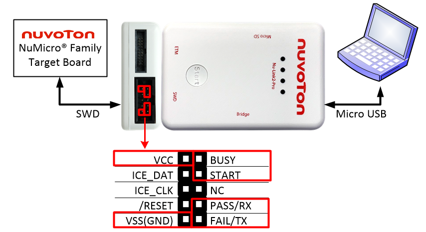

#### Figure: SWD Interface Connection Diagram for Automatic IC Programming

| Pin Name | Pin Number | Pin Corresponding to the Target Board |
|----|----|----|
| VCC | CON4.1 | VCC[1] |
| BUSY | CON4.2 | BUSY |
| START | CON4.4 | START |
| PASS | CON4.8 | PASS |
| VSS(GND) | CON4.9 | VSS(GND) |
| FAIL | CON4.10 | FAIL |

#### Table: SWD Interface Corresponding Pin for Automatic IC Programming

## Bridge Interface

The table below shows the bridge interface pin definition and description.
The Nu-Link2-Pro provides a bridge interface connector with a 100-mil
20-pin cable. The bridge interface supports one channel UART,
I2C, SPI, RS-485, CAN BUS, ADC, PWM and two GPIOs. The
following sections will introduce the definition of the bridge interface
pin and the connection of each function.

| **Pin Name** | **Pin Number** | **Pin Description** |
|----|----|:---|
| TXD | CON6.1 | Data transmitter output pin for UART |
| RXD | CON6.2 | Data receiver input pin for UART |
| SCL | CON6.3 | I2C clock |
| SDA | CON6.4 | I2C data input/output |
| SS | CON6.5 | SPI slave select / Data transmitter output pin for LIN |
| CLK | CON6.6 | SPI serial clock / Data receiver input pin for LIN |
| MOSI | CON6.7 | SPI MOSI (Master Out, Slave In) |
| MISO | CON6.8 | SPI MISO (Master In, Slave Out) |
| RS-485A | CON6.9 | RS-485 Data plus signal |
| RS-485B | CON6.10 | RS-485 Data minus signal |
| CANH | CON6.11 | CAN BUS Data plus signal |
| CANL | CON6.12 | CAN BUS Data minus signal |
| ADC | CON6.13 | ADC analog input signal |
| VCC33 | CON6.14 | Target Board voltage supply. The Nu-Link2-Pro Bridge VCC only support 3.3V. |
| PWM | CON6.15 | PWM output/Capture input |
| VCC33 | CON6.16 | Target Board voltage supply. The Nu-Link2-Pro Bridge VCC only support 3.3V. |
| GPIO0 | CON6.17 | General Purpose I/O 0 |
| GND | CON6.18 | Ground |
| GPIO1 | CON6.19 | General Purpose I/O 1 |
| GND | CON6.20 | Ground |

#### Table: Bridge Interface Pin Definition and Description

### UART Connection

The Nu-Link2-Pro can be used as an open platform, we provide an extra
UART interface as reserved. The UART connection pins are VCC33 (CON6.14
and CON6.16), VSS (CON6.18 and CON6.20), TXD(CON6.1) and RXD(CON6.2).
The diagram below presents how to connect the target board to use UART
function and the following table shows the pin corresponding to the target
board.

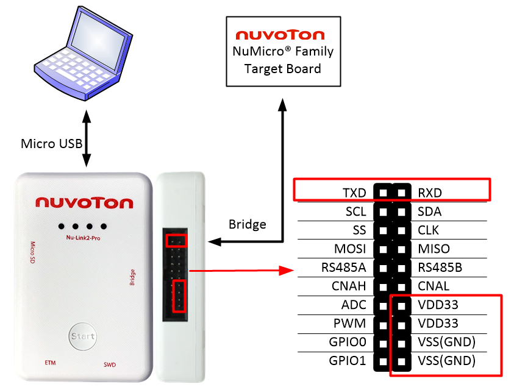

#### Figure: Bridge Interface Connection Diagram for UART

| Pin Name | Pin Number | Pin Corresponding to the Target Board |
|----|----|----|
| TXD | CON6.1 | RXD[1] |
| RXD | CON6.2 | TXD[1] |
| VCC33 | CON6.14 | VCC[1] |
| VCC33 | CON6.16 | VCC[1] |
| VSS(GND) | CON6.18 | VSS(GND) |
| VSS(GND) | CON6.20 | VSS(GND) |

#### Table: Bridge Interface Corresponding Pin for UART

### I2C Connection

The Nu-Link2-Pro provides one channel I2C function for bridge
and monitor mode. The I2C connection pins are VCC33(CON6.14
and CON6.16), VSS (CON6.18 and CON6.20), SCL(CON6.3) and SDA(CON6.4).
The diagram below presents how to connect the target board to use
I2C function and the following table shows the pin corresponding to
the target board. Click for further bridge information:
[Github](https://github.com/OpenNuvoton/Nuvoton_Tools)
[Gitee](https://gitee.com/OpenNuvoton/Nuvoton_Tools)

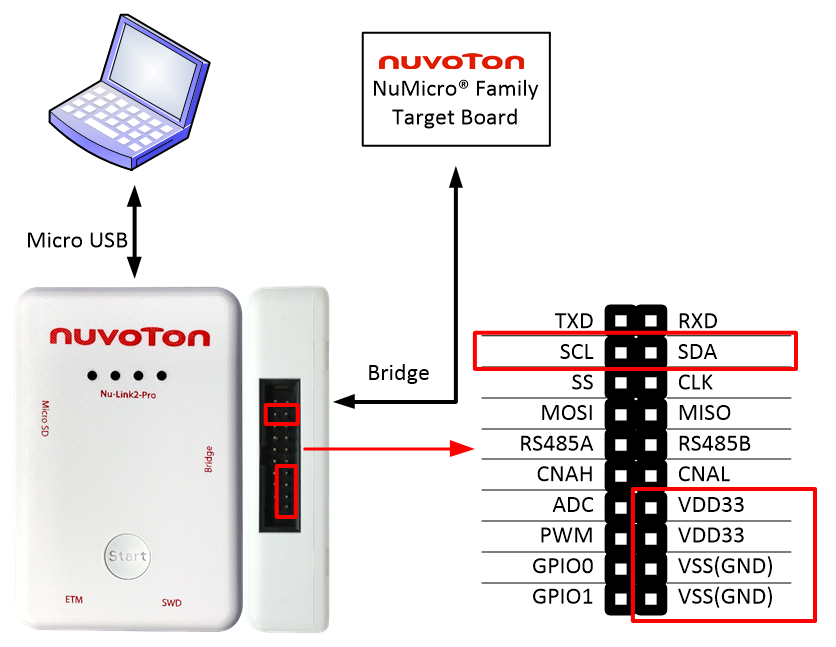

#### Figure: Bridge Interface Connection Diagram for I2C

| Pin Name | Pin Number | Pin Corresponding to the Target Board |
|----|----|----|
| SCL[1] | CON6.3 | SCL[2] |
| SDA[1] | CON6.4 | SDA[2] |
| VCC33 | CON6.14 | VCC[2] |
| VCC33 | CON6.16 | VCC[2] |
| VSS(GND) | CON6.18 | VSS(GND) |
| VSS(GND) | CON6.20 | VSS(GND) |

#### Table: Bridge Interface Pin for I2C

### SPI Connection

The Nu-Link2-Pro provides one channel SPI function for bridge and
monitor mode. The SPI connection pins are VCC33(CON6.14 and CON6.16),
VSS (CON6.18 and CON6.20), SS(CON6.5), CLK(CON6.6), MOSI(CON6.7) and
MISO(CON6.8). The diagram below presents how to connect the target board to
use SPI function and the following table shows the pin corresponding to the
target board. Click for further bridge information:
[Github](https://github.com/OpenNuvoton/Nuvoton_Tools)
[Gitee](https://gitee.com/OpenNuvoton/Nuvoton_Tools).

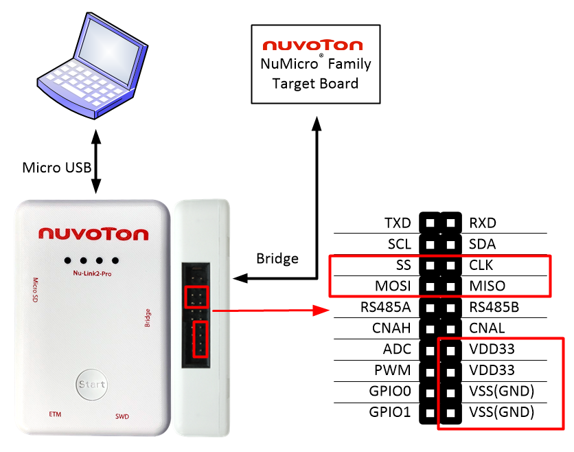

#### Figure: Bridge Interface Connection Diagram for SPI

| **Pin Name** | **Pin Number** | **Pin Corresponding to the Target Board** |
|----|----|:---|
| SS | CON6.5 | SS\[1\] |
| CLK | CON6.6 | CLK\[1\] |
| MOSI | CON6.7 | MOSI\[1\] |
| MISO | CON6.8 | MISO\[1\] |
| VCC33 | CON6.14 | VCC\[1\] |
| VCC33 | CON6.16 | VCC\[1\] |
| VSS (GND) | CON6.18 | VSS (GND) |
| VSS (GND) | CON6.20 | VSS (GND) |
| **Note:** The target board power and signal only support 3.3 V at Nu-Link2-Pro Bridge interface. |  |  |

#### Table: Bridge Interface Corresponding Pin for SPI

### RS-485 Connection

The Nu-Link2-Pro provides one channel RS-485 function for bridge and
monitor mode. The RS-485 connection pins are VCC33(CON6.14 and CON6.16),
VSS(CON6.18 and CON6.20), RS485A(CON6.9) and RS485B(CON6.10). The diagram
below presents how to connect the target board to use RS-485 function
and the following table shows the pin corresponding to the target board. Click
for further bridge information:
[Github](https://github.com/OpenNuvoton/Nuvoton_Tools)
[Gitee](https://gitee.com/OpenNuvoton/Nuvoton_Tools)

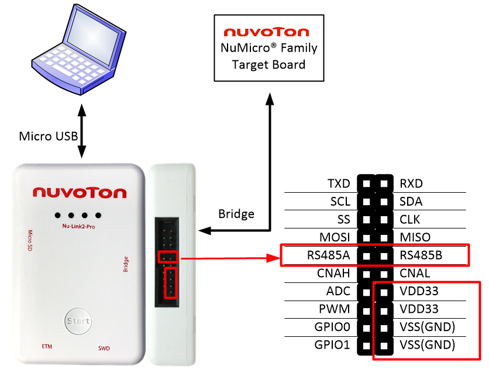

#### Figure: Bridge Interface Connection Diagram for RS-485

| Pin Name | Pin Number | Pin Corresponding to the Target Board |
|----|----|----|
| RS485A[1] | CON6.9 | RS485A[2] |
| RS485B[1] | CON6.10 | RS485B[2] |
| VCC33 | CON6.14 | VCC[2] |
| VCC33 | CON6.16 | VCC[2] |
| VSS(GND) | CON6.18 | VSS(GND) |
| VSS(GND) | CON6.20 | VSS(GND) |

#### Table: Bridge Interface Corresponding Pin for RS-485

### CAN BUS Connection

The Nu-Link2-Pro provides one channel CAN BUS function for bridge and
monitor mode. The CAN BUS connection pins are VCC33(CON6.14 and
CON6.16), VSS(CON6.18 and CON6.20), CANH(CON6.11) and CANL(CON6.12).
The diagram below presents how to connect the target board to use CAN BUS
function and the following table shows the pin corresponding to the target
board. 

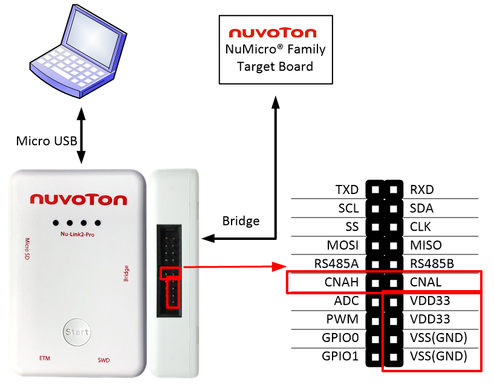

#### Bridge Interface Connection Diagram for CAN BUS

| Pin Name | Pin Number | Pin Corresponding to the Target Board |
|----|----|----|
| CANH[1] | CON6.11 | CANH |
| CANL[1] | CON6.12 | CANL |
| VCC33 | CON6.14 | VCC[2] |
| VCC33 | CON6.16 | VCC[2] |
| VSS(GND) | CON6.18 | VSS(GND) |
| VSS(GND) | CON6.20 | VSS(GND) |

#### Bridge Interface Corresponding Pin for CAN BUS

### PWM and Capture

The Nu-Link2-Pro provides one channel PWM function for user flexible
planning. The PWM connection pins are VCC33(CON6.14 and CON6.16),
VSS(CON6.18 and CON6.20) and PWM(CON6.15). The diagram below presents how to
connect the target board to use PWM function and the following table shows the
pin corresponding to the target board.

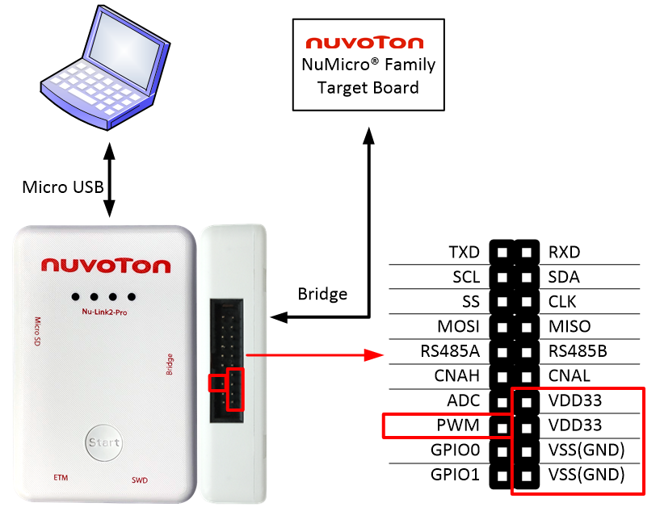

#### Bridge Interface Connection Diagram for PWM

| Pin Name | Pin Number | Pin Corresponding to the Target Board |
|----|----|----|
| PWM | CON6.15 | GPIO or Application side [1] |
| VCC33 | CON6.14 | VCC[1] |
| VCC33 | CON6.16 | VCC[1] |
| VSS(GND) | CON6.18 | VSS(GND) |
| VSS(GND) | CON6.20 | VSS(GND) |

#### Bridge Interface Corresponding Pin for PWM

### ADC Connection

The Nu-Link2-Pro provides one channel ADC function for user flexible
planning. The ADC connection pins are VCC33(CON6.14 and CON6.16),
VSS(CON6.18 and CON6.20) and ADC(CON6.13). The diagram below presents how to
connect the target board to use ADC function and the following table shows the
pin corresponding to the target board.

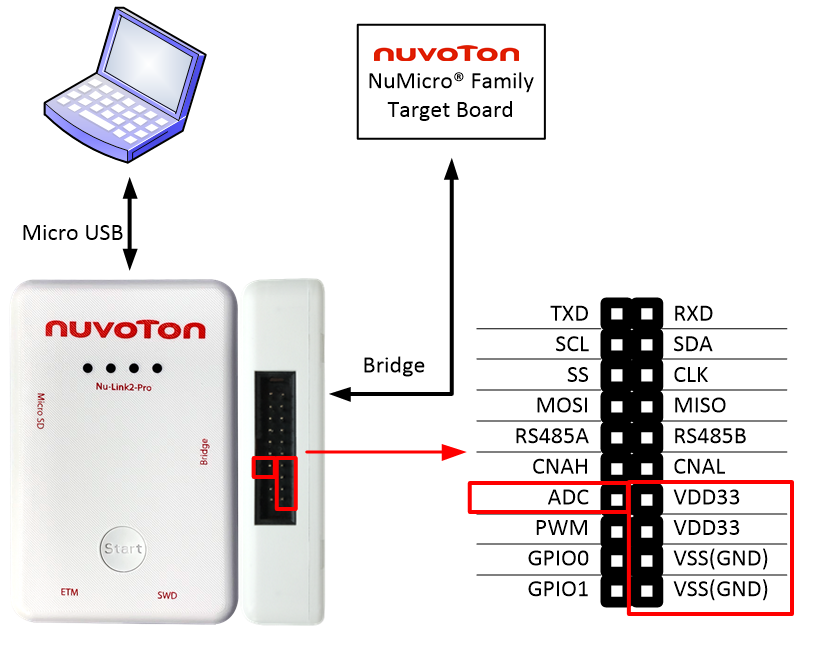

#### Bridge Interface Connection Diagram for ADC

| Pin Name | Pin Number | Pin Corresponding to the Target Board |
|----|----|----|
| ADC[1] | CON6.13 | Application side [1] |
| VCC33 | CON6.14 | VCC[1] |
| VCC33 | CON6.16 | VCC[1] |
| VSS (GND) | CON6.18 | VSS (GND) |
| VSS (GND) | CON6.20 | VSS (GND) |

#### Bridge Interface Corresponding Pin for ADC

### GPIO Connection

The Nu-Link2-Pro provides two channel GPIO function for user flexible
planning. The GPIO connection pins are VCC33(CON6.14 and CON6.16),
VSS(CON6.18 and CON6.20), GPIO0(CON6.17) and GPIO1(CON6.19). The diagram
below presents how to connect the target board to use GPIO function and
the following table shows the pin corresponding to the target board.

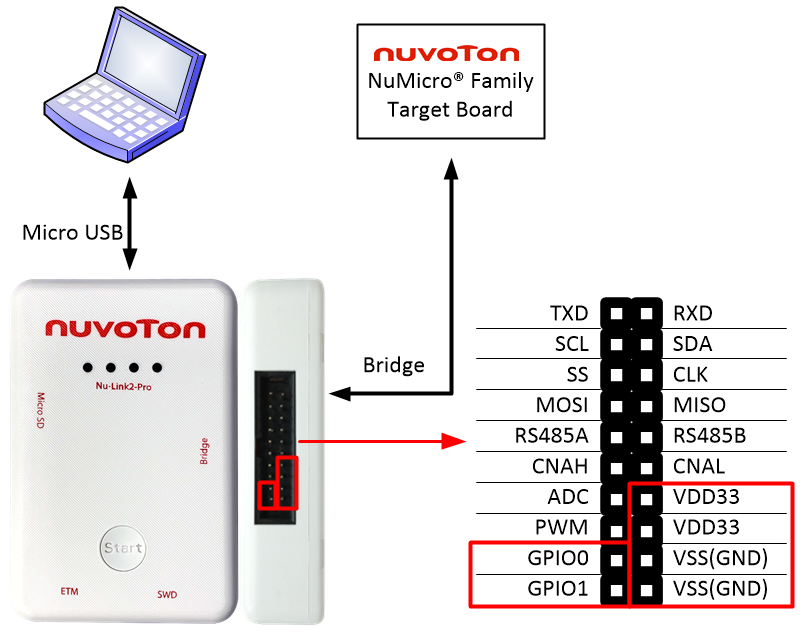

#### Bridge Interface Connection Diagram for GPIO

| Pin Name | Pin Number | Pin Corresponding to the Target Board |
|----|----|----|
| GPIO0 | CON6.17 | GPIO or Application side [1] |
| GPIO1 | CON6.19 | GPIO or Application side [1] |
| VCC33 | CON6.14 | VCC [1] |
| VCC33 | CON6.16 | VCC [1] |
| VSS(GND) | CON6.18 | VSS(GND) |
| VSS(GND) | CON6.20 | VSS(GND) |

#### Bridge Interface Corresponding Pin for GPIO

### LIN Connection

The Nu-Link2-Pro provides one LIN channel for user flexible planning.
The LIN connection pins are VCC33 (CON6.14 and CON6.16), VSS (CON6.18
and CON6.20), SS (CON6.5) and CLK (CON6.6). The diagram below presents how to
connect the target board to use LIN function and the following table shows the
pin corresponding to the target board.

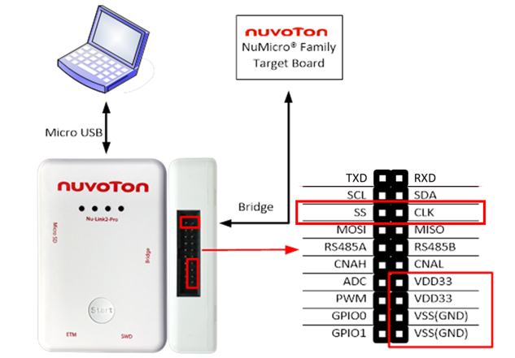

#### Figure: Bridge Interface Connection Diagram for LIN

| Pin Name | Pin Number | Pin Corresponding to the Target Board |
|----|----|----|
| SS | CON6.5 | RXD[1] |
| CLK | CON6.6 | TXD[1] |
| VCC33 | CON6.14 | VCC[1] |
| VCC33 | CON6.16 | VCC[1] |
| VSS(GND) | CON6.18 | VSS(GND) |
| VSS(GND) | CON6.20 | VSS(GND) |

#### Table: Bridge Interface Corresponding Pin for LIN

## ETM Interface

The table below shows ETM interface pin definition and description. The
Nu-Link2 and nu-link2 provide an ETM interface connector with a 50-mil 20-pin
cable. The ETM interface supports ETM and SWD functions. The following
sections introduce the definition of the ETM interface pins and the
connection of each function.

| **Pin Name** | **Pin Number** | **Pin Description** |
|----|----|:---|
| VCC33 | CON3.1 | Target Board voltage supply. The Nu-Link2 and nu-link2 ETM VCC only support 3.3V. |
| SWDIO | CON3.2 | Serial Wire Debug data pin |
| GND | CON3.3 | Ground |
| SWDCLK | CON3.4 | Serial Wire Debug clock pin |
| GND | CON3.5 | Ground |
| NC | CON3.6 | NC |
| KEY | CON3.7 | A key pin to properly orient the connector. |
| NC | CON3.8 | NC |
| GND | CON3.9 | Ground |
| /RESET | CON3.10 | IC reset pin, Nu-Link2 and nu-link2 will automatically reset the target IC during the programming process. |
| NC | CON3.11 | NC |
| TRACECLK | CON3.12 | ETM trace clock pin. |
| NC | CON3.13 | Ground |
| TRACEDATA\[0\] | CON3.14 | ETM trace data output pin. |
| GND | CON3.15 | Ground |
| TRACEDATA\[1\] | CON3.16 | ETM trace data output pin. |
| GND | CON3.17 | Ground |
| TRACEDATA\[2\] | CON3.18 | ETM trace data output pin. |
| GND | CON3.19 | Ground |
| TRACEDATA\[3\] | CON3.20 | ETM trace data output pin. |

#### Table: ETM Interface Pin Definition and Description

### SWD Connection

The ETM interface provides SWD function for IC programming and
Debugging. The diagram below presents how to connect the target board to use
SWD function. In addition, please pay attention to the behavior and do
not program or debug at the same time with the SWD interface; otherwise,
an error will occur.

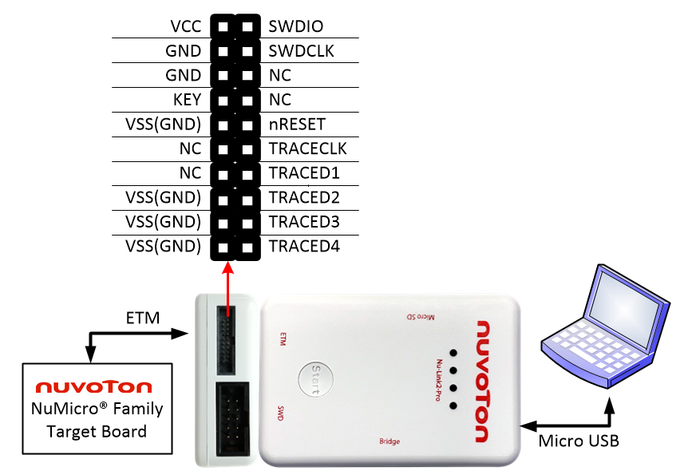

#### Figure: ETM Interface Connection Diagram for SWD and ETM Function

### ETM Connection

The ETM interface provides ETM function for capturing execution steps of
microprocessor on the target board, and ETM will display them a
readability format. The diagram above presents how to connect the target
board to use ETM function.

## ICP Offline Programming Connection

The Nu-Link2 and nu-link2 provide three kinds storage interface for Nu-Link2 and nu-link2
ICP offline programming. The user can save the bin file to USB Flash
drive, Micro SD card or SPI Flash for offline programming. The priority
of reading from these three storage is USB Flash drive \> Micro SD card
\> SPI Flash. The diagram below shows the SWD interface used for offline programming.

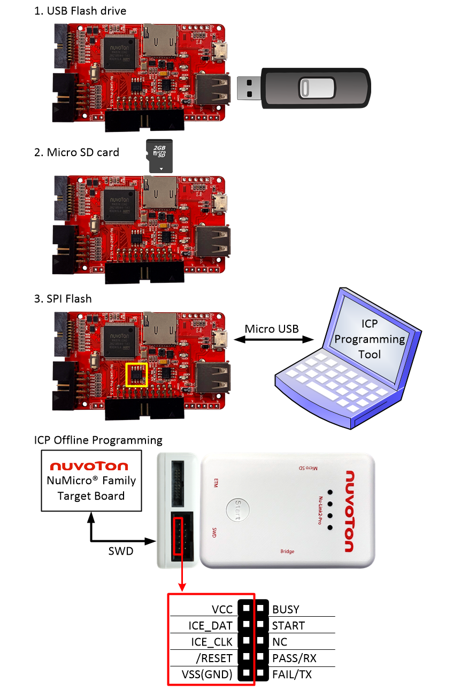

#### Figure: ICP Offline Programming Illustration of SWD Interface

