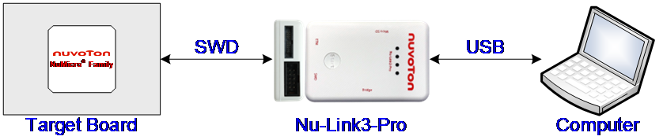

# Debugging

The Nu-Link family provide a USB-to-SWD bridge, enabling software tools to debug and program the target chip over USB.

This chapter introduces how to configure various software tools to use the Nu-Link family for debugging and programming.

