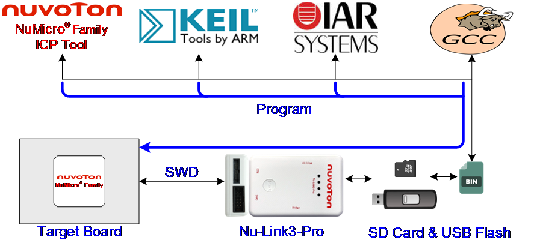
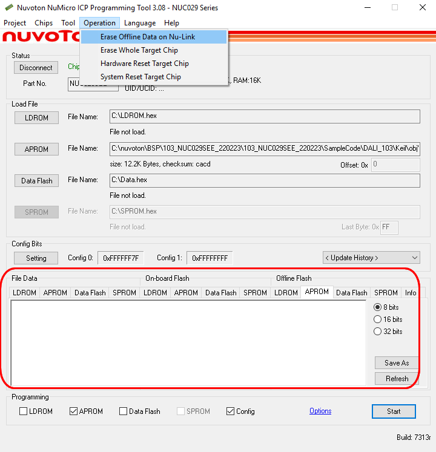
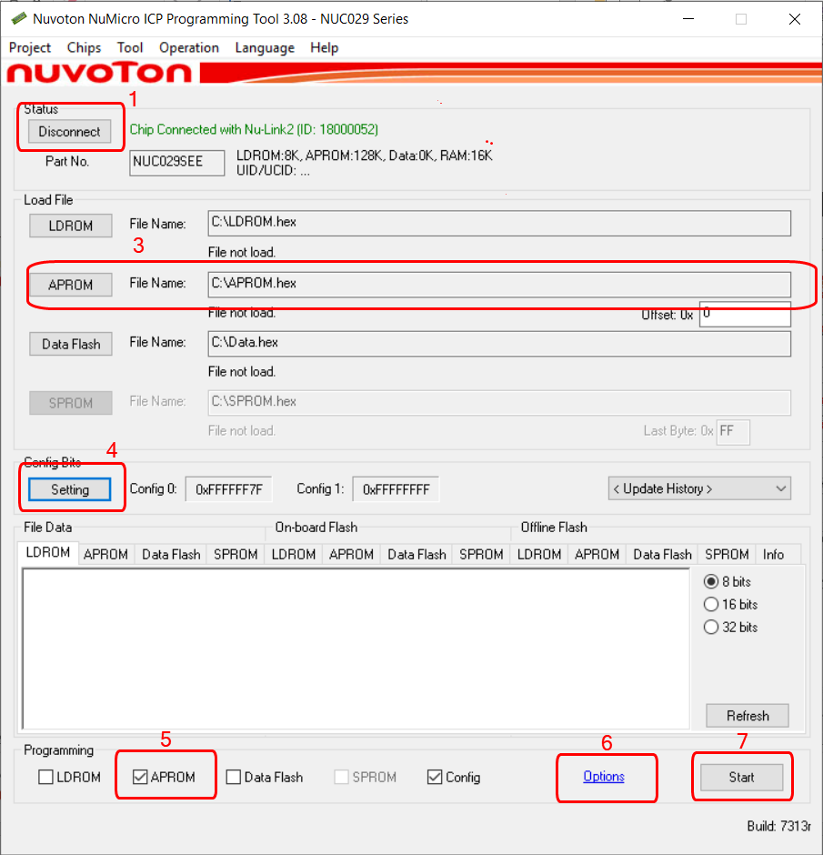
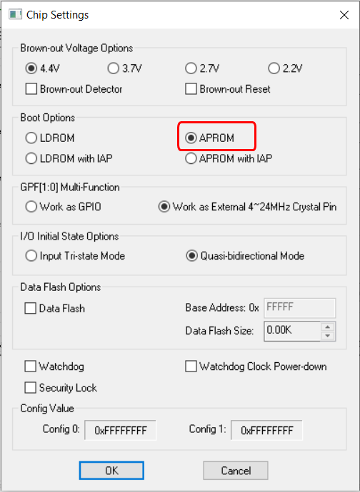
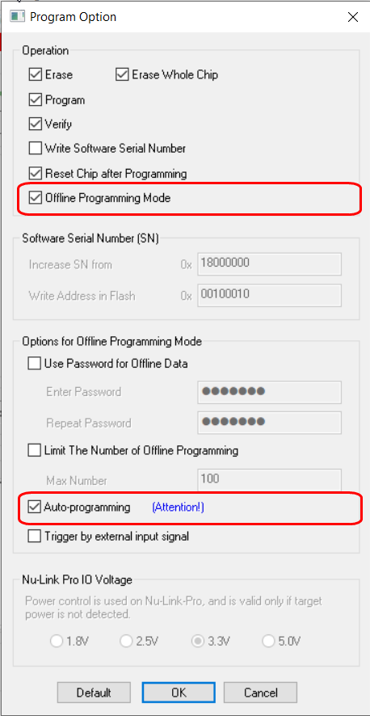
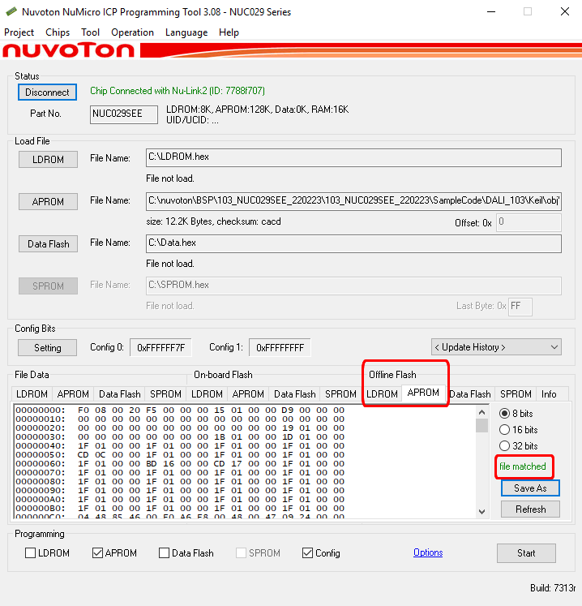
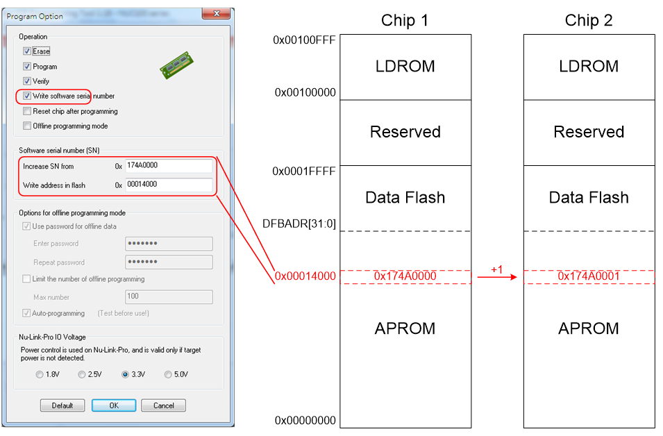

# Offline ICP Programming

## Overview

Offline Programming means that the Nu-Link can update the firmware without accessing software programs. Offline programming is useful for mass production since the original code or firmware file does not need to be delivered and only the Nu-Link is needed for mass production.

In addition, the Nu-Link supports "Limited Offline Programming," which can effectively control the authorized number of the firmware.

*Figure: Offline Programming Flow Diagram*

---

## Offline Data Storage Options

Nu-Link has three interfaces to download the offline data for offline download:

| Storage Option | Description | Supported devices |
|----------------|-------------|-------------|
| USB flash drive | External USB storage device | Nu-Link2-Pro and Nu-Link3-Pro |
| SD card | External SD card storage | Nu-Link2-Pro and Nu-Link3-Pro |
| Embedded SPI flash | Built-in flash memory | Nu-Link |

*Table: Offline Data Storage Options*

**Steps to use USB flash drive or SD card interface for offline download:**

1. Use **Tool → Create Offline USB/SD File** on the menu bar of ICP Tool to save **NuLink2.us** file and drag and drop the file into USB flash drive or SD card.
2. Plug USB flash drive or SD card into Nu-Link2-Pro and Nu-Link3-Pro.
3. Press the button on the Nu-Link2-Pro and Nu-Link3-Pro to start downloading.

---

## ICP Offline Programming and Auto Mode Steps

This section describes how to use Nu-Link for automatic offline programming.

**Step 1:** Open the ICP Tool, specify the **UI language** and **target chip**, and then click **Continue**.

**Step 2:** Click **Operation**, select **Erase Offline Data on Nu-Link** and make sure APROM is cleared.

*Figure: ICP Erase Whole Target Chip Diagram*

**Step 3:** Load target **APROM** file.

*Figure: ICP Offline Programming Diagram*

**Step 4:** Click **Setting** and select **Boot Option** as **APROM**.

*Figure: ICP Offline Programming Illustration of Chip Settings*

**Step 5:** Select the Programming target area as APROM.

**Step 6:** Click **Option** and select **Offline Programming Mode** and **Auto-programming**.

*Figure: ICP Offline Programming Illustration of Program Option*

**Step 7:** Press **Start** to storage offline data to Nu-Link, and confirm that APROM of Offline Flash and APROM of Load File are file matched.

*Figure: ICP Offline Flash File matched Diagram*

**Step 8:** Re-plug the power with Nu-Link and connect the target chip.

**Step 9:** Press Nu-Link button to trigger auto programming mode (first time needs trigger).

> **Note:** Auto programming includes "Erase", "Program", "Verify".

**Step 10:** Check the state LED.

**Step 11:** Remove old chip, connect to new chip, it will auto detect and start auto programming.

**Step 12:** Check the state LED.

**Step 13:** Repeat steps 11 and 12 for automatic programming.

---

## Wide Voltage Programming

The Nu-Link-Pro family supports the wide voltage programming function for offline programming. The development software tool can adjust the SWD port voltage as 1.8 V, 2.5 V, 3.3 V, or 5.0 V. The pins that can be controlled include VCC, ICE_DAT, ICE_CLK, and /RESET.

*Table: Supported Voltage Levels*

---

## Software Serial Number (SN)

The Software Serial Number (SN) function provided by the ICP Tool enables users to specify the value in the "Increase SN from" and "Write address in flash" fields for the target chip during offline programming.

The user can specify a set of "Increased Serial Number (SN)" and "Write Address" to any of APROM, LDROM, and Data Flash, and the written Serial Number (SN) will be automatically incremented.

*Figure: Software Serial Number (SN) Settings*
