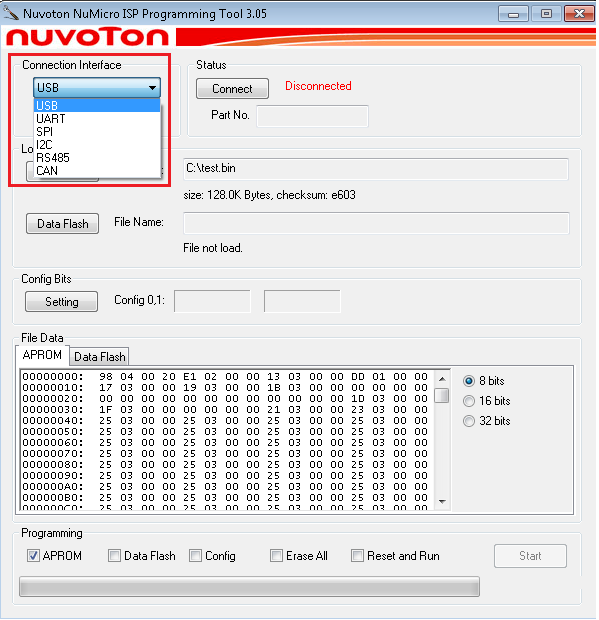
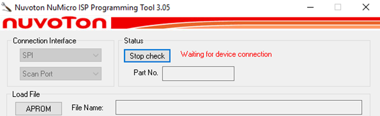
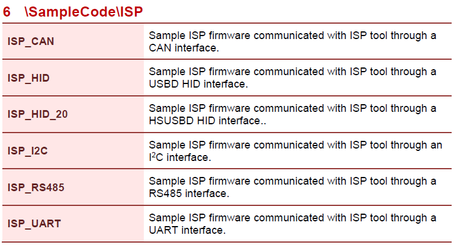
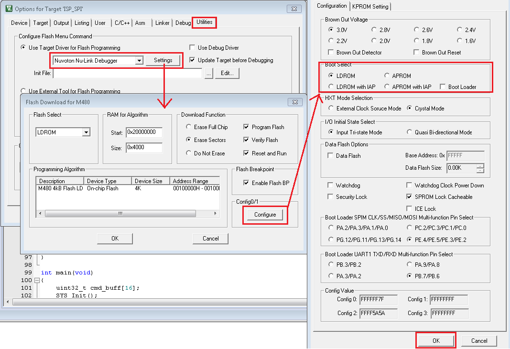
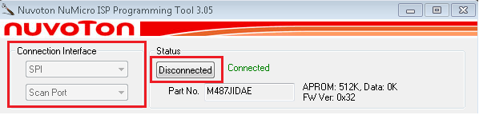
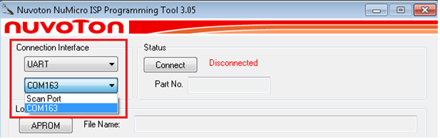
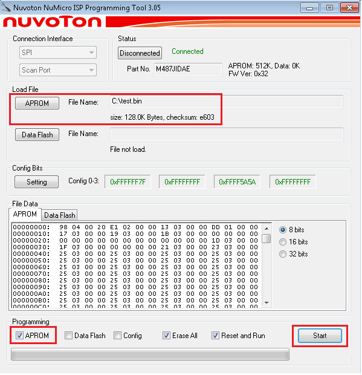

## Installation and Interface Selection

1. **Installation:** Download and install the latest [Nuvoton NuMicro® ISP Programming Tool](https://www.nuvoton.com/tool-and-software/software-tool/programmer-tool/).

2. **Select Interface:** Launch the ISP Tool and select the desired connection interface (e.g., UART, SPI, I2C).

   
   
   *Figure: Startup Screen of ISP Tool*

3. **Check Status:** Upon opening, the status will show "Disconnected" as the target chip is not yet linked.

   
   
   *Figure: ISP Tool is not connected to any device*

---

## Hardware Connection

4. Connect the Nu-Link to the target chip based on the selected interface. For detailed pin definitions and connection diagrams, please refer to:
   - **Nu-Link2-Pro**: [Bridge Interface](../../03_hardware_connection/nu-link2-pro.md#bridge-interface)
   - **Nu-Link3-Pro**: [Bridge Interface](../../03_hardware_connection/nu-link3-pro.md#bridge-interface)

---

## Prepare Target Firmware

1. The target chip must be running specific ISP bootloader firmware:
   - Download the BSP for your specific chip from [GitHub](https://github.com/OpenNuvoton/) or [Gitee](https://gitee.com/OpenNuvoton/).
   - Locate the ISP sample project in `SampleCode\ISP`.
   - Open the project in your IDE (e.g., Keil MDK).

   
   
   *Figure: ISP Firmware Sample Code Project*

2. **Flash ISP Bootloader:**
   - Configure the project to boot from **LDROM**.
   - Compile and download the ISP firmware to the target chip's **LDROM**.

   
   
   *Figure: Boot from LDROM Setting in Keil ISP Firmware Project*

---

## Establish Connection and Program

1. **Establish Connection:**
   - Return to the ISP Tool on your PC.
   - Click **Connect**.
   - Reset the target chip to execute the ISP code in LDROM. The tool should now detect the device.

   
   
   *Figure: Connect to Target Chip with SPI Interface*

2. **UART Configuration (If applicable):** If using UART, select the correct COM port corresponding to the Nu-Link VCOM.

   
   
   *Figure: Select VCOM Port Number with UART Interface*

3. **Program Device:**
   - Load the application binary file (APROM) you wish to flash.
   - Configure programming options.
   - Click **Start** to begin programming.

   
   
   *Figure: Program Data to Target Chip with SPI Interface*

   | ISP Interface | Connection Condition |
   |---------------|----------------------|
   | SPI, UART, I2C/I3C, RS-485, CAN | Chip reset reboots into LDROM; ISP FW connects to tool. |
   | USB | Chip reset reboots into LDROM; ISP FW checks control pin state (Low) to enter ISP mode. |

   *Table: ISP Entry Conditions*
