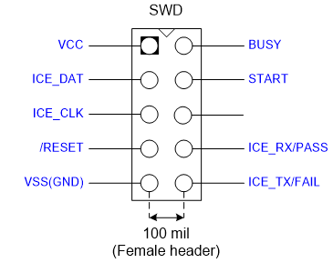
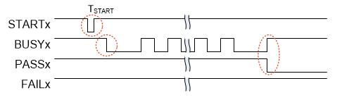
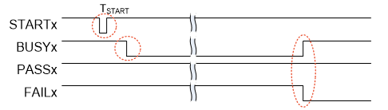

## Nu-Link2-Pro 

### Operating Current of ICP

When power is supplied via an USB during ICP online programming, the
operating current of Nu-Link2-Pro is shown in the Table: below.

| **SWD I/O Mode Settings** | **5.0 V** | **3.3 V** | **2.5 V** | **1.8 V** |
|---------------------------|:---------:|:---------:|:---------:|:---------:|
| USB Input Voltage (V)     |    5.0    |    5.0    |    5.0    |    5.0    |
| SWD I/O Voltage (V)       |   4.66    |   3.33    |   2.52    |   1.82    |
| USB Input Current (mA)    |    128    |    117    |    115    |    113    |

Table: Nu-Link2-Pro Operating Current (Online Programming)

When power is supplied from a target board (SWD VCC pin) during offline
programming with offline file stored on SPI flash, the operating current of
Nu-Link2-Pro is shown in the Table: below.

| **Power Supplied from a Target Board** | **5.0 V** | **3.3 V** | **2.5 V** | **1.8 V** |
|----|:--:|:--:|:--:|:--:|
| Power Supplied via an USB | Off | Off | Off | Off |
| SWD VCC Input Voltage (V) | 5.01 | 3.33 | 2.51 | 1.82 |
| SWD VCC Input Current (mA) | 77.5 | 127.5 | 155.4 | 167.5 |

Table: Nu-Link2-Pro Operating Current (Offline Programming) of SPI
Flash

When power is supplied from a target board (SWD VCC pin) during offline
programming with offline file stored on USB flash drive, the operating current
of Nu-Link2-Pro is shown in the Table: below.

| **Power Supplied from a Target Board** | **5.0 V** | **3.3 V** | **2.5 V** | **1.8 V** |
|----|:--:|:--:|:--:|:--:|
| Power Supplied via an USB | Off | Off | Off | Off |
| SWD VCC Input Voltage (V) | 5.00 | 3.22 | 2.52 | 1.82 |
| SWD VCC Input Current (mA) | 77.6 | 123.3 | 152.6 | 161.7 |

Table: Nu-Link2-Pro Operating Current (Offline Programming) of USB
Flash

When power is supplied from a target board (SWD VCC pin) during offline
programming with offline file stored on Micro SD card, the operating current of
Nu-Link2-Pro is shown in the Table: below.

| **Power Supplied from a Target Board** | **5.0 V** | **3.3 V** | **2.5 V** | **1.8 V** |
|----|:--:|:--:|:--:|:--:|
| Power Supplied via an USB | Off | Off | Off | Off |
| SWD VCC Input Voltage (V) | 5.01 | 3.28 | 2.53 | 1.81 |
| SWD VCC Input Current (mA) | 77.3 | 125.5 | 154.6 | 165.2 |

Table: Nu-Link2-Pro Operating Current (Offline Programming) of
Micro SD Card

### Operating Current of ISP

The operating current of Nu-Link2-Pro during ISP online programming with
power supply via USB is shown in the Table: below.

| **ISP programming Interface** | **I2C** | **SPI** | **RS-485** | **CAN** | **UART** |
|----|:--:|:--:|:--:|:--:|:--:|
| USB VCC Input Current (mA) | 117.1 | 114.3 | 151 | 191 | 114.2 |
| Target board Input Current (mA) | 11.9 | 15.1 | 47.1 | 90.1 | 15 |

Table: Operating Current of ISP Online Programming

### Automatic IC Programming System

The automatic IC programming system through individual slot and the
Control Bus as Figure:.

### Operation Sequence and Waveform

1.  The Nu-Link2-Pro power on. START, BUSY, PASS, and FAIL are set to
    logic high.

2.  To start programming, START needs to be set to logic 0 for
    TSTART,$\ 50ms \leq T_{START} \leq 80ms$

3.  Programming start-up. BUSY is set to logic 0, and might toggle
    during programming.

4.  When finish programming, BUSY is set to logic 1, and PASS or FAIL is
    set to logic 0.

- When BUSY is set to logic 1, and PASS is set to logic 0, means “PASS”.

- When BUSY is set to logic 1, and FAIL is set to logic 0, means “FAIL”.

