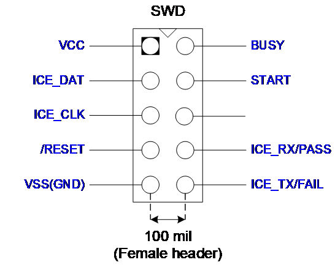
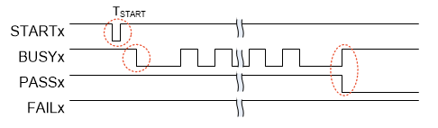
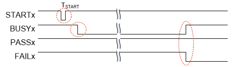

## Nu-Link3-Pro

This section provides technical reference data for the Nu-Link3-Pro, including operating current measurements under various programming modes and I/O voltage settings.

Powered through a USB interface, this programmer provides a stable 3.3 V / 300 mA (max) power output to the target board after accounting for its internal circuit power consumption.

> **Note:** It is recommended to keep the maximum system operating current of the target board within 300 mA. If the power consumption of the target side is higher, please use an external independent power supply.

### ICP Operating Current

#### Online Programming (USB Power Supply)

When power is supplied via USB during ICP online programming, the operating current of Nu-Link3-Pro is shown in the table below:

| SWD I/O Mode Settings | 5.0 V | 3.3 V | 2.5 V | 1.8 V |
|-----------------------|:-----:|:-----:|:-----:|:-----:|
| USB Input Voltage (V) | 5.0 | 5.0 | 5.0 | 5.0 |
| SWD I/O Voltage (V) | 5.02 | 3.37 | 2.55 | 1.84 |
| USB Input Current (mA) | 128 | 112 | 109 | 106 |

Table: Nu-Link3-Pro Operating Current (Online Programming)

#### Offline Programming - SPI Flash

When power is supplied from a target board (SWD VCC pin) during offline programming with the offline file stored on SPI flash, the operating current of Nu-Link3-Pro is shown in the table below:

| Power Supplied from a Target Board | 5.0 V | 3.3 V | 2.5 V | 1.8 V |
|------------------------------------|:-----:|:-----:|:-----:|:-----:|
| Power Supplied via USB | Off | Off | Off | Off |
| SWD VCC Input Voltage (V) | 4.93 | 3.34 | 2.52 | 1.86 |
| SWD VCC Input Current (mA) | 74 | 111 | 140 | 118 |

Table: Nu-Link3-Pro Operating Current (Offline Programming) of SPI Flash

#### Offline Programming - USB Flash Drive

When power is supplied from a target board (SWD VCC pin) during offline programming with the offline file stored on a USB flash drive, the operating current of Nu-Link3-Pro is shown in the table below:

| Power Supplied from a Target Board | 5.0 V | 3.3 V | 2.5 V | 1.8 V |
|------------------------------------|:-----:|:-----:|:-----:|:-----:|
| Power Supplied via USB | Off | Off | Off | Off |
| SWD VCC Input Voltage (V) | 5.00 | 3.22 | 2.52 | 1.82 |
| SWD VCC Input Current (mA) | 77.6 | 123.3 | 152.6 | 161.7 |

Table: Nu-Link3-Pro Operating Current (Offline Programming) of USB Flash Drive

#### Offline Programming - Micro SD Card

When power is supplied from a target board (SWD VCC pin) during offline programming with the offline file stored on a Micro SD card, the operating current of Nu-Link3-Pro is shown in the table below:

| Power Supplied from a Target Board | 5.0 V | 3.3 V | 2.5 V | 1.8 V |
|------------------------------------|:-----:|:-----:|:-----:|:-----:|
| Power Supplied via USB | Off | Off | Off | Off |
| SWD VCC Input Voltage (V) | 5.01 | 3.28 | 2.53 | 1.81 |
| SWD VCC Input Current (mA) | 77.3 | 125.5 | 154.6 | 165.2 |

Table: Nu-Link3-Pro Operating Current (Offline Programming) of Micro SD Card

### ISP Operating Current

The operating current of Nu-Link3-Pro during ISP online programming with power supply via USB is shown in the table below:

| ISP Programming Interface | I2C/I3C | SPI | RS-485 | CAN | UART |
|---------------------------|:-------:|:---:|:------:|:---:|:----:|
| USB VCC Input Current (mA) | 117.1 | 114.3 | 151 | 191 | 114.2 |
| Target board Input Current (mA) | 11.9 | 15.1 | 47.1 | 90.1 | 15 |

Table: Nu-Link3-Pro Operating Current (ISP Online Programming)

### Automatic IC Programming System

The automatic IC programming system operates through an individual slot and the Control Bus, as shown in the diagram below:

#### Operation Sequence and Waveform

1. The Nu-Link3-Pro powers on. START, BUSY, PASS, and FAIL are set to logic 1.

2. To start programming, START needs to be set to logic 0 for T_START (50ms ≤ T_START ≤ 80ms).

3. Programming start-up: BUSY is set to logic 0, and might toggle during programming.

4. When programming finishes, BUSY is set to logic 1, and PASS or FAIL is set to logic 0.
   - When BUSY is set to logic 1 and PASS is set to logic 0, it indicates **"PASS"**.
   - When BUSY is set to logic 1 and FAIL is set to logic 0, it indicates **"FAIL"**.

