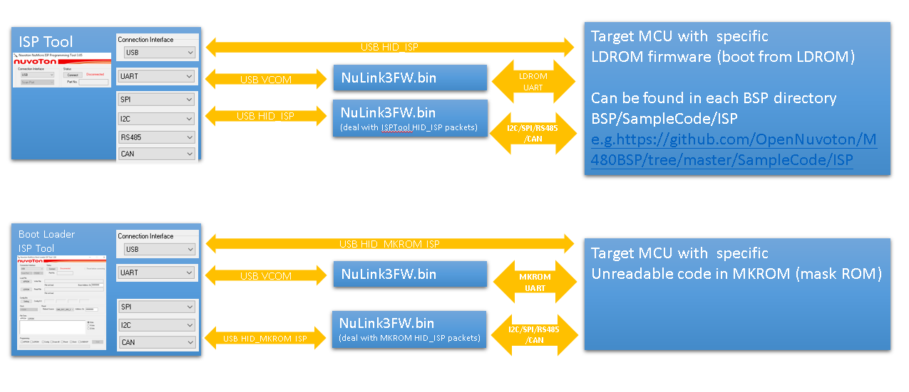

# Chapter 1: Overview

## 1.1 Introduction

The Nu-Link3-Pro is a powerful debugger and programmer designed for the Nuvoton NuMicro® Family microcontrollers. Its versatility makes it suitable for a range of applications, including both software and hardware development as well as mass production environments.

### System Overview

The following diagrams illustrate the various roles Nu-Link3-Pro can play in your development workflow:

**Debugger Mode:**

**Bridge / USB-to-Serial Mode:**

**Monitor Mode:**

**PulseView Logic Analyzer:**

**ISP Programming:**

---

## 1.2 Nu-Link3-Pro Features

The Nu-Link3-Pro offers complete programming and debugging support for all NuMicro® microcontrollers. This chapter outlines its features:

### 1.2.1 Programming and Debugging Support

- Compatible with all NuMicro® Family microcontrollers, enabling seamless programming and debugging across multiple device types.
- Serial Wire Debug (SWD) support enables fast and effective debugging processes.
- Selectable SWD output voltages, including 1.8 V, 2.5 V, 3.3 V, and 5.0 V, ensuring adaptability to various hardware requirements.
- Supports ICP for efficient microcontroller programming directly on the circuit board.
- ICP Programming Tool with robust image file protection to safeguard firmware integrity during programming.
- Drag & drop Flash programming for user-friendly and rapid firmware updates.
- Accepts image file storage via USB flash drive, SD card, and SPI Flash, offering flexibility in source media.
- Features an automatic IC programming system connector (Control Bus) for streamlined integration.
- It can be powered by USB Type-C or through the target system via the SWD interface, enhancing deployment options.
- Provides an ISP Programming Tool for efficient and reliable in-system programming.
- Allows multiple bridge connections for ISP functions, including I2C/I3C, SPI, CAN, UART, and RS-485 interfaces.

### 1.2.2 Advanced Debugging and Analysis

- Supports multiple debug interfaces and tools, catering to various development needs.
- Embedded Trace Macrocell (ETM) capability at speeds up to 110 MHz, allowing detailed trace analysis.
- Features unlimited breakpoints and step execution for in-depth troubleshooting.
- Compatible with Arm PyOCD for enhanced debugging and automation.
- Supports multi-interfaces analyzer, enabling monitoring of SPI, I2C/I3C, CAN, and RS-485 signals.
- Provides a virtual COM port via USB for convenient serial communication.
