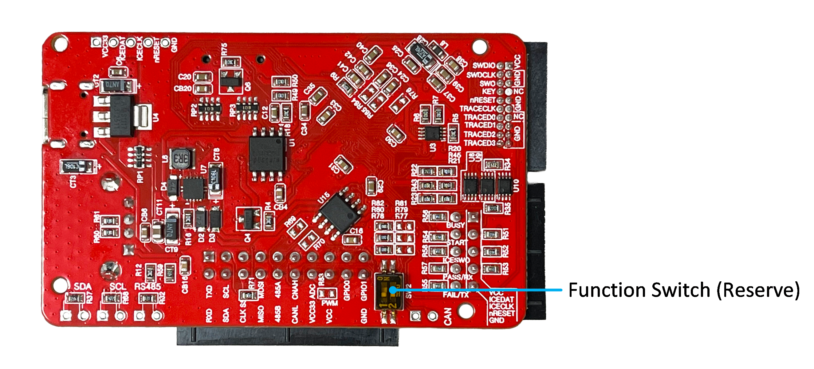
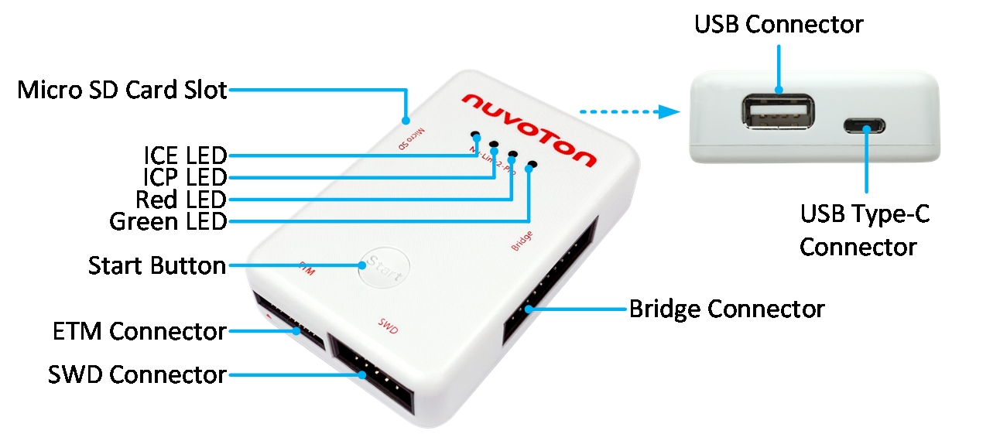
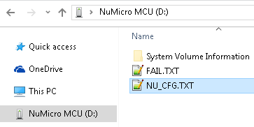

# Chapter 2: Getting Started with Nu-Link3-Pro

## 2.1 Nu-Link3-Pro Kit Contents

*Figure 2.1-1 Nu-Link3-Pro Full Kit Contents*

The Nu-Link3-Pro full kit contains:

- Nu-Link3-Pro main body (2952mil x 1968mil x 688mil)
- USB cable (0.3m, high-speed, USB Type-C)
- ETM cable (50-mil 20-pin IDC flat cable with 50-mil 20-pin connectors)
- SWD cable (100-mil 10-pin squid cable with 10 x 100-mil sockets)
- Bridge cable (100-mil 20-pin squid cable with 20 x 100-mil sockets)

---

## 2.2 Nu-Link3-Pro PCBA

### Front View

*Figure 2.2-1 Front View of Nu-Link3-Pro PCBA*

The following lists components and connectors from the front view:

- Main Chip: M55S1K2LJAE
- Micro SD Card Slot
- USB Type-C Connector
- USB Connector
- Bridge Connector
- SWD Connector
- Start Button
- ETM Connector

### Rear View

*Figure 2.2-2 Rear View of Nu-Link3-Pro PCBA*

The following lists components and connectors from the rear view:

- Function Switch (Reserved)

---

## 2.3 Nu-Link3-Pro Overview

*Figure 2.3-1 Nu-Link3-Pro Connector and Function Overview*

### Connectors and Functions

#### USB Type-C Connector (J2)
- USB Type-C port of a PC to debug and program target chips through the development software tool

#### Bridge Connector (CON6)
- UART (Used for Offline ISP)
- I3C Transmission Interface
- SPI Transmission Interface
- RS-485 Transmission Interface
- CAN BUS Transmission Interface
- PWM/Capture
- PSIO
- ADC
- GPIO

#### SWD Connector (CON4)
- SWD Host Interface
- ICP Offline Programming
- Virtual COM by UART (Used for Online ISP)
- Automatic IC Programming

#### ETM Connector (CON3)
- ETM Interface
- SWD Host Interface

#### USB Connector (CON5)
- USB Flash Drive for ICP Offline Programming

#### Micro SD Card Slot
- Save bin file for ICP Offline Programming

#### Start Button (SW1)
- Click this button to proceed with offline programming

#### Status LED (ICES0, ICES1, ICES2, ICES3)
- Display the operation status of the Nu-Link3-Pro

---

## 2.4 Status LEDs

| Nu-Link3-Pro Operation Status | ICE | ICP | Red | Green |
|-------------------------------|:---:|:---:|:---:|:-----:|
| Boot | Flash×3 | Flash×3 | Flash×3 | Flash×3 |
| One Nu-Link3-Pro selected to connect | Flash×3 | Flash×3 | Flash×3 | On |
| ICE Online (Not connected with a target chip) | On | - | Flash×3 | Flash×3 |
| ICE Online (Connected with a target chip) | On | - | - | On |
| ICE Online (Failed to connect with a target chip) | On | Any | Flash | On |
| During Offline Programming | - | On | - | Flash |
| Offline Programming Completed | On | - | - | - |
| Offline Programming Completed (Auto mode) | On | On | - | - |
| Offline Programming Failed | On | Flash | - | - |

*Table 2.3-1 Status LEDs Difference List*

---

## 2.5 Nu-Link3 Adapter Firmware Update

**Nu-Link firmware binary files can be found on the [Releases page](https://github.com/OpenNuvoton/Nuvoton_Tools/releases) on GitHub.**

**Requirement: Nu-Link3 needs v3.22.7946r or above**

Users can reprogram Nu-Link3 with another .bin file using the following instructions (Windows OS):

1. Press the button on Nu-Link3 and plug in the USB cable.
2. The "Nu-Link3" disk will appear. (If you see the disk name as "NuMicro MCU", it will upgrade the target device firmware instead of Nu-Link3 itself.)
3. Drag and drop the Nu-Link3 firmware .bin file into the disk.
4. Re-plug the USB cable and it's done.

---

## 2.6 Configuration Options

You will see some options in NU_CFG.TXT:

* Open the NU_CFG.TXT file in the pop-up "NuMicro MCU" disk  
  

* Set `POWER-MODE` for SWD output voltage level (mainly for CMSIS-DAP interface use).

* Set `CMSIS-DAP=1`; Enables CMSIS-DAP. This is the default setting.
* Set `CMSIS-DAP=0`; Disables CMSIS-DAP. Use this if the interface interferes with other operations.

* Set `BUTTON-MODE=0`; This is the default setting. Offline programming via SWD pins.
* Set `BUTTON-MODE=1`; Offline ISP programming via BRIDGE pins (UART, I2C, I3C, SPI, CAN FD, RS-485, USB-HID).
* Set `BUTTON-MODE=2`; Custom offline programming via MicroPython. Nu-Link3-Pro will run MAIN.PY on the microSD card.
