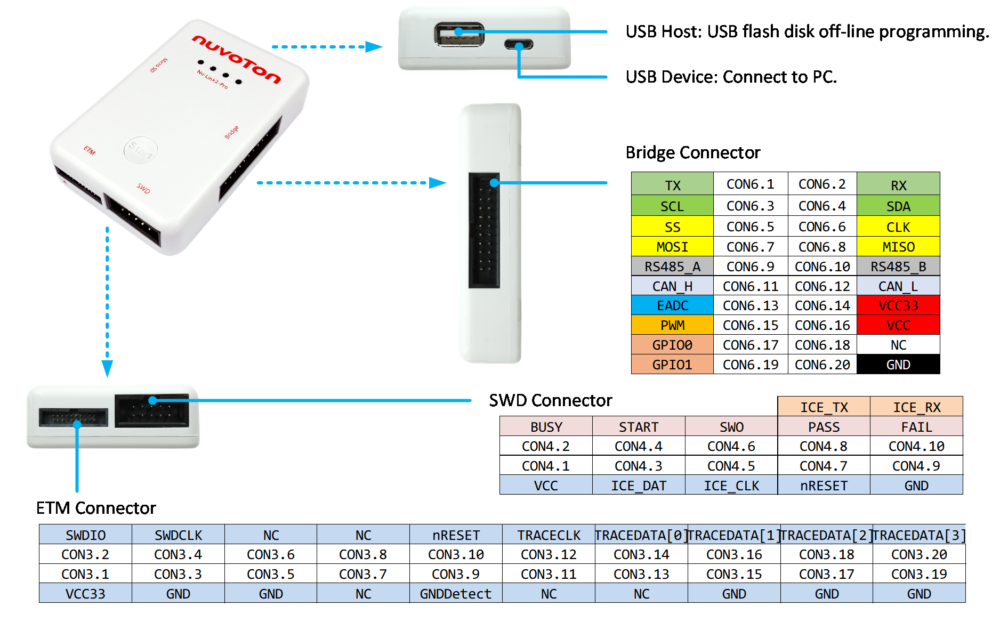
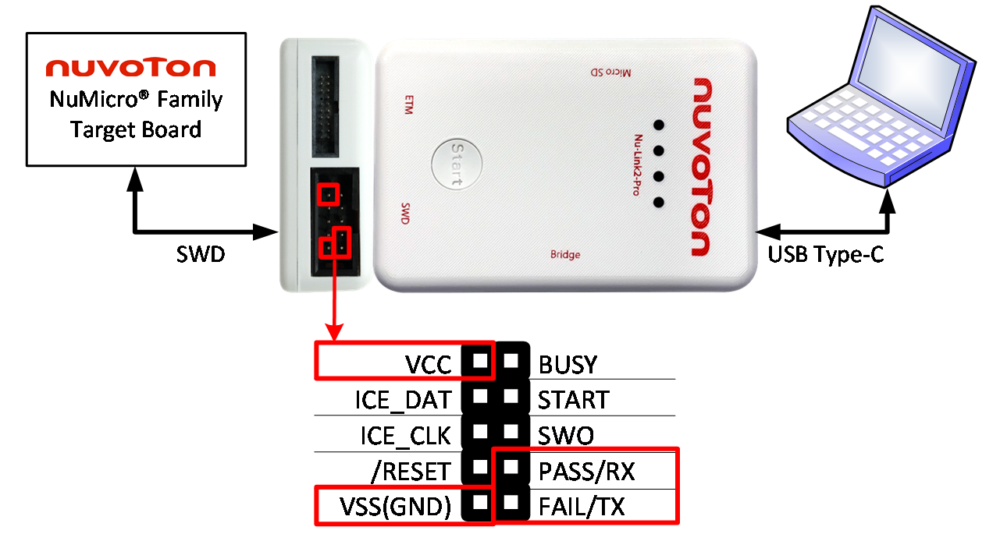
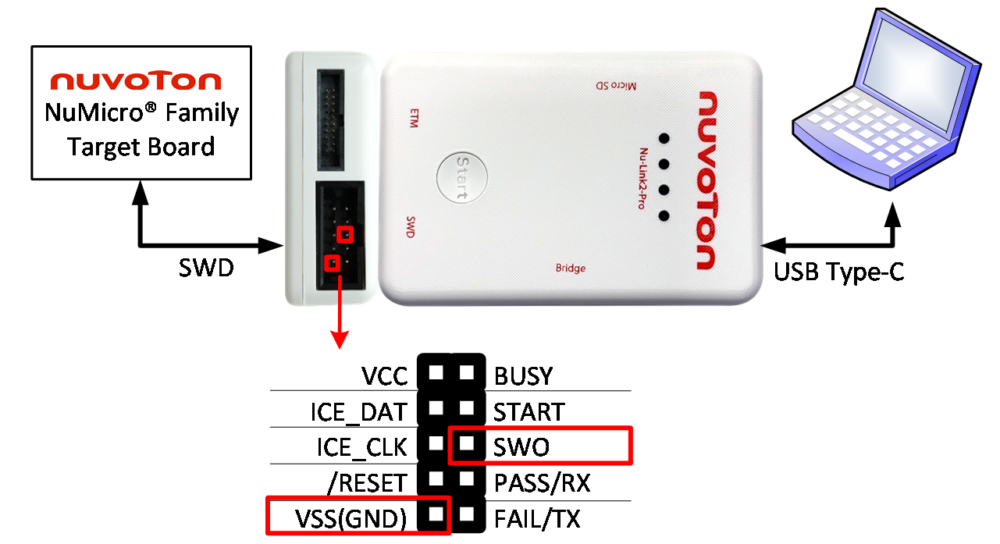
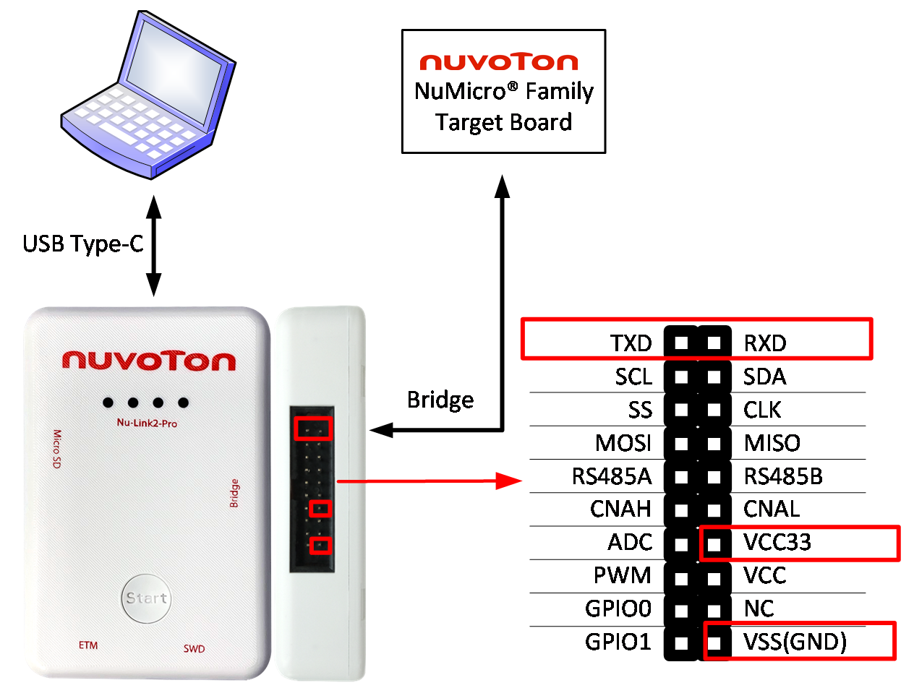
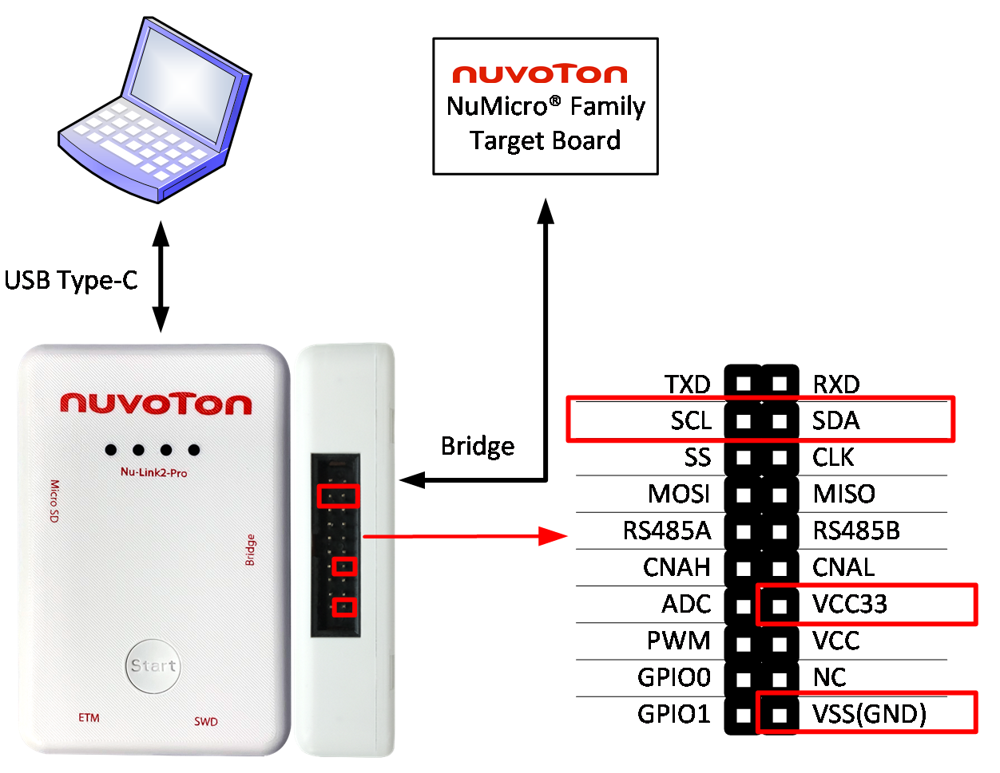
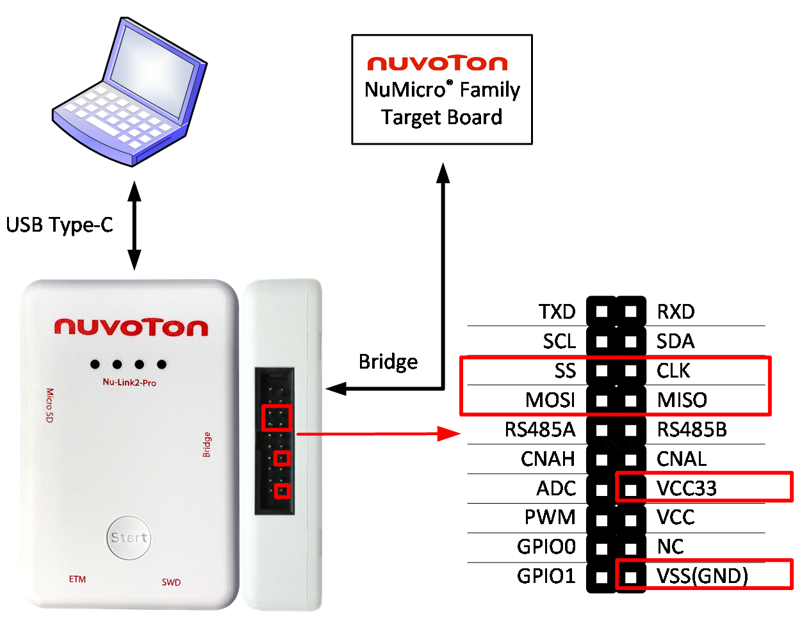
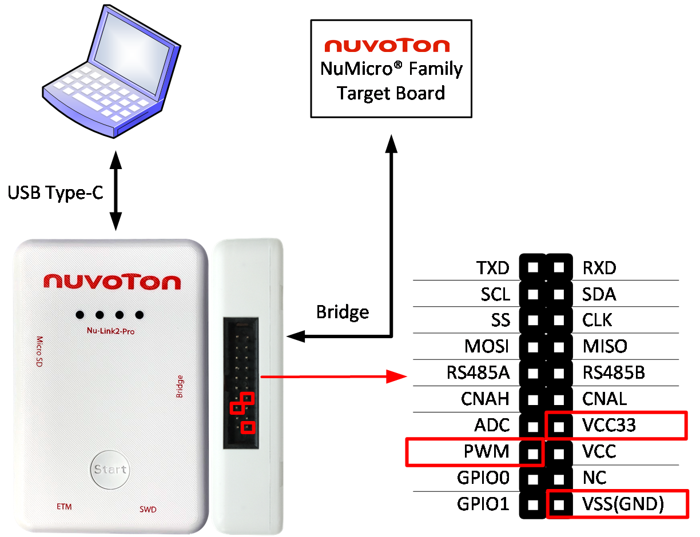
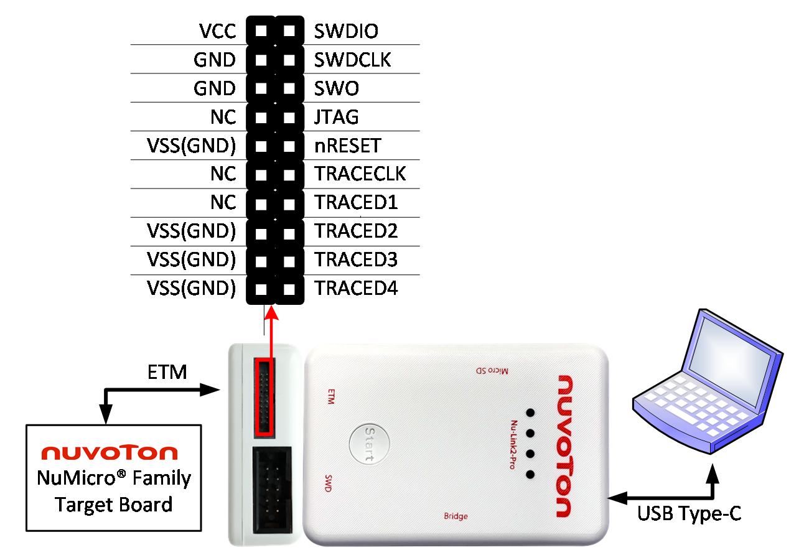

# Chapter 3: Connecting the Nu-Link3-Pro

This chapter introduces how to connect the Nu-Link3-Pro to a computer, and how to connect individual connectors to development board or products.

---

## 3.1 Nu-Link3-Pro Compatible Extension Connectors

*Figure 3.1-1 Pin Definition of Nu-Link3-Pro Connectors*

The Nu-Link3-Pro mainly contains USB, USB Type-C, Bridge interface, ETM interface and SWD interface. Users can freely select a suitable interface for debugger and programmer.

---

## 3.2 SWD Interface Pin Definition and Function Connection

| Pin Name | Pin Number | Pin Description |
|----------|------------|-----------------|
| VCC | CON4.1 | Target Board voltage supply. The Nu-Link3-Pro supports the wide voltage programming function, by ICP tool can adjust the SWD port voltage as 1.8V, 3.3V, 2.5V or 5.0V.|
| BUSY | CON4.2 | "BUSY" is Control Bus signals for IC Programmer. For details, please refer to [section 7.3](ch7_appendix.md#73-automatic-ic-programming-system). |
| ICE_DAT | CON4.3 | Serial Wired Debugger Data pin |
| START | CON4.4 | "START" is Control Bus signals for IC Programmer. For details, please refer to [section 7.3](ch7_appendix.md#73-automatic-ic-programming-system). |
| ICE_CLK | CON4.5 | Serial Wired Debugger Clock pin |
| SWO | CON4.6 | Single-Wire Trace and Monitoring |
| /RESET | CON4.7 | IC reset pin, Nu-Link3-Pro will automatically reset the target IC during the programming process. |
| PASS/TX | CON4.8 | "PASS" is Control Bus signals for IC Programmer. Also UART TX for Virtual COM (Used for Online ISP). For details, please refer to [section 7.3](ch7_appendix.md#73-automatic-ic-programming-system). |
| GND | CON4.9 | Ground |
| FAIL/RX | CON4.10 | "FAIL" is Control Bus signals for IC Programmer. Also UART RX for Virtual COM (Used for Online ISP). For details, please refer to [section 7.3](ch7_appendix.md#73-automatic-ic-programming-system). |

*Table 3.2-1 SWD Interface Pin Definition and Description*

### 3.2.1 ICE Programming Connection

The Nu-Link3-Pro provides ICE function to Programming and debugging on PC.

*Figure 3.2-1 SWD Interface Connection Diagram for ICE*

| Pin Name | Pin Number | Pin Corresponding to the Target Board |
|----------|------------|---------------------------------------|
| VCC | CON4.1 | VCC |
| ICE_DAT | CON4.3 | ICE_DAT |
| ICE_CLK | CON4.5 | ICE_CLK |
| /RESET | CON4.7 | /RESET |
| VSS(GND) | CON4.9 | VSS(GND) |

*Table 3.2-2 SWD Interface Corresponding Pin for ICE*

### 3.2.2 Virtual COM Connection

The Nu-Link3-Pro provides virtual COM port (VCOM) function to print out messages on PC, and the Virtual COM transmission data by UART0. The UART here is also used by default for Online ISP.

*Figure 3.2-2 SWD Interface Connection Diagram for Virtual COM*

| Pin Name | Pin Number | Pin Corresponding to the Target Board |
|----------|------------|---------------------------------------|
| VCC | CON4.1 | VCC |
| PASS/RX | CON4.8 | UART_RX |
| VSS(GND) | CON4.9 | VSS(GND) |
| FAIL/TX | CON4.10 | UART_TX |

*Table 3.2-3 SWD Interface Corresponding Pin for Virtual COM*

### 3.2.3 Automatic IC Programming Connection

The Nu-Link3-Pro provides Automatic IC Programming function to mass production. For details about Control Bus signals, please refer to [section 7.3](ch7_appendix.md#73-automatic-ic-programming-system).

*Figure 3.2-3 SWD Interface Connection Diagram for Automatic IC Programming*

### 3.2.4 SWO Debug Connection

The Nu-Link3-Pro supports SWO (Serial Wire Output) for trace and monitoring functions.

*Figure 3.2-4 SWD Interface Connection Diagram for SWO debug*

---

## 3.3 Bridge Interface Pin Definition and Function Connection

| Pin Name | Pin Number | Pin Description |
|----------|------------|-----------------|
| TXD | CON6.1 | Data transmitter output pin for UART (Used for Offline ISP) |
| RXD | CON6.2 | Data receiver input pin for UART (Used for Offline ISP) |
| SCL | CON6.3 | I2C/I3C clock |
| SDA | CON6.4 | I2C/I3C data input/output |
| SS | CON6.5 | SPI slave select |
| CLK | CON6.6 | SPI serial clock |
| MOSI | CON6.7 | SPI MOSI (Master Out, Slave In) |
| MISO | CON6.8 | SPI MISO (Master In, Slave Out) |
| RS-485A | CON6.9 | RS-485 Data plus signal |
| RS-485B | CON6.10 | RS-485 Data minus signal |
| CANH | CON6.11 | CAN BUS Data plus signal |
| CANL | CON6.12 | CAN BUS Data minus signal |
| ADC | CON6.13 | ADC analog input signal |
| VCC33 | CON6.14 | Target Board voltage supply. The Nu-Link3-Pro Bridge VCC only supports 3.3V. |
| PWM | CON6.15 | PWM output/Capture input |
| VCC | CON6.16 | Target Board voltage supply. The Nu-Link3-Pro Bridge VCC support 1.8V, 2.5V, 3.3V and 5.0V. |
| GPIO0 | CON6.17 | General Purpose I/O 0 |
| NC | CON6.18 | NC |
| GPIO1 | CON6.19 | General Purpose I/O 1 |
| GND | CON6.20 | Ground |

*Table 3.3-1 Bridge Interface Pin Definition and Description*

### 3.3.1 UART Connection

This connection is also used by default for Offline ISP.

*Figure 3.3-1 Bridge Interface Connection Diagram for UART*

### 3.3.2 I2C/I3C Connection

*Figure 3.3-2 Bridge Interface Connection Diagram for I2C/I3C*

### 3.3.3 SPI Connection

*Figure 3.3-3 Bridge Interface Connection Diagram for SPI*

### 3.3.4 RS-485 Connection

*Figure 3.3-4 Bridge Interface Connection Diagram for RS-485*

### 3.3.5 CAN BUS Connection

*Figure 3.3-5 Bridge Interface Connection Diagram for CAN BUS*

### 3.3.6 PWM and Capture

*Figure 3.3-6 Bridge Interface Connection Diagram for PWM*

### 3.3.7 ADC Connection

*Figure 3.3-7 Bridge Interface Connection Diagram for ADC*

### 3.3.8 GPIO Connection

*Figure 3.3-8 Bridge Interface Connection Diagram for GPIO*

---

## 3.4 ETM Interface Pin Definition and Function Connection

| Pin Name | Pin Number | Pin Description |
|----------|------------|-----------------|
| VCC | CON3.1 | Target Board voltage supply. |
| SWDIO | CON3.2 | Serial Wired Debugger Data pin |
| GND | CON3.3 | Ground |
| SWDCLK | CON3.4 | Serial Wired Debugger Clock pin |
| GND | CON3.5 | Ground |
| SWO | CON3.6 | SWO |
| NC | CON3.7 | NC |
| JTAG | CON3.8 | JTAG |
| GND | CON3.9 | Ground |
| /RESET | CON3.10 | IC reset pin, Nu-Link3-Pro will automatically reset the target IC during the programming process. |
| NC | CON3.11 | NC |
| TRACECLK | CON3.12 | ETM trace clock pin. |
| NC | CON3.13 | Ground |
| TRACEDATA[0] | CON3.14 | ETM trace data output pin. |
| GND | CON3.15 | Ground |
| TRACEDATA[1] | CON3.16 | ETM trace data output pin. |
| GND | CON3.17 | Ground |
| TRACEDATA[2] | CON3.18 | ETM trace data output pin. |
| GND | CON3.19 | Ground |
| TRACEDATA[3] | CON3.20 | ETM trace data output pin. |

*Table 3.4-1 ETM Interface Pin Definition and Description*

### 3.4.1 ETM Connection

*Figure 3.4-1 ETM Interface Connection Diagram for SWD and ETM Function*

---

## 3.5 ICP Offline Programming Function Connection

*Figure 3.5-1 ICP Offline Programming Illustration of SWD Interface*
