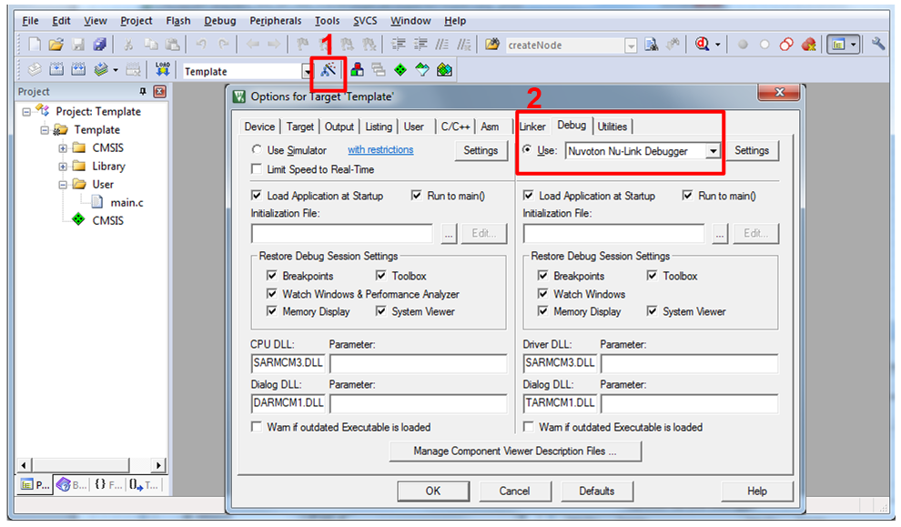
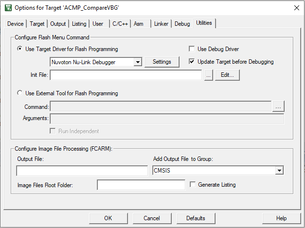
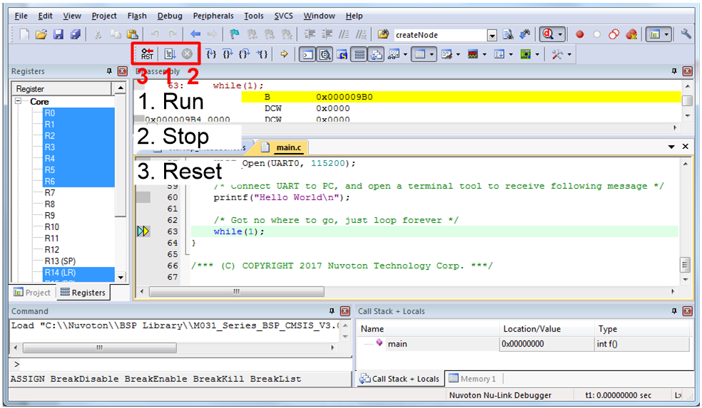
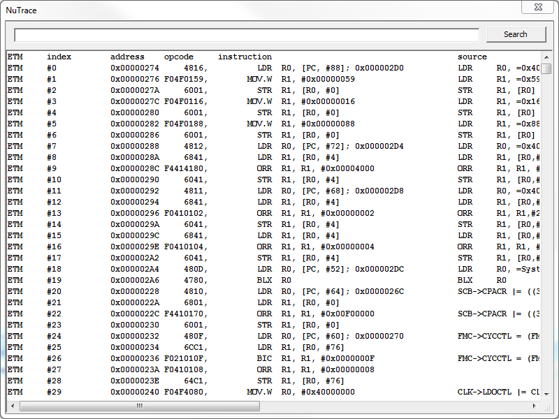
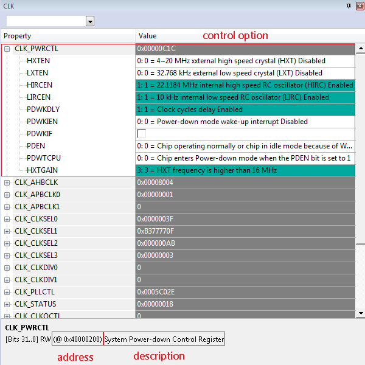

# 4.1 Keil MDK

**Prerequisites:**

- **Install Keil MDK:** Ensure the Keil MDK environment is properly installed on your system.
- **Install Nu-Link Driver:** Before configuring the Nu-Link3-Pro, download and install the [Nu-Link_Keil_Driver](https://www.nuvoton.com/tool-and-software/ide-and-compiler/). This driver is essential for Keil MDK to recognize the Nu-Link3-Pro hardware.

---

## 4.1.1 Debugger Settings

1. **Open the Project:** Double-click the **Template.uvproj** file to launch the project.

   > **Note on Project Migration:** If the "Device not found" warning appears, you must migrate the project to the Version 5 format. During this process, the file extension will change from **.uvproj** to **.uvprojx**.

2. **Enable Debug Information:** Navigate to **Project → Options for Target → Output**. Ensure the **Debug Information** option is checked.

   
   
   *Figure 4.1-1 Enable Debug Information for Keil MDK*

3. **Select the Debugger:** Navigate to **Project → Options for Target → Debug**. In the "Use" drop-down menu on the right, select **Nuvoton Nu-Link Debugger** and ensure the option is checked.

   
   
   *Figure 4.1-2 Debugger Setting in Options Window*

4. **Configure Debug Parameters:** Click the **Settings** button to open the **Debug** setup window.

   | Debug Function | Description |
   |----------------|-------------|
   | Driver Version | Displays the Nu-Link3-Pro driver version currently installed on the host PC |
   | Chip Type | Used to specify the target chip series |
   | Reset | Select **Reset** type to allow the debugger to automatically reset the target chip |
   | IO Voltage | Specifies the SWD port I/O voltage (1.8 V, 2.5 V, 3.3 V, or 5 V) |

   *Table 4.1-1 Debugger Function Settings Description*
   
---

## 4.1.2 Programmer Settings

5. **Select Flash Driver:** Navigate to **Project → Options for Target → Utilities**. Ensure **Use Target Driver for Flash Programming** is enabled and select **Nuvoton Nu-Link Debugger** from the drop-down menu. Additionally, check the **Update Target before Debugging** option.

   
   
   *Figure 4.1-3 Keil MDK Programmer Selection*

6. **Configure Flash Download:** Click the **Settings** button to open the **Flash Download** setup window. Here, you can specify actions to be performed before programming the target via the Nu-Link3-Pro.

   
   
   *Figure 4.1-4 Nu-Link3-Pro Programming Settings*

7. **Compile and Download:** Click **Rebuild** to compile all target files. After a successful compilation, click the **Download** button to flash the code to memory. To begin a session, click the **Start/Stop Debug Session** button to enter debug mode.

   
   
   *Figure 4.1-5 Compile and Download the Project*

8. **Execution and Monitoring:** Click **Run** to execute the code; debug messages will be displayed. While in debug mode, you can analyze the project by inspecting source code, assembly language, and peripheral registers, as well as utilizing breakpoints, step-run, and variable monitoring.

   
   
   *Figure 4.1-6 Keil MDK Debug Mode*

---

## 4.1.3 ETM Trace Settings

To enable **Embedded Trace Macrocell (ETM)** tracing on Nuvoton Cortex®-M4, M23, M33 and M55 devices, connect the device using the **Nu-Link3-Pro** with a 20-pin connector and follow these steps:

1. **Open the Project:** Open the **Template.uvproj** file located in the M480 BSP.

2. **Configure NuTrace Settings:** In the **Options for Target → Debug** setup dialog, select the **Trace** tab and configure:
   - **Trace Port:** Select **Sync Trace Port with 4-bit data**
   - **Capture Mode:** Specify whether trace data is collected before or after a trigger
   - **Enabling Trace:** Ensure both Trace Enable and ETM Trace Enable are checked

   
   
   *Figure 4.1-7 Trace Setup with ETM*

3. **Build and Download:** Build the project and download the code to the target chip.

4. **Invoke NuTrace:** Start the debugger to enter Debug mode. Navigate to **Debug → NuTrace** to open the trace information dialog.

5. Set **breakpoints** or use **single-step execution** to observe the instruction flow.

   
   
   *Figure 4.1-8 Tracing Information Dialog*

   

---

## 4.1.4 Debug Mode

The Nu-Link3-Pro supports debugging for NuMicro® Family chips via the SWD interface. This section covers the primary debug features available in Keil MDK.

| Debug Feature | Description |
|---------------|-------------|
| Breakpoints | Pause execution at specific code lines for inspection |
| System Viewer | View and modify peripheral registers in real-time |
| Semihost | Output debug messages via debugger |

*Table 4.1-2 Debug Mode Features*

### Breakpoints

Breakpoints allow you to pause program execution at specific lines of code. During real-time simulation, the chip will halt at each breakpoint, enabling you to inspect variables, registers, and program state.

**To set a breakpoint:**
1. Enter Debug mode by clicking **Start/Stop Debug Session**.
2. Click in the gray margin next to a line of code to toggle a breakpoint.
3. Run the program; execution will pause at each breakpoint.

*Figure 4.1-9 Setting Breakpoints in Keil MDK Debug Mode*

### System Viewer

The System Viewer displays peripheral register contents and allows real-time manipulation. This is useful for debugging hardware configurations and peripheral states.

**To use System Viewer:**
1. Enter Debug mode.
2. Navigate to **View → System Viewer**.
3. Select a peripheral from the list (e.g., ADC, CAN, CLK, GPIO, TIMER).

*Figure 4.1-10 System Viewer Menu in Keil MDK Debug Mode*

**Register Operations:**
- **Expand register details:** Double-click a register name to view bit fields.
- **Modify values:** Click on a register value to edit it directly. Changes are written to the target chip immediately.

*Figure 4.1-11 System Viewer Register Details in Keil MDK Debug Mode*

### Semihost

Semihost enables debug message output through the debugger interface, eliminating the need for a physical UART connection. Messages from the microcontroller are redirected to the Keil MDK debug window via the Nu-Link3-Pro.

**To enable Semihost:**

1. **Enable Semihost Macro:**
   - Navigate to **Project → Options for Target → C/C++**.
   - Add `DEBUG_ENABLE_SEMIHOST` to the **Define** field.

2. **Rebuild the Project:**
   - Click **Rebuild** to recompile with semihost support.

3. **Enter Debug Mode:**
   - Click **Start/Stop Debug Session**.

4. **Open Serial Window:**
   - Navigate to **View → Serial Windows → UART #1**.

5. **Run the Program:**
   - Press **F5** or click **Run**. Debug messages will appear in the UART #1 window.

*Figure 4.1-12 Semihost Output in Keil MDK Debug Mode*

> **Note:** Semihost output is slower than hardware UART but is useful for debugging when UART pins are unavailable or in use by the application.
