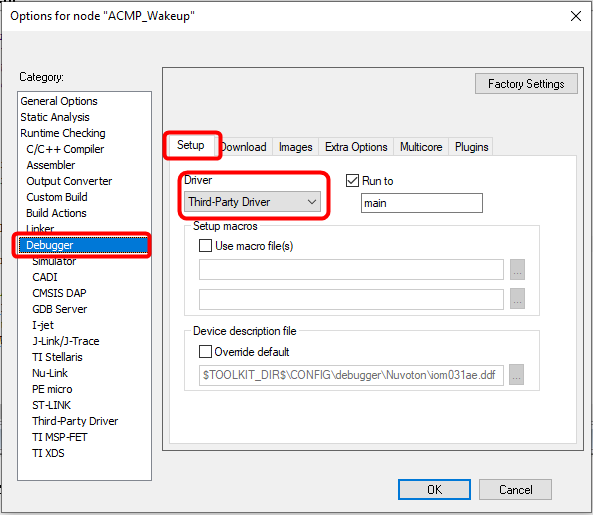
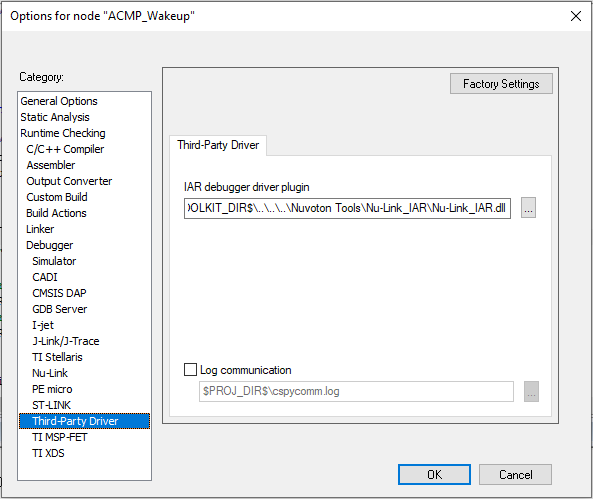
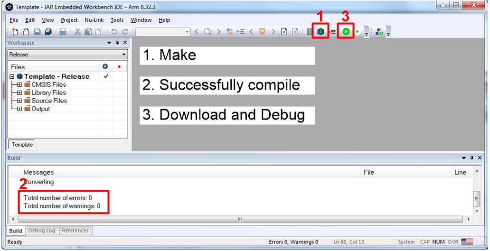

# 4.2 IAR EWARM

**Prerequisites:**

- Install **IAR EWARM**.
- Download and install [Nu-Link_IAR_Driver](https://www.nuvoton.com/tool-and-software/ide-and-compiler/) for IAR EWARM before configuring the Nu-Link3-Pro.

---

## 4.2.1 Project Settings

1. Open IAR EWARM, and open the project to be configured.

2. In the **Target** tab of the **General Options** page (through invoking **Project → Options**), click the button to the right of the **Device** option and select your target chip.

   
   
   *Figure 4.2-1 IAR EWARM Target Chip Selection*

---

## 4.2.2 Debugger and Programmer Settings

3. In the **Setup** tab of the **Debugger** page, select **Third-Party Driver** as the driver.

   
   
   *Figure 4.2-2 Set IAR EWARM as Third-Party Driver for Debugger & Programmer*

4. In the **Download** tab of the **Debugger** page, make sure that the **Use flash loader(s)** option is selected.

   
   
   *Figure 4.2-3 IAR EWARM Programming Settings*

5. In the **Download** tab, select the **Override default .board file** option if you want the firmware to be downloaded to APROM or LDROM, and then specify the appropriate .board file.

   
   
   *Figure 4.2-4 Select .board File for IAR EWARM*

---

## 4.2.3 Driver Plugin File Settings

6. In the **Third-Party Driver** page, specify the path of the IAR debugger driver plugin `C:\Program Files\Nuvoton Tools\Nu-Link_IAR\Nu-Link_IAR.dll`.

   
   
   *Figure 4.2-5 Set the Path of the IAR EWARM Debugger Driver Plugin*

7. Click **OK** to save the settings and return to the IAR EWARM main window.

8. Invoke **Nu-Link3-Pro** to open the Nu-Link form, select **SWD** as the Port, and specify the **Nu-Link3-Pro I/O Voltage** in the **Target power control** section.

   
   
   *Figure 4.2-6 Specify the Port and Target I/O Voltage*

---

## 4.2.4 Compile and Debug

9. After successfully compiling the project, download code to the flash memory and enter debug mode.

   
   
   *Figure 4.2-7 Compile and Download the Project*

10. Click "Go" and the debug message will be printed out. Users can debug the project under debug mode by checking source code, assembly language, peripherals' registers, and setting breakpoint, step run, value monitor, etc.

    
    
    *Figure 4.2-8 IAR EWARM Debug Mode*
