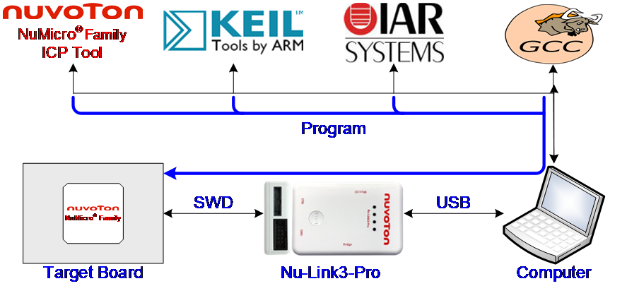
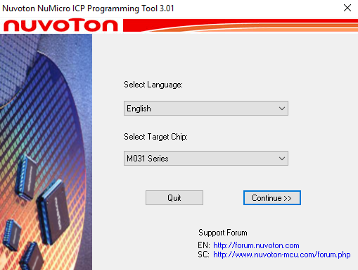
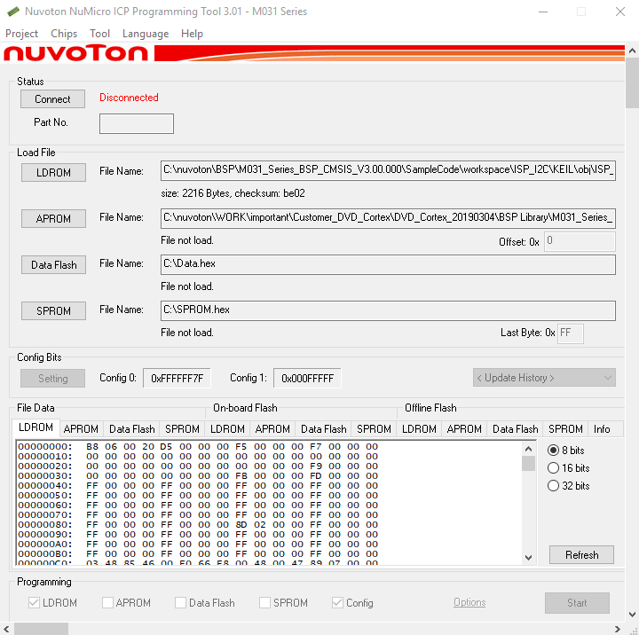
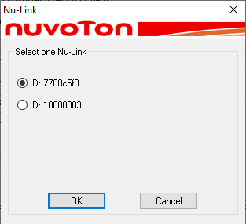
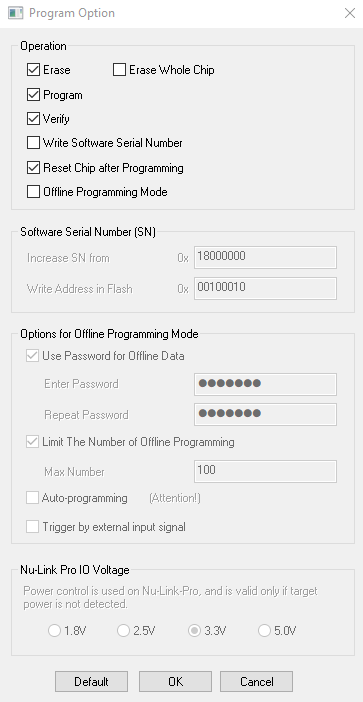
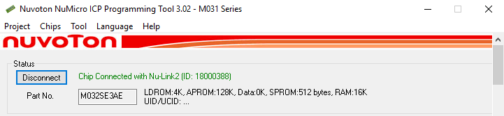
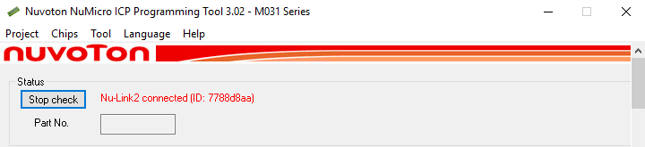
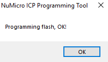

# 5.1.1 Online ICP Programming

Online Programming means that the Nu-Link3-Pro can download the firmware to the target chip through software programs.

*Figure 5.1.1-1 Online Programming Flow Diagram*

---

## Installation and Launch

1. **Installation:** Download and install the latest version of the **Nuvoton NuMicro® ICP Programming Tool** from the [official website](https://www.nuvoton.com/tool-and-software/software-tool/programmer-tool/).

2. **Initial Launch:** Open the ICP Tool. Select your preferred **UI language** and the specific **target chip** series, then click **Continue** to enter the main interface.

   
   
   *Figure 5.1.1-2 Startup Screen of ICP Tool*

3. **Connection Status:** Upon entering the main window, the connection status in the status bar will display as **"Disconnected"**. This indicates that the ICP Tool has not yet established a communication link with the Nu-Link3-Pro hardware.

   
   
   *Figure 5.1.1-3 ICP Tool Main Window*

---

## Establishing Connection

4. **Click the Connect button.** If multiple Nu-Link3-Pro adapters are connected to the host, proceed to step 5. If only one Nu-Link3-Pro is connected, skip to step 6.

5. **Select the target adapter.** When two or more Nu-Link Debugger and Programmers are detected, a selection message will appear. Select the desired adapter and click OK to establish the connection.

   
   
   *Figure 5.1.1-4 Select One Nu-Link3-Pro*

---

## Configure Programming Options

6. **Open Programming Options:** Click the **Option** button within the "Programming" section to open the **Program Option** dialog box.

7. **Set Voltage:** In the **Nu-Link Pro IO Voltage** section, specify the appropriate supply voltage for the target chip's SWD port.

   
   
   *Figure 5.1.1-5 ICP Tool Programming Options*

8. **Establishing Connection:** Once the **Connect** button is clicked, the ICP Tool establishes a link with the Nu-Link3-Pro via the SWD port.

   
   
   *Figure 5.1.1-6 Nu-Link3-Pro Connected with a Target Chip Detected*

9. **Target Detection Status:** If the ICP Tool connects to the Nu-Link3-Pro but fails to find a target chip, the tool will continuously attempt to detect a chip until **Stop Check** is clicked.

   
   
   *Figure 5.1.1-7 Nu-Link3-Pro Connected with No Target Chip Detected*

---

## Execute Programming

10. **File Selection:** Select the desired **.bin** file(s) for the APROM or LDROM sections. Ensure you check the corresponding tick boxes for the memory locations you intend to program.

    
    
    *Figure 5.1.1-8 Programming File Selection Window*

11. **Execution:** Click the **Start** button to begin the programming process.

12. **Completion:** Upon successful completion, a confirmation window will appear.

    
    
    *Figure 5.1.1-9 Programming Completion Window*

---

## Wide Voltage Programming

The Nu-Link3-Pro supports the wide voltage programming function, by which the development software tool can adjust the SWD port voltage as 1.8 V, 2.5 V, 3.3 V, or 5.0 V. The pins that can be controlled include VCC, ICE_DAT, ICE_CLK, and /RESET.

---

## Software Serial Number (SN)

The Software Serial Number (SN) function provided by the ICP Tool enables users to specify the value in the "Increase SN from" and "Write address in flash" fields for the target chip during online programming.

The user can specify a set of "Increased Serial Number (SN)" and "Write Address" to any of APROM, LDROM, and Data Flash, and the written Serial Number (SN) will be automatically incremented.

*Figure 5.1.1-10 Software Serial Number (SN) Settings*
