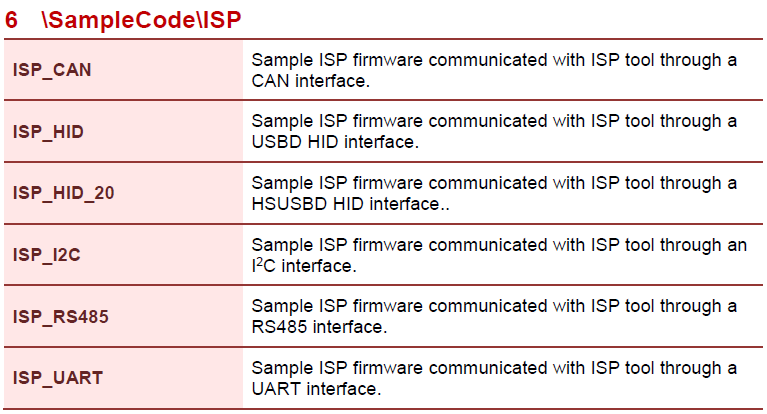
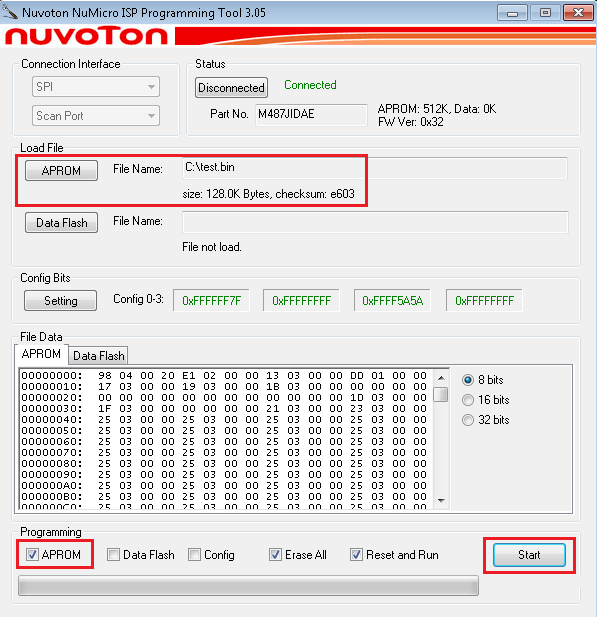

# 5.2.1 Online ISP Programming

Online ISP (In-System Programming) allows users to program Nuvoton microcontrollers via various bridge interfaces such as UART, I2C, SPI, RS-485, and CAN while connected to a host PC.

---

## Installation and Interface Selection

1. **Installation:** Download and install the latest [Nuvoton NuMicro® ISP Programming Tool](https://www.nuvoton.com/tool-and-software/software-tool/programmer-tool/).

2. **Select Interface:** Launch the ISP Tool and select the desired connection interface (e.g., UART, SPI, I2C).

   
   
   *Figure 5.2.1-1 Startup Screen of ISP Tool*

3. **Check Status:** Upon opening, the status will show "Disconnected" as the target chip is not yet linked.

   
   
   *Figure 5.2.1-2 ISP Tool is not connected to any device*

---

## Hardware Connection

4. Connect the Nu-Link3-Pro to the target chip based on the selected interface. 

   | ISP Interface | Nu-Link3-Pro Connection Reference |
   |---------------|-----------------------------------|
   | UART | [SWD Connector (VCOM)](ch3_connecting.md#322-virtual-com-connection) |
   | I2C/I3C | [Bridge Connector](ch3_connecting.md#332-i2ci3c-connection) |
   | SPI | [Bridge Connector](ch3_connecting.md#333-spi-connection) |
   | RS-485 | [Bridge Connector](ch3_connecting.md#334-rs-485-connection) |
   | CAN | [Bridge Connector](ch3_connecting.md#335-can-bus-connection) |

   *Table 5.2.1-1 Connection Interface Options*

---

## Prepare Target Firmware

5. The target chip must be running specific ISP bootloader firmware:
   - Download the BSP for your specific chip from [GitHub](https://github.com/OpenNuvoton/) or [Gitee](https://gitee.com/OpenNuvoton/).
   - Locate the ISP sample project in `SampleCode\ISP`.
   - Open the project in your IDE (e.g., Keil MDK).

   
   
   *Figure 5.2.1-3 ISP Firmware Sample Code Project*

6. **Flash ISP Bootloader:**
   - Configure the project to boot from **LDROM**.
   - Compile and download the ISP firmware to the target chip's **LDROM**.

   
   
   *Figure 5.2.1-4 Boot from LDROM Setting in Keil ISP Firmware Project*

---

## Establish Connection and Program

7. **Establish Connection:**
   - Return to the ISP Tool on your PC.
   - Click **Connect**.
   - Reset the target chip to execute the ISP code in LDROM. The tool should now detect the device.

   
   
   *Figure 5.2.1-5 Connect to Target Chip with SPI Interface*

8. **UART Configuration (If applicable):** If using UART, select the correct COM port corresponding to the Nu-Link3-Pro VCOM.

   
   
   *Figure 5.2.1-6 Select VCOM Port Number with UART Interface*

9. **Program Device:**
   - Load the application binary file (APROM) you wish to flash.
   - Configure programming options.
   - Click **Start** to begin programming.

   
   
   *Figure 5.2.1-7 Program Data to Target Chip with SPI Interface*

   | ISP Interface | Connection Condition |
   |---------------|----------------------|
   | SPI, UART, I2C/I3C, RS-485, CAN | Chip reset reboots into LDROM; ISP FW connects to tool. |
   | USB | Chip reset reboots into LDROM; ISP FW checks control pin state (Low) to enter ISP mode. |

   *Table 5.2.1-2 ISP Entry Conditions*
