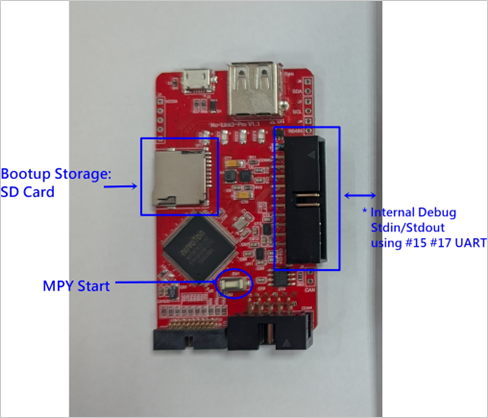

# 6.2 MicroPython Support

The Nu-Link3-Pro has a built-in **MicroPython interpreter**. You can run your own MicroPython code by following these steps:

1.  Take a **microSD card** and place your MicroPython code on it. The file **must** be named `MAIN.PY`.
2.  Insert the microSD card into the Nu-Link3-Pro.
3.  Press the **MPY start button** on the device.

The Nu-Link3-Pro will automatically run the `MAIN.PY` file from the microSD card.

[Sample code for offline ISP](../../Scripts/Nu-Link3-Pro/MicroPythonOfflineISP/MAIN.PY)

| Nu-Link3-Pro Support | Standard Library | Description                              |
|----------------------|------------------|------------------------------------------|
| Yes                  | array            | Arrays of numeric data                   |
|                      | asyncio          | Asynchronous I/O scheduler               |
|                      | binascii         | Binary/ASCII conversions                 |
| Yes                  | builtins         | Built-in functions and exceptions        |
|                      | cmath            | Mathematical functions for complex numbers|
|                      | collections      | Collection and container types           |
|                      | errno            | System error codes                       |
| Yes                  | gc               | Control the garbage collector            |
|                      | gzip             | Gzip compression & decompression         |
|                      | hashlib          | Hashing algorithms                       |
|                      | heapq            | Heap queue algorithm                     |
| Yes                  | io               | Input/output streams                     |
|                      | json             | JSON encoding and decoding               |
|                      | marshal          | Python object serialization              |
|                      | math             | Mathematical functions                   |

| Nu-Link3-Pro Support | Specific Library | Description                              |
|----------------------|------------------|------------------------------------------|
|                      | bluetooth        | Low-level Bluetooth                      |
|                      | btree            | Simple BTree database                    |
|                      | cryptolib        | Cryptographic ciphers                    |
|                      | deflate          | Deflate compression & decompression      |
|                      | framebuffer      | Frame buffer manipulation                |
| Yes                  | machine          | **Classes: UART, SPI, I2C, Timer, RS485, CAN** |
|                      | micropython      | Access and control MicroPython internals |
|                      | neopixel         | Control of WS2812 / NeoPixel LEDs        |
|                      | network          | Network configuration                    |
|                      | openamp          | Standard Asymmetric Multiprocessing (AMP) support |
|                      | uctypes          | Access binary data in a structured way   |
|                      | vfs              | Virtual filesystem control               |
