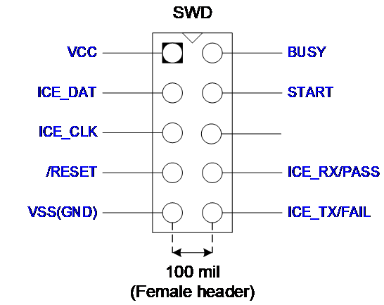

# Chapter 7: Appendix

---

## 7.1 Nu-Link3-Pro Operating Current of ICP

### Online Programming (USB Power Supply)

When power is supplied via USB during ICP online programming, the operating current of Nu-Link3-Pro is shown below:

| SWD I/O Mode Settings | 5.0 V | 3.3 V | 2.5 V | 1.8 V |
|-----------------------|:-----:|:-----:|:-----:|:-----:|
| USB Input Voltage (V) | 5.0 | 5.0 | 5.0 | 5.0 |
| SWD I/O Voltage (V) | 5.02 | 3.37 | 2.55 | 1.84 |
| USB Input Current (mA) | 128 | 112 | 109 | 106 |

*Table 7.1-1 Nu-Link3-Pro Operating Current (Online Programming)*

### Offline Programming - SPI Flash

When power is supplied from a target board (SWD VCC pin) during offline programming and offline file on SPI flash:

| Power Supplied from a Target Board | 5.0 V | 3.3 V | 2.5 V | 1.8 V |
|------------------------------------|:-----:|:-----:|:-----:|:-----:|
| Power Supplied via USB | Off | Off | Off | Off |
| SWD VCC Input Voltage (V) | 4.93 | 3.34 | 2.52 | 1.86 |
| SWD VCC Input Current (mA) | 74 | 111 | 140 | 118 |

*Table 7.1-2 Nu-Link3-Pro Operating Current (Offline Programming) of SPI Flash*

### Offline Programming - USB Flash Drive

When power is supplied from a target board (SWD VCC pin) during offline programming and offline file on USB flash drive:

| Power Supplied from a Target Board | 5.0 V | 3.3 V | 2.5 V | 1.8 V |
|------------------------------------|:-----:|:-----:|:-----:|:-----:|
| Power Supplied via USB | Off | Off | Off | Off |
| SWD VCC Input Voltage (V) | 5.00 | 3.22 | 2.52 | 1.82 |
| SWD VCC Input Current (mA) | 77.6 | 123.3 | 152.6 | 161.7 |

*Table 7.1-3 Nu-Link3-Pro Operating Current (Offline Programming) of USB Flash*

### Offline Programming - Micro SD Card

When power is supplied from a target board (SWD VCC pin) during offline programming and offline file on Micro SD card:

| Power Supplied from a Target Board | 5.0 V | 3.3 V | 2.5 V | 1.8 V |
|------------------------------------|:-----:|:-----:|:-----:|:-----:|
| Power Supplied via USB | Off | Off | Off | Off |
| SWD VCC Input Voltage (V) | 5.01 | 3.28 | 2.53 | 1.81 |
| SWD VCC Input Current (mA) | 77.3 | 125.5 | 154.6 | 165.2 |

*Table 7.1-4 Nu-Link3-Pro Operating Current (Offline Programming) of Micro SD Card*

---

## 7.2 Nu-Link3-Pro Operating Current of ISP

The operating current of Nu-Link3-Pro during ISP online programming with power supply via USB:

| ISP Programming Interface | I2C/I3C | SPI | RS-485 | CAN | UART |
|---------------------------|:-------:|:---:|:------:|:---:|:----:|
| USB VCC Input Current (mA) | 117.1 | 114.3 | 151 | 191 | 114.2 |
| Target board Input Current (mA) | 11.9 | 15.1 | 47.1 | 90.1 | 15 |

*Table 7.2-1 Operating Current of ISP Online Programming*

---

## 7.3 Automatic IC Programming System

The automatic IC programming system through individual slot and the Control Bus.

*Figure 7.3-1 SWD Connector Pin Diagrams*

### 7.3.1 Operation Sequence and Waveform

1. The Nu-Link3-Pro power on. START, BUSY, PASS, and FAIL are set to logic 1.

2. To start programming, START needs to be set to logic 0 for T_START (50ms ≤ T_START ≤ 80ms).

3. Programming start-up. BUSY is set to logic 0, and might toggle during programming.

4. When finish programming, BUSY is set to logic 1, and PASS or FAIL is set to logic 0.
   - When BUSY is set to logic 1, and PASS is set to logic 0, means **"PASS"**.
   - When BUSY is set to logic 1, and FAIL is set to logic 0, means **"FAIL"**.

*Figure 7.3-2 PASS Waveform*

*Figure 7.3-3 FAIL Waveform*

---

## 7.4 Nu-Link Debugger and Programmer Comparison

The Nu-Link Debugger and Programmer series provides a USB connector and a SWD signal interface for connecting to the target chip. The user can connect the Nu-Link Debugger and Programmer to a USB port of a PC to debug and program target chips through the development software tools.

| Type / Function | Nu-Link3-Pro | Nu-Link2-Pro | Nu-Link2 | Nu-Link2-Me | Nu-Link-Me |
|-----------------|:------------:|:------------:|:--------:|:-----------:|:----------:|
| **Debug** | | | | | |
| Debug via SWD | ✔ | ✔ | ✔ | ✔ | ✔ |
| ETM | ✔ | ✔ | - | - | - |
| pyOCD | ✔ | ✔ | - | - | - |
| **Program** | | | | | |
| Online ICP Programming | ✔ | ✔ | ✔ | ✔ | ✔ |
| Offline ICP-Button | ✔ | ✔ | ✔ | ✔ | - |
| Offline ICP-Control Bus | ✔ | ✔ | - | ✔ | - |
| Drag & drop Flash programming | ✔ | ✔ | - | ✔ | - |
| SWD I/O Voltage Support | 1.8V, 2.5V, 3.3V, 5.0V | 1.8V, 2.5V, 3.3V, 5.0V | 1.8V, 2.5V, 3.3V, 5.0V | 1.8V, 3.3V, 5.0V [^2] | 3.3V, 5.0V [^3] |
| **Upgrade** | | | | | |
| Online ISP | ✔ | ✔ | - | ✔ [^4] | - |
| **Storage** | | | | | |
| SPI Flash | ✔ | ✔ | ✔ | ✔ | - |
| SD Card | ✔ | ✔ | - | - | - |
| USB Flash Drive | ✔ | ✔ | - | - | - |
| **Bridge** | | | | | |
| Virtual COM | ✔ | ✔ | - | ✔ | ✔ |
| **Bus Monitor** | | | | | |
| I2C/I3C, SPI, CAN, RS-485 | ✔ | ✔ [^1] | - | - | - |

*Table 7.4 Comparison of Nu-Link Debugger and Programmer*

**Notes:**  
[^1]: Nu-Link2-Pro does not support I3C  
[^2]: Voltage adjusted by resistor ICEJPR1  
[^3]: Voltage adjusted by resistor JPR1  
[^4]: Nu-Link2-Me only supports UART interface for ISP update  
[^5]: The Nu-Link3-Pro, Nu-Link2-Pro and Nu-Link2-Me can be connected to an automatic IC programming system through the Control Bus.

