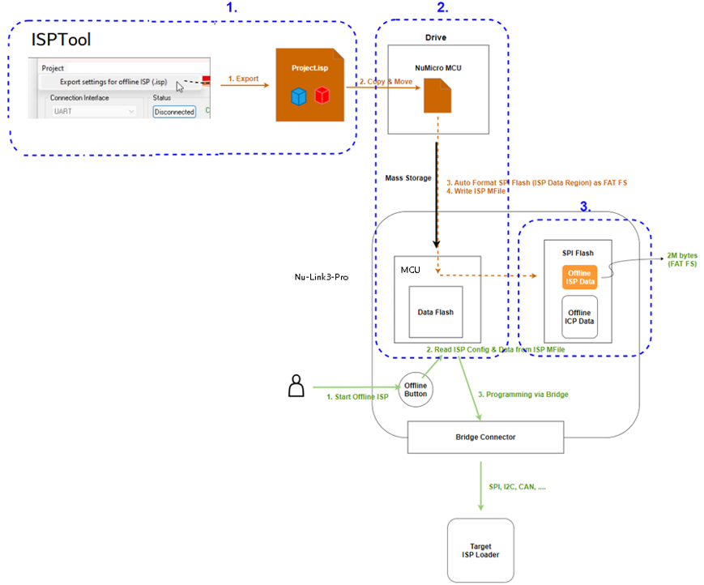
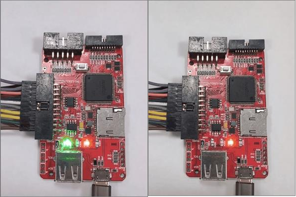

## Offline ISP Programming

Offline ISP (In-System Programming) refers to the ability to program a Nuvoton microcontroller without needing a host PC connected during the programming process. This is a key feature for mass production environments where it is impractical to have a computer at every programming station.

### Requirements

To use the offline ISP functionality, ensure your tools meet the following minimum requirements:

- **ISP Tool Software**: [ISPTool v4.18](https://github.com/OpenNuvoton/ISPTool/releases) or later.
- **Nu-Link Firmware**: Version **7973r** or later.


### Operation Steps

The offline ISP programming process is divided into three distinct phases:

#### Phase 1: Project Preparation (PC Side)

The process begins in the ISP Tool software on the PC.

1. **Configure Project**: The user configures the target settings and selects the firmware to be programmed.
2. **Export Settings**: Select **Export settings for offline ISP**.
3. **Generate File**: The software generates a file named `Project.isp` which contains all necessary configuration data and firmware images.

#### Phase 2: Data Transfer (PC to Programmer)

The Nu-Link (e.g., Nu-Link3-Pro) connects to the PC and appears as a Mass Storage Drive (similar to a USB flash drive).

1. **Mount Drive**: Connect the Nu-Link to the PC via USB.
2. **Drag & Drop**: Simply copy or drag the `Project.isp` file into the Nu-Micro MCU disk drive.
3. **Internal Processing**: The programmer's internal MCU automatically formats the SPI Flash memory (ISP Data Region) using a FAT File System.
4. **Storage**: The ISP file is written into this internal memory for persistent storage.

#### Phase 3: Offline Programming (Programmer to Target)

At this stage, a PC is no longer required.

1. **Disconnect PC**: The programmer can now be powered by an external source or remained powered via USB without a data connection.
2. **Connect Target**: Connect the Nu-Link to the target board via the appropriate bridge interface.
3. **Trigger Programming**: Press the **Offline Button** on the Nu-Link.
4. **Execute**: The programmer's MCU reads the configuration and data from the internal SPI Flash.
5. **Data Transmission**: Data is sent through the **Bridge Connector** to the target.
6. **Flash Target**: The firmware is programmed into the Target ISP Loader via the supported interface (SPI, I2C, CAN, etc.).

The following is the flowchart:




### Configuration and Operation Notes

#### Function Mode Configuration

Plug in the Nu-Link3-Pro. When the **NuMicro MCU** disk appears, make sure the `BUTTON-MODE` is `ISP` in the `NU_CFG.TXT` file.

**NU_CFG.TXT Example:**

```ini
[Offline Programming]
BUTTON-MODE=1
; 0 = ICP
; 1 = ISP
; 2 = MicroPython
```

#### Verification and Data Status

After copying the `.isp` project file to the disk, the Nu-Link automatically processes the update. You can verify the stored programming information by checking the `OFL_ISP` file generated on the disk.

    **OFL_ISP Example:**
    ```
    Connection Interface: RS485
    APROM File: AP_16K.bin (Size: 16384 bytes, Checksum: B1E7)
    DataFlash File: DF_4K.bin (Size: 4096 bytes, Checksum: D129)
    Config Bits: [0xFFFFFFFF, 0xFFFFFFFF]
    Programming Options: APROM DataFlash Config EraseAll
    ```

#### Essential Usage Notes

- **Exclusivity**: Offline and Online ISP modes can be used interchangeably, but they **must not be used simultaneously**.
- **Data Updates**: To update the offline firmware or configuration, simply overwrite the existing `.isp` file on the NuMicro MCU disk with a new one. The disk will automatically remount once the update is complete.
- **Clearing Data**: To completely remove the offline ISP data from the programmer, create a blank file named `CLR_ISP.ACT` in the root directory of the Nu-Link disk. This will trigger the internal cleanup process.


### Status LED Description

The offline LED indicator for ISP is the same as for ICP.

| Status                                 | ICE | ICP | Red LED | Green LED |
|-----------------------------------------|-----|-----|---------|-----------|
| During Offline Programming              | On  | On  | Flash   | -         |
| Offline Programming Completed           | On  | On  | -       | Flash     |
| Offline Programming Failed (Auto mode)  | On  | On  | Flash   | -         |
| Offline Programming Failed              | On  | On  | Flash   | -         |

Table: Offline ISP LED Status


### Programming Success & Failure Indicators

- **Programming Success (Left Image)**
- **Programming Failure (Right Image)**



