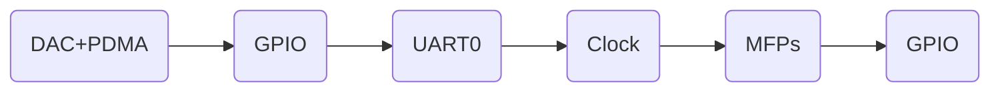

# DAC ExPin Trigger with PDMA

## Purpose
This example demonstrates how to use PDMA to transfer data and trigger DAC by external pin.

## Configuration
- Used Model: Claude Opus 4.5
- Pin Connect:
  - PA.9 and DAC1_OUT are connected together.

## Generation Flow


## Prompts
### DAC+PDMA Prompt
```
@nucodegen Generate a sample DAC code for Nuvoton MCU with the following configuration:
- IP: DAC1
- Trigger Source: STDAC pin falling edge trigger
- DAC Conversion Settling Time: 1 us
- Data Transfer Type: PDMA (data width: 16-bit, transfer count = size of source array)
- Optional: 
    * configure source array to store data for DAC conversion.
    * Sweep data in source array from min to max and back to min with step size 256.
    * use PDMA to transfer data from memory to the DAC data register.
    * Re-Set transfer count and basic operation mode to re-start transfer data from source array to DAC register after previous PDMA transfer is completed.
- Purpose: Demonstrate how to trigger DAC by external pin and use PDMA to transfer data to register.
```

### GPIO Prompt
```
@nucodegen Generate a sample GPIO code for Nuvoton MCU with the following configuration:
- Port: PA
- Pin(s): BIT9
- Operation Mode: Output
- Optional:
    * Set PA.9 init state to low 
    * Toggle PA.9 output in loop
- Purpose: Configure PA.9 to trigger DAC conversion.
```

### UART0 Prompt
```
@nucodegen open UART0 to print message after PDMA transfer is completed, and times that trigger PDMA transfer done interrupt.
```

### Clock Prompt
```
@nucodegen Generate a sample CLK (clock controller) configuration code for Nuvoton MCU with the following configuration:
- Enable Module Clock: UART0, GPIOB, DAC01, GPIOA, PDMA0
- Module Clock Source: 
    * UART0: HIRC
- Module Clock Divider: 
    * UART0: 1
- Enable Clock Source: HIRC
- Set PLL Frequency: Source: HIRC, Frequency: 220 MHz, Select: CLK_APLL0_SELECT
- Add 100-us delay after toggling PA.9 in the loop.
```

### MFPs Prompt
```
@nucodegen Generate a sample PIN (MFP) configuration code for Nuvoton MCU with the following configuration:
- Port: PA, Pin: PA.1, Function: UART0_TXD
- Port: PA, Pin: PA.0, Function: UART0_RXD
- Port: PB, Pin: PB.13, Function: DAC1_OUT
- Port: PA, Pin: PA.11, Function: DAC1_ST
```

### GPIO Prompt
```
@nucodegen Generate a sample GPIO code for Nuvoton MCU with the following configuration:
- Port: PB
- Pin Mask: BIT13
- Operation Mode: Output
- Digital Input Path: Disable
- Purpose: Disable digital input path of analog pin DAC1_OUT to prevent leakage
```
