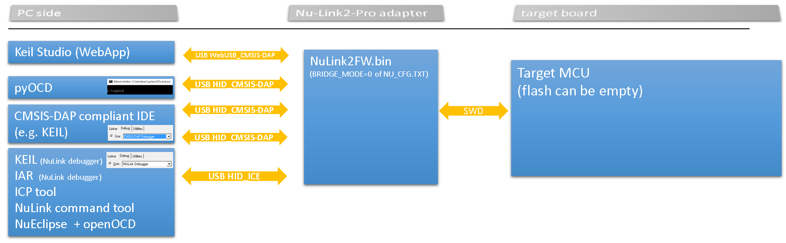
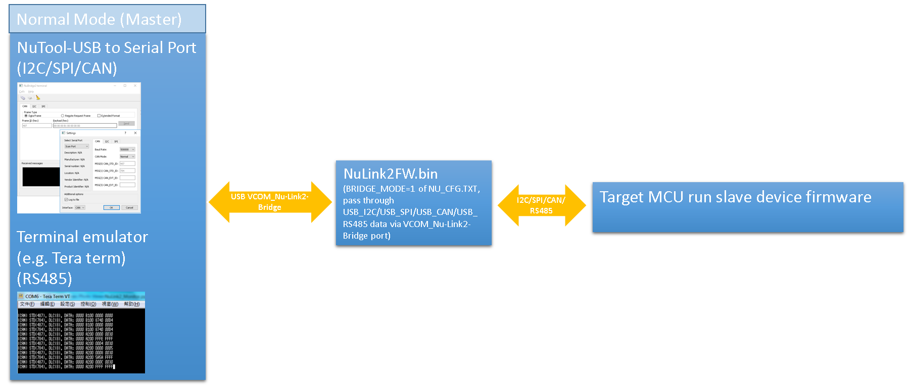
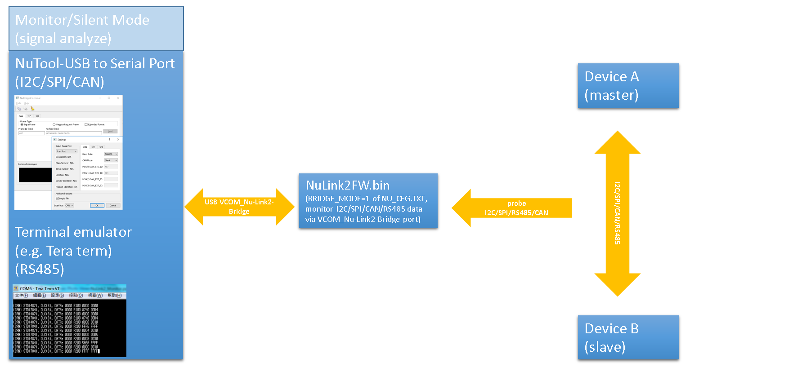
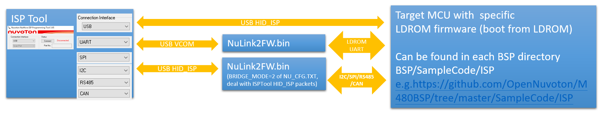
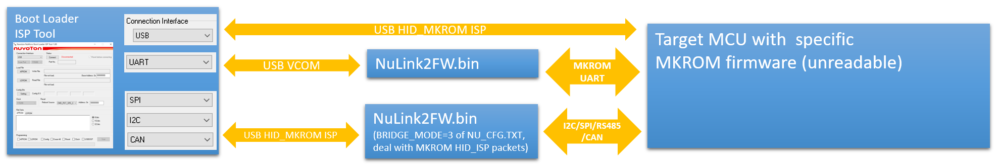
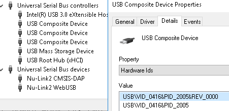
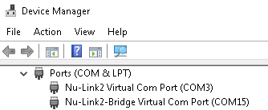

# Nu-Link2-Pro Debugging and Programming Adapter

## Introduction

When using software development tools, you may need a USB adapter. Here, we introduce the feature-rich Nu-Link2-Pro adapter.

- [Where to buy](https://direct.nuvoton.com/tw/Nu-Link2-pro)
- [Nu-Link2-Pro Debugger and Programmer User Manual](https://www.nuvoton.com/resource-download.jsp?tp_GUID=UG1320200319174043)

This page focuses only on the Nu-Link2-Pro. If you wish to learn about other types of Nu-Link, please click on [Nu-Link](https://www.nuvoton.com/tool-and-software/debugger-and-programmer/1-to-1-debugger-and-programmer/).

Overview of software tools, Nu-Link2-Pro adapters, and targets:

## Nu-Link2-Pro Adapter Firmware

### Download the latest firmware from the [Releases page](https://github.com/OpenNuvoton/Nuvoton_Tools/releases).

Users can reprogram Nu-Link2-Pro with another .bin file using the following instructions (Windows OS):

1. Press the button on Nu-Link2-Pro and plug in the USB cable.
2. The "Nu-Link2-Pro" disk will appear. (If you see the disk name as "NuMicro MCU", it will upgrade the target device firmware instead of Nu-Link2-Pro itself.)
3. Drag and drop the Nu-Link2-Pro firmware .bin file into the disk.
4. Re-plug the USB cable and it's done.

### More Options for NuLink2FW (Configuration File NU_CFG.TXT)

#### Warning: The meanings of the options for versions newer than v3.09.7380 are different from those in versions v3.05.7174r to v3.08.7313. For the old settings, please see the [old version setting](https://github.com/OpenNuvoton/Nuvoton_Tools/blob/70dcc9ce06c7d178160c84b870a49d4e9cbf5d1a/README.md).
#### Inside NU_CFG.TXT, you will find the firmware version entry, which appears in the format "Version=VERSION NUMBER".

1. When you upgrade NuLink2FW.bin to a version greater than or equal to v3.09.7380, you will see some options in NU_CFG.TXT:

- Open the NU_CFG.TXT file in the pop-up "NuMicro MCU" disk
    

2. For the Nu-Link2-Pro, you will see POWER-MODE and BRIDGE-MODE options. You need to re-plug the USB cable to activate the setting.

- Set POWER-MODE for SWD output voltage level (mainly for CMSIS-DAP interface use).

- Set BRIDGE-MODE=0; this is the default setting. It has a WebUSB interface conforming to the CMSIS-DAP protocol, and you can connect to KEIL Studio Desktop/Cloud via this interface. Note that CMSIS-DAP will be disabled in other BRIDGE-MODEs (limited USB endpoints).  
    

- Set BRIDGE-MODE=1; the pass-through bridge function of Nu-Link2-Pro will be enabled ("Nu-Link2-Bridge" refers to the pass-through bridge application on the Nu-Link2-Pro adapter). Nu-Link2-Bridge passes data between the VCOM port and I2C/SPI/RS485/CAN interfaces.
    (You will see a "Nu-Link2-Bridge Virtual Com Port" in Device Manager.)  
    

- Set BRIDGE-MODE=2; a USB HID interface that supports ISPTool will be enabled. This USB HID interface doesn't pass through data; it communicates with ISPTool via HID_ISP and offers I2C/SPI/RS485/CAN interfaces for ISPTool.

- Set BRIDGE-MODE=3; a USB HID interface that supports Boot_Loader_ISPTool will be enabled. This USB HID interface doesn't pass through data; it communicates with Boot_Loader_ISPTool via HID_MKROM_ISP, and offers I2C/SPI/RS485/CAN interfaces for Boot_Loader_ISPTool. (This mode requires firmware v3.10 or later.)
    Only NuMicro chips that support mask ROM Boot Loader (e.g., M460 series) can communicate with [Boot_Loader_ISPTool](https://www.nuvoton.com/resource-download.jsp?tp_GUID=SW132022071806572776&currentFolder=/products/microcontrollers/arm-cortex-m4-mcus/m467-ethernet-crypto-series/).

3. If you use Nu-Link2-ME, it doesn't support BRIDGE functions, and you will only see the CMSIS-DAP option.

- Set CMSIS-DAP=1; this is the default setting. It has a WebUSB interface conforming to the CMSIS-DAP protocol, and you can connect to KEIL Studio Cloud via this interface.
- Set CMSIS-DAP=0; this will disable CMSIS-DAP and enable the Nu-Link2 "USB BULK_ICE" interface (it's faster than "USB HID_ICE").

### Comparison of NuLink2 and NuLink2_DAPLink

#### NuLink2

- Proprietary code
- Supports NuMicro 8051, offline programming, encryption during data transmission, unlimited flash breakpoints, NuMicro chip-specific features (config0/config1 dataflash setting, KPROM, etc.)
- USB interfaces: MSC/VCOM/HID_ICE (proprietary commands) or CMSIS-DAPv2 WinUSB + WebUSB CMSIS-DAP/VCOM_Nu-Link2-Bridge or HID_ISP (defined by BRIDGE-MODE in NU_CFG.TXT)

#### NuLink2_DAPLink

- Open source: [DAPLink on Nu-Link2-Pro](https://github.com/OpenNuvoton/DapLink)
- Supports many third-party IDEs
- USB interfaces: MSC/CDC/CMSIS-DAPv2 WinUSB/WebUSB CMSIS-DAP

### Other Example Projects for Nu-Link2

- [Nu-Link2-CMSIS_DAP](https://github.com/OpenNuvoton/NuLink2_CMSIS_DAP)
- [Nu-Link2-ICP_Library](https://github.com/OpenNuvoton/NuLink2_ICP_Library)
- [Nu-Link2-Pro_Offline_ISP](https://github.com/OpenNuvoton/Nu-Link2-Pro_Offline_ISP)
