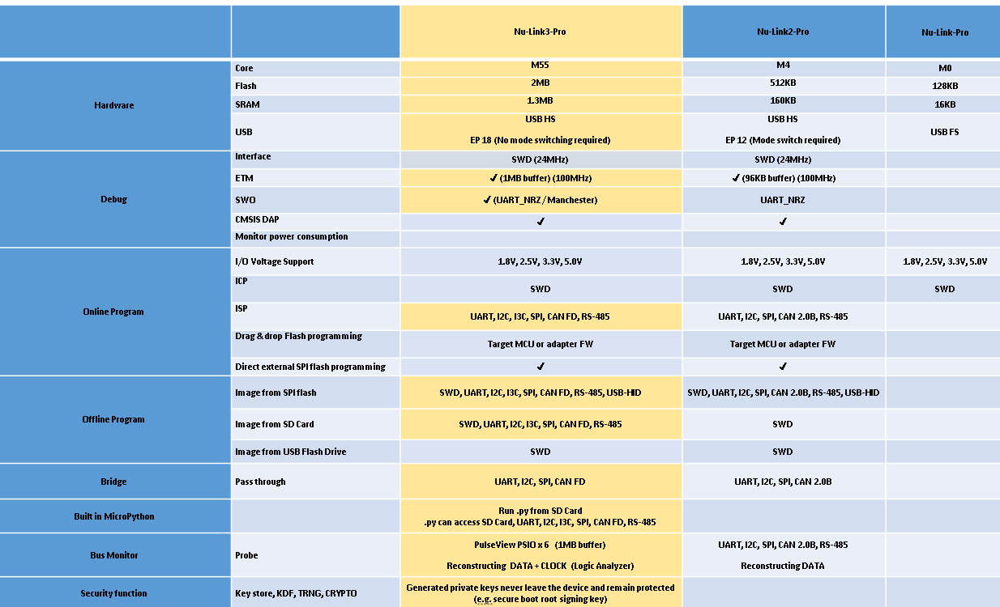
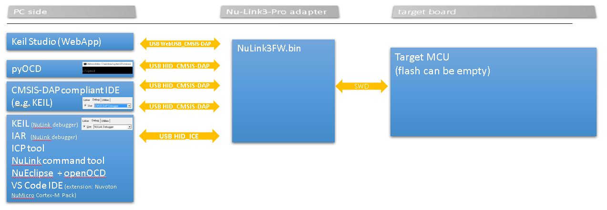
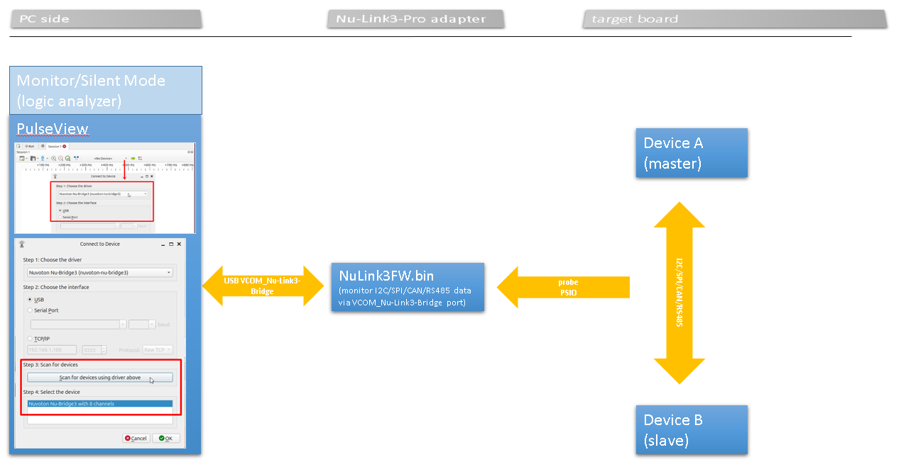
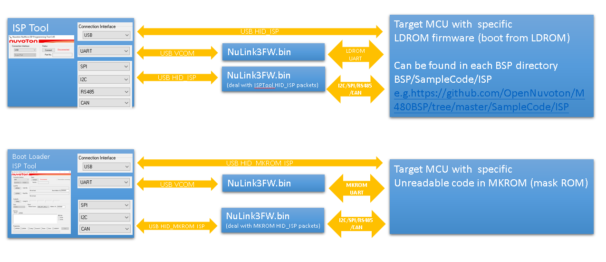
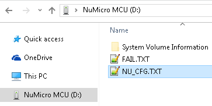
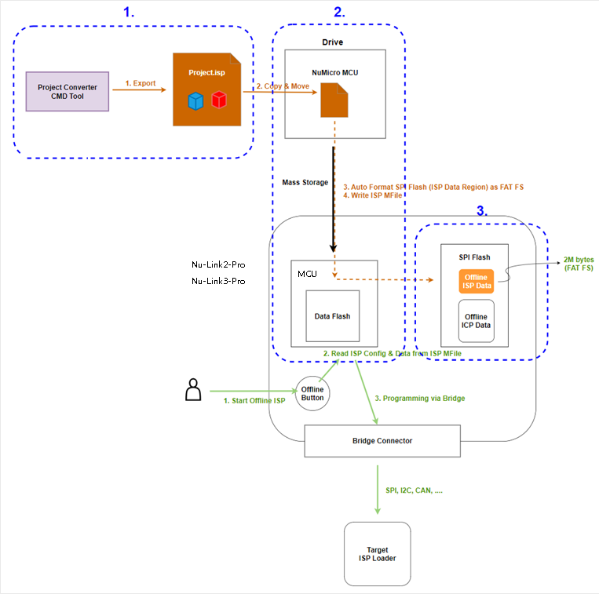

# Nu-Link3-Pro Debugging and Programming Adapter

## Introduction

When using software development tools, you may need a USB adapter. Here, we introduce the feature-rich Nu-Link3-Pro adapter.

This page focuses only on the Nu-Link3-Pro. If you wish to learn about other types of Nu-Link, please click on [Nu-Link](https://www.nuvoton.com/tool-and-software/debugger-and-programmer/1-to-1-debugger-and-programmer/).

Comparison table of Nu-Link adapters:

Overview of software tools, Nu-Link3-Pro adapters, and targets:

## Nu-Link3 Adapter Firmware

### Nu-Link3 firmware binary files can be found here: [Latest_NuLink_Firmware](./Latest_NuLink_Firmware)

Users can reprogram Nu-Link3 with another .bin file using the following instructions (Windows OS):

1. Press the button on Nu-Link3 and plug in the USB cable.
2. The "Nu-Link3" disk will appear. (If you see the disk name as "NuMicro MCU", it will upgrade the target device firmware instead of Nu-Link3 itself.)
3. Drag and drop the Nu-Link3 firmware .bin file into the disk.
4. Re-plug the USB cable and it's done.

### More Options for NuLink3FW (Configuration File NU_CFG.TXT)

You will see some options in NU_CFG.TXT:

- Open the NU_CFG.TXT file in the pop-up "NuMicro MCU" disk  
        

- Set `POWER-MODE` for SWD output voltage level (mainly for CMSIS-DAP interface use).

- Set `CMSIS-DAP=1`; This is the default setting. Enables CMSIS-DAP.
- Set `CMSIS-DAP=0`; Disables CMSIS-DAP.

- Set `BUTTON-MODE=0`; This is the default setting. Offline programming via SWD pins.
- Set `BUTTON-MODE=1`; Offline ISP programming via BRIDGE pins (UART, I2C, I3C, SPI, CAN FD, RS-485, USB-HID).
          
        [ISP OFFLINE HOWTO](../Documents/NuLink3_OfflineISP.md)
- Set `BUTTON-MODE=2`; Custom offline programming via MicroPython. Nu-Link3-Pro will run MAIN.PY on the microSD card.
        [MicroPython HOWTO](../Documents/NuLink3_MPY.md)

