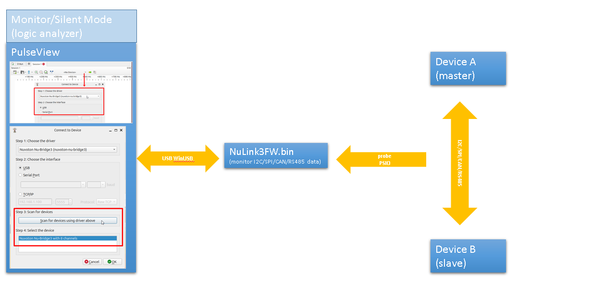

# Nu-Link3-Pro debugging and programming adapter

## Introduction

When using the software development tools, you may need a USB adapter.
Here, we introduce a feature-rich Nu-Link3-Pro adapter to you.

On this page, we will only focus on the feature-rich Nu-Link3-Pro. If you wish to learn about other types of Nu-Link, please click on [Nu-Link](https://www.nuvoton.com/tool-and-software/debugger-and-programmer/1-to-1-debugger-and-programmer/).

Comparison table of Nu-Links.

An overview picture of software tools, Nu-Link3-Pro adapters and targets  

## The firmware of the Nu-Link3 adapter

### Nu-Link3 firmware binary files can be found here [Latest_NuLink_Firmware](./Latest_NuLink_Firmware)  

Users can reprogram Nu-Link3 with another .bin file using the following instructions (Windows OS)  

1. Press the button on Nu-Link3 and plug in the USB cable.
2. The "Nu-Link3" disk will appear.  (If you see the disk name as "NuMicro MCU", it will upgrade target the device firmware instead of Nu-Link3 itself)
3. Drag and drop the Nu-Link3 firmware .bin file into the disk.
4. Re-plug the USB cable and it's done.  

### More options for NuLink3FW (configuration file NU_CFG.TXT)

1. You will see some options in NU_CFG.TXT.

    - Open the NU_CFG.TXT file in the pop-up "NuMicro MCU" disk  
    

    - Set POWER-MODE for SWD output voltage level (mainly for CMSIS-DAP interface use)

    - Set CMSIS-DAP=1; This is the default setting. Enable CMSIS-DAP. 
    - Set CMSIS-DAP=0; Disable CMSIS-DAP.

    - Set BUTTON-MODE=0; This is the default setting. Offline programming via SWD pins.
    - Set BUTTON-MODE=1; Offline ISP programming via BRIDGE pins (UART, I2C, I3C, SPI, CAN FD, RS-485, USB-HID).
              
            [ISP OFFLINE HOWTO](../Documents/NuLink3_OfflineISP.md)
    - Set BUTTON-MODE=2; Customize Offline programming via MicroPython. Nu-Link3-Pro will run MAIN.PY in micro SD Card.
            [MicroPython HOWTO](../Documents/NuLink3_MPY.md)

