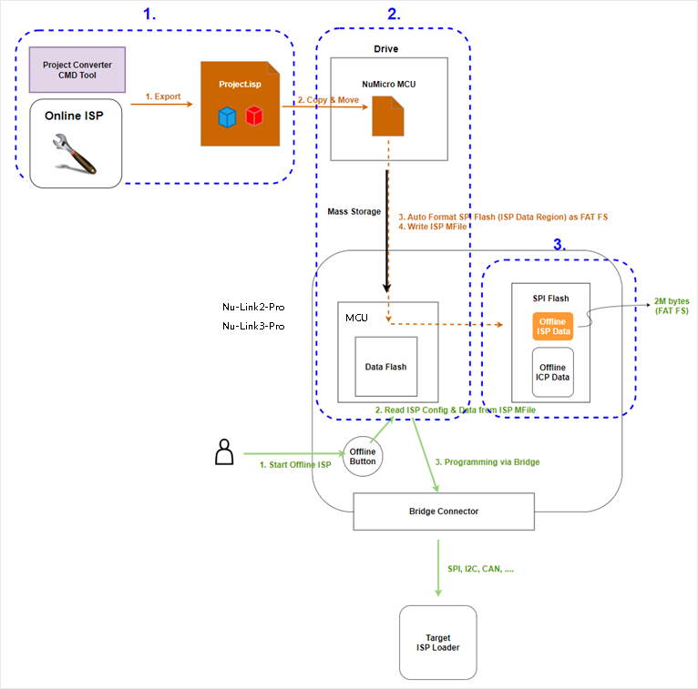

# 🔧 Nu-Link3-Pro Debugging and Programming Adapter

---

## 📖 Introduction

When using software development tools, you may need a USB adapter. Here, we introduce the feature-rich Nu-Link3-Pro adapter.

This page focuses only on the Nu-Link3-Pro. If you wish to learn about other types of Nu-Link, please click on [Nu-Link](https://www.nuvoton.com/tool-and-software/debugger-and-programmer/1-to-1-debugger-and-programmer/).

Comparison table of Nu-Link adapters:

Overview of software tools, Nu-Link3-Pro adapters, and targets:

---

## ✨ Features

- **Multi-Interface Support**: SWD, UART, I2C, SPI, CAN FD, USB-HID, and more.
- **CMSIS-DAP Compatible**: Works with ARM development tools.
- **Offline Programming**: Supports button-triggered ICP/ISP via various interfaces.
- **MicroPython Integration**: Run custom scripts from microSD card.
- **Real-Time Monitoring**: Compatible with PulseView for logic analysis.

---

## 💾 Nu-Link3 Adapter Firmware

**Nu-Link firmware binary files can be found on the [Releases page](https://github.com/OpenNuvoton/Nuvoton_Tools/releases) on GitHub.**

Users can reprogram Nu-Link3 with another .bin file using the following instructions (Windows OS):

1. Press the button on Nu-Link3 and plug in the USB cable.
2. The "Nu-Link3" disk will appear. (If you see the disk name as "NuMicro MCU", it will upgrade the target device firmware instead of Nu-Link3 itself.)
3. Drag and drop the Nu-Link3 firmware .bin file into the disk.
4. Re-plug the USB cable and it's done.

---

## ⚙️ Configuration Options (NU_CFG.TXT)

You will see some options in NU_CFG.TXT:

* Open the NU_CFG.TXT file in the pop-up "NuMicro MCU" disk  
  

* Set `POWER-MODE` for SWD output voltage level (mainly for CMSIS-DAP interface use).

* Set `CMSIS-DAP=1`; Enables CMSIS-DAP. This is the default setting.
* Set `CMSIS-DAP=0`; Disables CMSIS-DAP. Use this if the interface interferes with other operations.

* Set `BUTTON-MODE=0`; This is the default setting. Offline programming via SWD pins.
* Set `BUTTON-MODE=1`; Offline ISP programming via BRIDGE pins (UART, I2C, I3C, SPI, CAN FD, RS-485, USB-HID).  
    
  [ISP OFFLINE HOWTO](../Documents/NuLink3_OfflineISP.md)
* Set `BUTTON-MODE=2`; Custom offline programming via MicroPython. Nu-Link3-Pro will run MAIN.PY on the microSD card.  
  [MicroPython HOWTO](../Documents/NuLink3_MPY.md)

---

## 🔧 Usage

### Connecting to Target
1. Connect Nu-Link3-Pro to your PC via USB.
2. Ensure the target board is powered (either from its own power source or supplied by Nu-Link3-Pro).
3. Connect the target board using the appropriate interface (SWD for debugging, UART/I2C/SPI for bridge mode, etc.).
4. Use your IDE or command-line tool to connect and debug/program.

**Pin Connections**:
- **SWD**: Connect SWDIO, SWCLK, GND, RST and VCC.
- **Bridge Mode**: Connect SDA/SCL for I2C, MOSI/MISO/SCK for SPI, etc.

### Debugging and Programming
- **In IDE**: Select Nu-Link3-Pro as the debugger in tools like Keil, IAR, or NuEclipse.
- **Command Line**: Use Nuvoton Command Tool for batch operations.

### Offline Programming
- Press the button on Nu-Link3-Pro to trigger offline ICP/ISP.
- Ensure the target is powered and connected correctly.
- For MicroPython mode, insert a microSD card with MAIN.PY script.

### Monitoring
- Use PulseView for logic analysis of bus signals.
- Refer to [PulseView Setup](../Documents/NuLink3_PulseView.md) for details.
- Compatible with sigrok for protocol decoding.

### Firmware Update
- Download the latest firmware from the [Releases page](https://github.com/OpenNuvoton/Nuvoton_Tools/releases).
- Follow the drag-and-drop instructions in the Firmware section above.

---

## 🛠️ Troubleshooting
- **Device Not Recognized**: Check USB connection and drivers. Update firmware if needed.
- **Programming Fails**: Verify target voltage and connection pins.
- **Monitoring Issues**: Confirm PulseView configuration and Nu-Link3-Pro mode.
- **Configuration Not Saved**: Edit NU_CFG.TXT and save properly in the virtual disk.

---

## 📚 References
- [CMSIS-DAP Specification](https://github.com/ARM-software/CMSIS-DAP)
- [PulseView Documentation](https://sigrok.org/wiki/PulseView)

---

