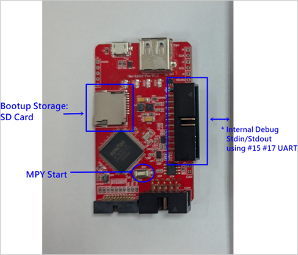

### **Nu-Link3-Pro MicroPython**

The Nu-Link3-Pro has a built-in **MicroPython program**. You can run your own MicroPython code by following these steps:

1.  Take a **microSD card** and place your MicroPython code onto it. The file **must** be named `MAIN.PY`.
2.  Plug the microSD card into the Nu-Link3-Pro.
3.  Press the **MPY start button** on the device.

The Nu-Link3-Pro will then automatically run the `MAIN.PY` file from the microSD card.

TODO: Sample code

| Nu-Link3-Pro Implement | Standard Library | Description                              |
|------------------|-------------|------------------------------------------|
| Yes              | array       | arrays of numeric data                  |
|                  | asyncio     | asynchronous I/O scheduler              |
|                  | binascii    | binary/ASCII conversions                |
| Yes              | builtins    | builtin functions and exceptions        |
|                  | cmath       | mathematical functions for complex numbers |
|                  | collections | collection and container types          |
|                  | errno       | system error codes                      |
| Yes              | gc          | control the garbage collector           |
|                  | gzip        | gzip compression & decompression        |
|                  | hashlib     | hashing algorithms                      |
|                  | heapq       | heap queue algorithm                    |
| Yes              | io          | input/output streams                    |
|                  | json        | JSON encoding and decoding              |
|                  | marshal     | Python object serialization             |
|                  | math        | mathematical functions                  |

| Nu-Link3-Pro Implement | Specific ibrary | Description      |
|-------------------------|-------------|---------------------------|
|                  | bluetooth   | low-level Bluetooth            |
|                  | btree       | simple BTree database                                                       |
|                  | cryptolib   | cryptographic ciphers                                                       |
|                  | deflate     | deflate compression & decompression                                         |
|                  | framebuffer | frame buffer manipulation                                                   |
|Yes                  | machine     | **class UART, SPI, I2C, Timer, RS485, CAN**|  
|                  | micropython | access and control MicroPython internals                                    |
|                  | neopixel    | control of WS2812 / NeoPixel LEDs                                           |
|                  | network     | network configuration                                                       |
|                  | openamp     | provides standard Asymmetric Multiprocessing (AMP) support                  |
|                  | uctypes     | access binary data in a structured way                                      |
|                  | vfs         | virtual filesystem control                                                  |
