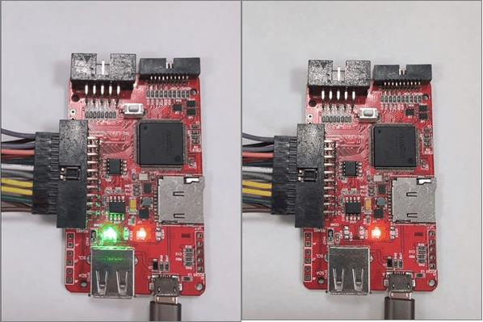

# Nu-Link3-Pro Offline ISP 

Offline ISP (In-System Programming) refers to the ability to program a Nuvoton microcontroller without the need for a host PC connected during the programming process. This is a key feature for mass production environments where it's impractical to have a computer at every programming station.

The process involves two main stages:

1. **Preparation (on a PC)**
    * Install [**NuMicro ICP Tool**](#2-offline_isp_file_convertor-executable-to-convert-the-data).
    * Configure the programming settings.
    * Export .isp file and update it to Nu-Link3-Pro.


2. **Offline Programming (on the production line)**
    * The Nu-Link-3 programmer is disconnected from the PC and powered on.
    * The programmer is connected to the target **NuMicro chip**.
    * The user presses the button on the programmer.
    * The Nu-Link programmer then uses the stored data to program the target chip without needing a computer.


The following is the flowchart.
<div style="margin-left: 30px;">
  
</div>

<br>
<br>
<br>

# Configuration Flow Details

## NU_CFG File Settings

Plug in the Nu-Link3-Pro. Pop up disk **NuMicro MCU**, set the `BUTTON-MODE` is set to `ISP` in the `NU_CFG.TXT` file.

**NU_CFG.TXT Example:**

```ini
[Offline Programming]
BUTTON-MODE=1
; 0 = ICP
; 1 = ISP
; 2 = MicroPython
```


## ISP Operation Notes

- Offline/Online ISP can be used interchangeably, but **do not use them at the same time**.
- To update the Offline ISP data on Nu-Link3-Pro, you can use:       
   #### `Offline_isp_file_convertor` executable to convert the data. 
    - For Offline_isp_file_convertor.exe 
       All `Offline_isp_file_convertor` related files are located in the ICPTool installation directory: `Nuvoton Tools\ICPTool\Offline_ISP`.
   
       Programming options are set in the `.ini` configuration file.
   
       **config.ini Example:**
   
       ```ini
       [Connection Interface]
       Bridge=3
       ; 0 = UART
       ; 1 = SPI
       ; 2 = I2C
       ; 3 = RS485
       ; 4 = CAN
   
       [Files]
       APROM=AP_16K.bin
       DataFlash=DF_4K.bin
   
       [Config Bits]
       Config0=0xFFFFFFFF
       Config1=0xFFFFFFFF
       ; Config0~13
   
       [Programming Options]
       APROM=1
       DataFlash=1
       Config=1
       RESETAndRun=0
       EraseAll=1
       ; 1 = enabled
       ```
   
       **Converter Command Example**
   
       ```shell
       offline_isp_file_convertor.exe -h
       offline_isp_file_convertor.exe -i .\config.ini -s .\AP_16K.bin .\DF_4K.bin -o demo.isp
       ```


## ISP Project File Operation

- Copy or drag the `.isp` project file into the NuMicro MCU disk drive to trigger the update process.
- After completion, the disk will automatically remount. You can check the `OFL_ISP` file for Offline ISP information.

    OFL_ISP example
    ```
    Connection Interface: RS485
    APROM File: AP_16K.bin (Size: 16384 bytes, Checksum: B1E7)
    DataFlash File: DF_4K.bin (Size: 4096 bytes, Checksum: D129)
    Config Bits: [0xFFFFFFFF, 0xFFFFFFFF]
    Programming Options: APROM DataFlash Config EraseAll
    ```


## Clear Offline ISP Data

- To clear Offline ISP data, create a file named `CLR_ISP.ACT` in the disk drive to trigger the clearing process.


## Status LED Description

The offline LED indicator for ISP is the same as for ICP.

| Status                        | ICE | ICP | Red LED | Green LED |
|-------------------------------|-----|-----|---------|-----------|
| During Offline Programming    | On  | On  | Flash   | -         |
| Offline Programming Completed | On  | On  | -       | Flash     |
| Offline Programming Failed (Auto mode) | On  | On  | Flash   | -         |
| Offline Programming Failed    | On  | On  | Flash   | -         |


## Programming Success & Failure Indicators

- **Programming Success (Left Image)**
- **Programming Failure (Right Image)**


