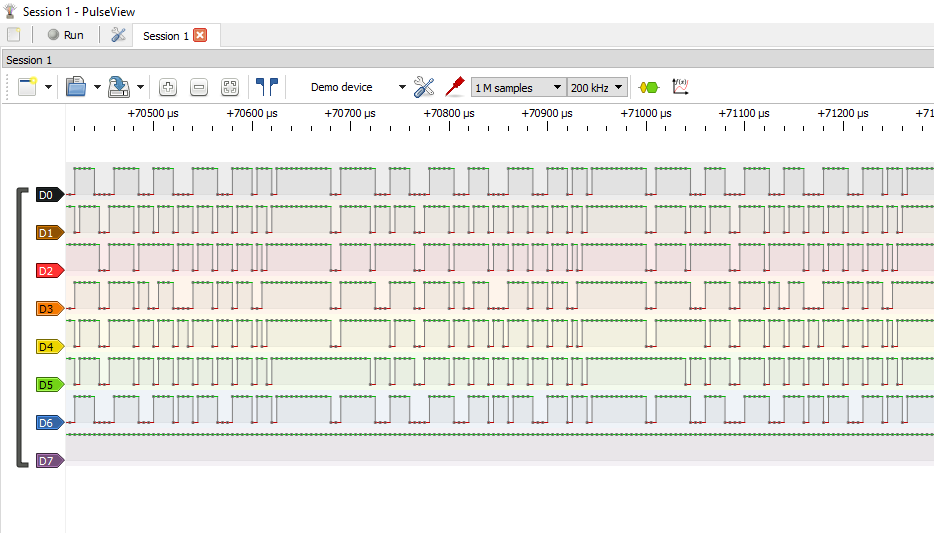
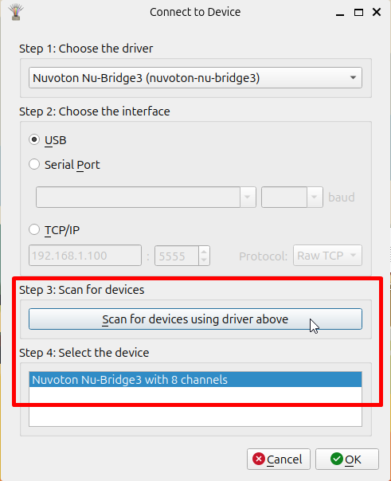
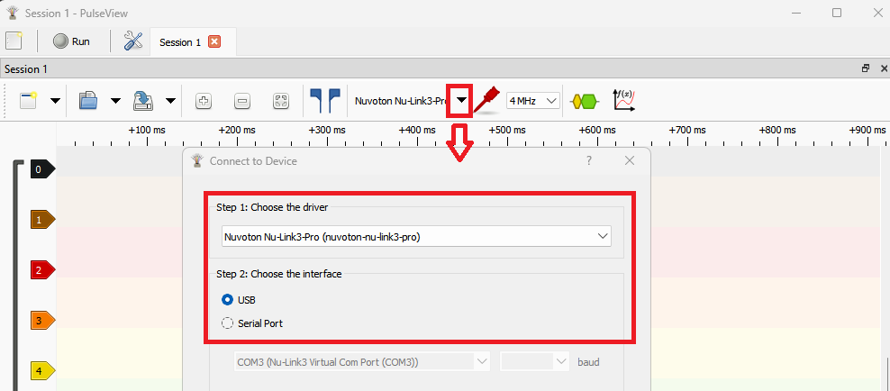
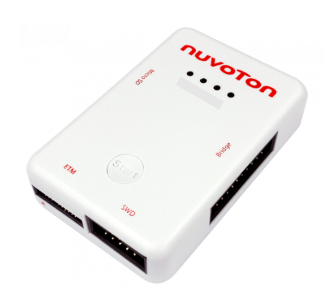

# PulseView + Nu-Link3 Bridge

  

# PulseView

* Logic Analysis
  * Supports multiple protocols
    * UART\, SPI\, I2C\, SWD\, …
  * Open-source software
  * Cross-platform support
    * Windows\, Linux\, …

  

# Connecting Devices

  

  

# Nu-Link3-Pro

Bridge Connector

  

  

# LA Trigger Conditions

  * Each channel can independently configure trigger conditions

  

# Data Capture and Protocol Analysis

  

  

# File Output

  

  

# Bridge Resource Conflicts

* Nu-Link3-Pro Bridge
  * Interface priority order
    * MicroPython
    * NuTool USB to Serial Port
    * ISP Bridge
    * NuLogic (PSIO)

# Performance Test

Maximum Sample Rate and Record Length under various channel count combinations

| Channel Count | Maximum Sample Rate \(MHz\) | Buffer Size = 256K bytes\,Record Lenth \(millisecond\) |  |  |  |
| :-: | :-: | :-: | :-: | :-: | :-: |
|  |  | Sample Rate |  |  |  |
|  |  | __1 MHz__ | __4 MHz__ | __10 MHz__ | __22 MHz__ |
| 1 | 22 | 2030 | 520 | 210 | 95 |
| 2 | 22 | 1050 | 260 | 105 | 48 |
| 4 | 10 | 520 | 130 | 52 |  |
| 6 | 4 | 260 | 65 |  |  |

