# NUVOTON-NUCODEGEN
## Description
The `nuvoton-nucodegen` is an AI-powered autonomous coding extension that generates code based on the library files of chip series and utilizes tools to edit files, build projects, retrieve functions or macros from the library files, and fix code errors.

## Outline
- [Requirements](#requirements)  
- [Steps](#steps)
- [Usage](#usage)
- [Troubleshooting](#troubleshooting)
  - [Shell Integration Unavailable](#shell-integration-unavailable)
- [Nuvoton_NuMicro_Cortex-M Project Setup](#nuvoton_numicro_cortex-m-project-setup)

## Requirements
- Visual Studio Code: Version 1.95.0 or higher is recommended.
- Need a GitHub Account to sign in to the Github Copilot extension.

## Steps
### Step 1: Install Required Extensions
1. Install [Nuvoton NuMicro Cortex-M Pack](https://marketplace.visualstudio.com/items?itemName=Nuvoton.nuvoton-numicro-cortex-m-pack).  

2. Install `NUCODEGEN` extension.
    - this extension will automatically install the [GitHub Copilot](https://marketplace.visualstudio.com/items?itemName=GitHub.copilot) extension.
    - **Method 1:** From the Extensions view in VS Code:
      1. Go to the Extensions view.
      2. Select **Views and More Actions...**
      3. Select Install from VSIX...  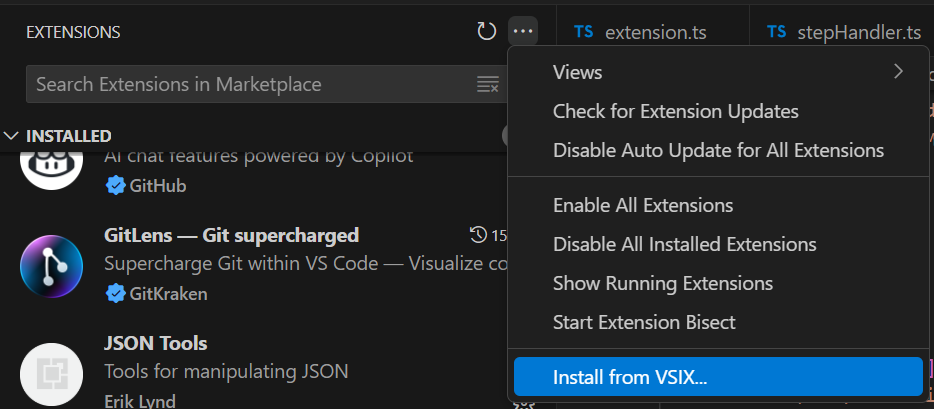
    - **Method 2:** From the command line:
        ```shell
        # if you use VS Code
        code --install-extension nuvoton-nucodegen-0.0.3.vsix
        # if you use VS Code Insiders
        code-insiders --install-extension nuvoton-nucodegen-0.0.3.vsix
        ```
### Step 2: Prepare BSP Project
1. Go to [Nuvoton Technology Corp](https://github.com/opennuvoton), and download NuMicro BSP project.

### Step 3: Open VSCode folder in Visual Studio Code
1. Open Visual Studio Code.
2. Open `VSCode` folder in the BSP project.  
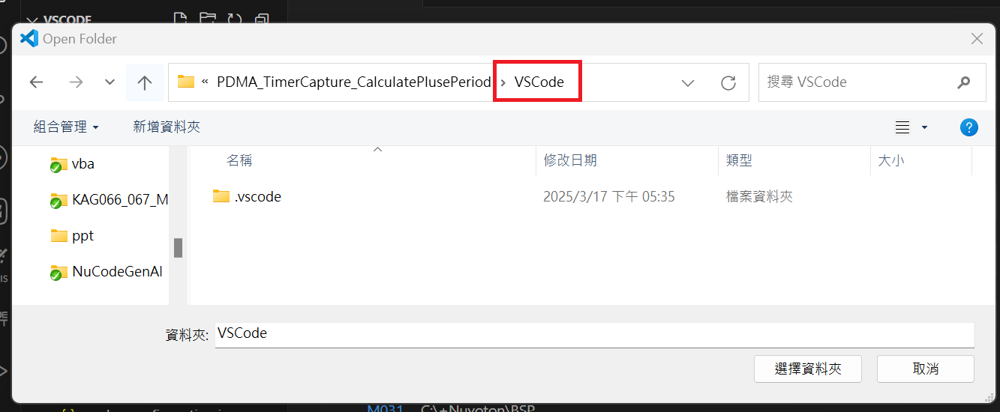
3. follow [Nuvoton_NuMicro_Cortex-M Project Setup](#nuvoton_numicro_cortex-m-project-setup) to set up the project.

### Step 4: Open Copilot Chat
1. Click copilot icon.  
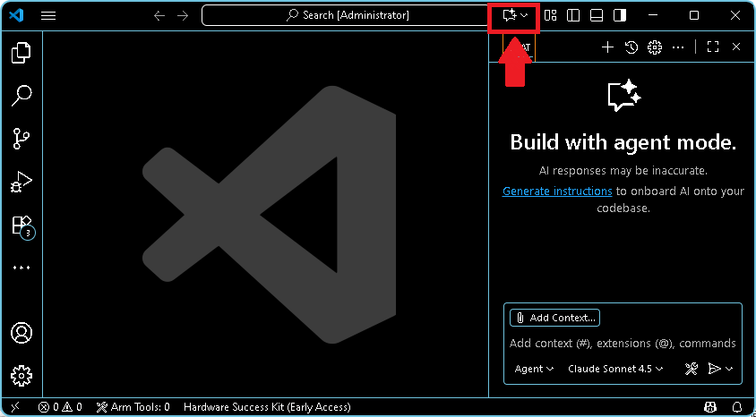
2. Set chat mode to `Ask` and choose model.
    - **It is recommended to choose the Claude series, e.g. Claude Sonnet 3.5 or Claude Soonet 4.**  
  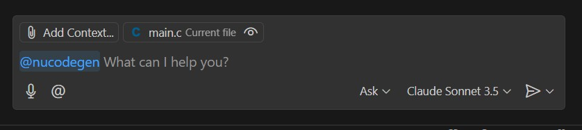
    - The Claude Sonnet 3.7 series cannot be used because it is not supported by the VSCode LLM API.  
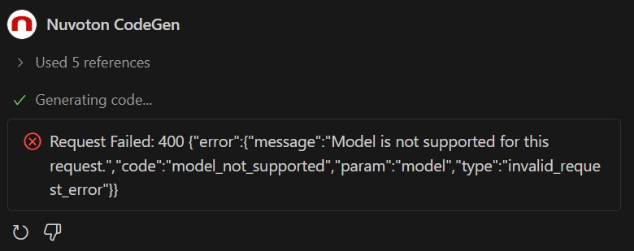

### Step 5: Start using `NUCODEGEN` extension
Use `@nucodegen` participant to start using `NUCODEGEN` extension.  


### Step 6: Generate Code
The following steps are need to be used with the `@nucodegen` participant.
1. Use `/{peripheral_name}_settings` to get configurable settings and an example prompt.
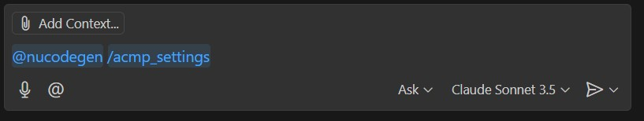
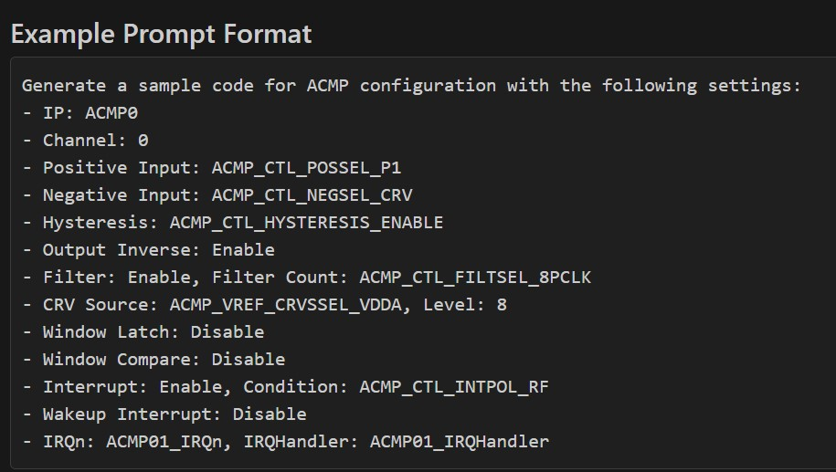
2. Based on the example prompt, use `/{peripheral_name}` to generate your code.
    - Each setting can be adjusted based on your needs.
    - Without clear configuration settings, the likelihood of generating incorrect configurations is higher.
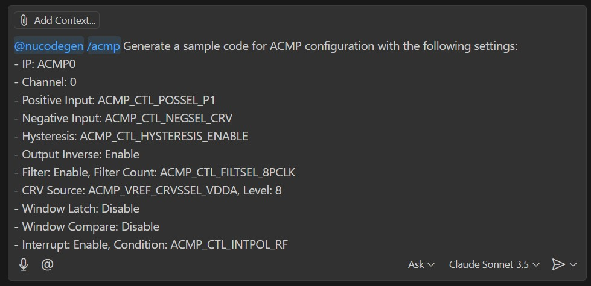
3. Click `Always Allow` to enable automatic execution of command line operations.
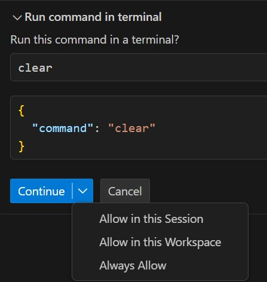
### Step 7: Build Code
If you want to build the code separately, you can use the `#buildcode` tool.  
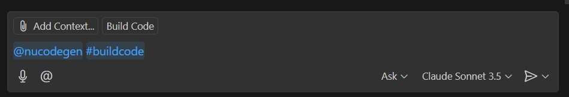
### Step 8: Load & Debug Code
If you want to load and debug the code, you can use the `#debugcode` tool.  
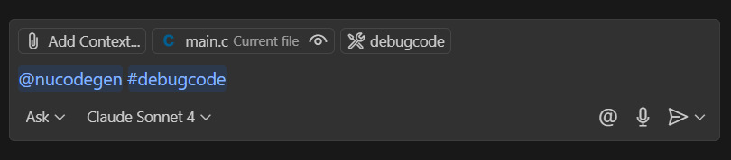

## Usage
### 1. Chat Participant
- use `@nucodegen` to start using the `NUCODEGEN` extension.  

### 2. slash commands
The following commands need to be used with the `@nucodegen` participant.
- `/{peripheral_name}_settings`: 
    - list the relevant settings for the specified peripheral
    - example prompt format for settings  

- `/{peripheral_name}`: handle issues related to the specified peripheral. For example,
    - `/pdma`: generate code for PDMA functionality
    - `/clk`: generate code for peripherals' clocks  
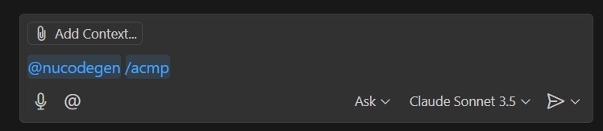
### 3. tool
The following commands need to be used with the `@nucodegen` participant.
- `#buildcode`: build your project  

- `#debugcode`: load and debug your project  


## Troubleshooting
### Shell Integration Unavailable
During the process of building the code, you may encounter a `Shell integration unavailable` issue.
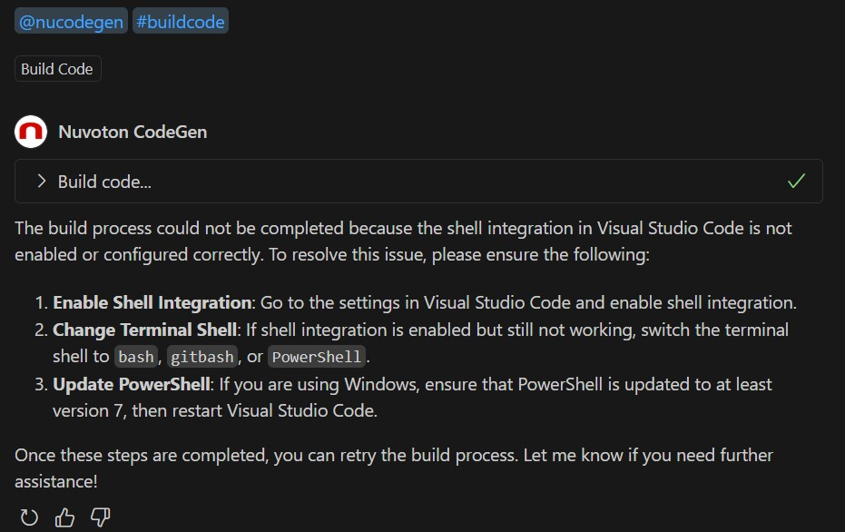
#### Solution 1. Enable Shell Integration
1. Open VSCode
2. Click `Manage` -> `Settings`
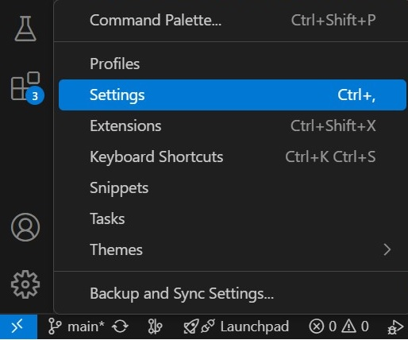
3. Search `terminal.integrated.shellIntegration.enabled`
4. Make sure this feature is turned on.
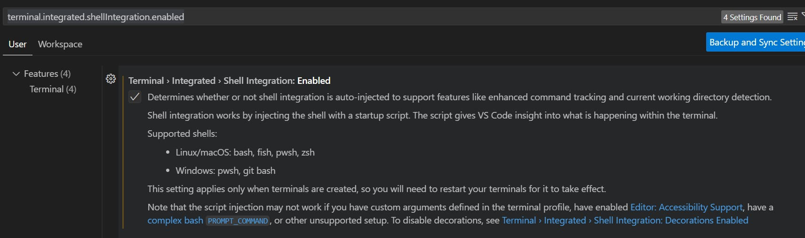

#### Solution 2. Configure VSCode to Use the Correct Shell
1. Open VSCode
2. Press `Ctrl + Shift + P`
3. Type `Terminal: Select Default Profile` and choose it
4. Select one of the supported shells: e.g. `git bash`, or `PowerShell`.
    - `CMD (Command Prompt)` does not support shell integration.

### Solution 3. Update PowerShell
- If you still encounter the same issue when using PowerShell, upgrade PowerShell to version 7 or later.
    1. Check current PowerShell version by running: `$PSVersionTable.PSVersion`
    2. If your version is below 7, [update PowerShell](https://learn.microsoft.com/en-us/powershell/scripting/whats-new/migrating-from-windows-powershell-51-to-powershell-7?view=powershell-7.4#installing-powershell-7).

## Nuvoton_NuMicro_Cortex-M Project Setup
To set up a Nuvoton NuMicro Cortex-M project, follow [this guide](https://github.com/OpenNuvoton/Nuvoton_Tools/blob/master/Documents/VSCode_Extensions/Nuvoton_NuMicro_Cortex-M-Pack.md) for detailed instructions.