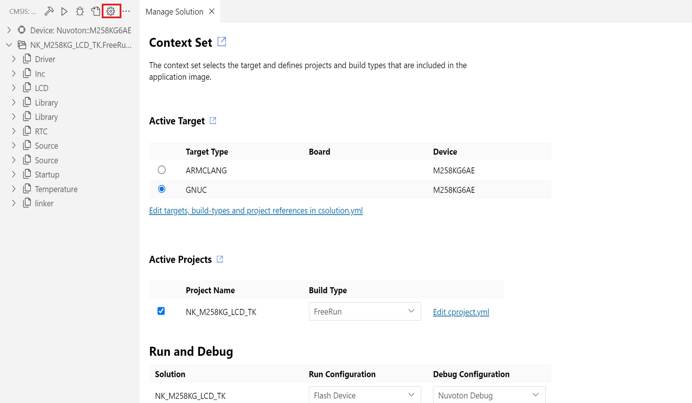
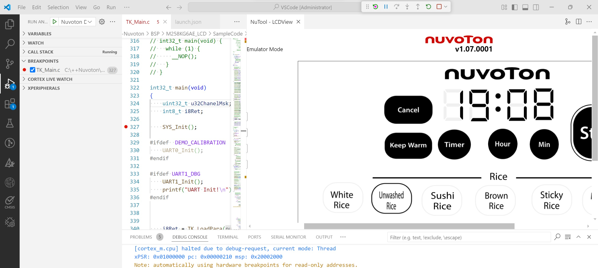

# 🔧 LCDView Environment Setup Guide

This guide walks you through setting up a LCDView project.

---

## ✅ Step 1: Install Required Extension Packs

Install the following extension packs:
- **Nuvoton NuMicro Cortex-M Pack**
- **NuTool-LCDView**

---

## ✅ Step 2: Prepare your NuMicro BSP project.
You can choose from the following options
- Go to [Nuvoton Technology Corp](https://github.com/opennuvoton), and download the project which you need. (Recommended)
- Custom project. Download[ M258KG6AE_LCD.zip](../../example/LCDView/M258KG6AE_LCD.zip)

**Note: For demonstration purposes, the subsequent steps (Step 3 and onward) will be based on the custom project.**

---

## ✅ Step 3: Launch Visual Studio Code, choose "Open Folder...", and select VSCode folder in your project.

## ✅ Step 4: Ensure your settings in "Manage Solution" are properly configured.

---

## ✅ Step 5: Click `CMSIS`, then execute `Build solution` and `Run`

---

## ✅ Step 6: Click `Run and Debug` and select `Nuvoton Debug`

## ✅ Step 7: Set breakpoints and then click `Start Debugging`

## ✅ Step 8: Open LCDView to observe LCD view
- Load project, please select M258KG6AE.nvt
- Switch to Emulator Mode

---