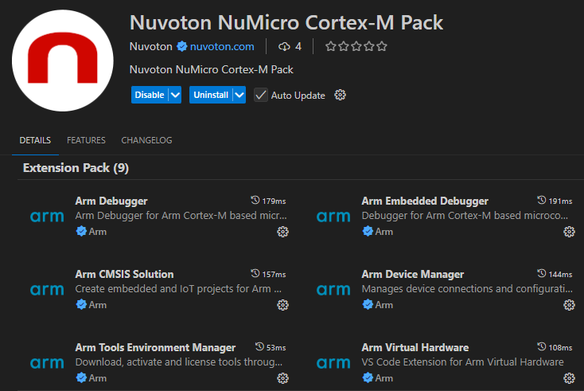
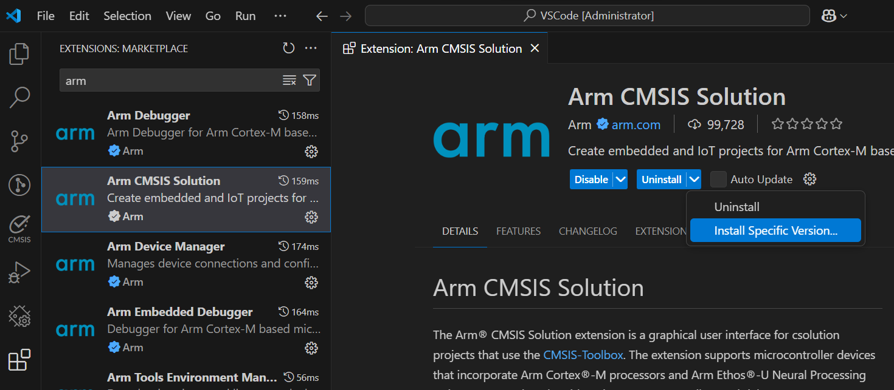
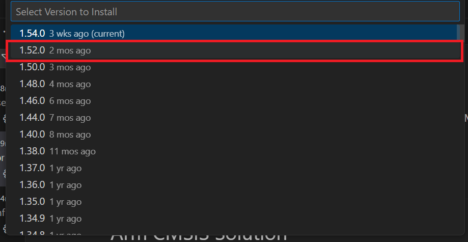
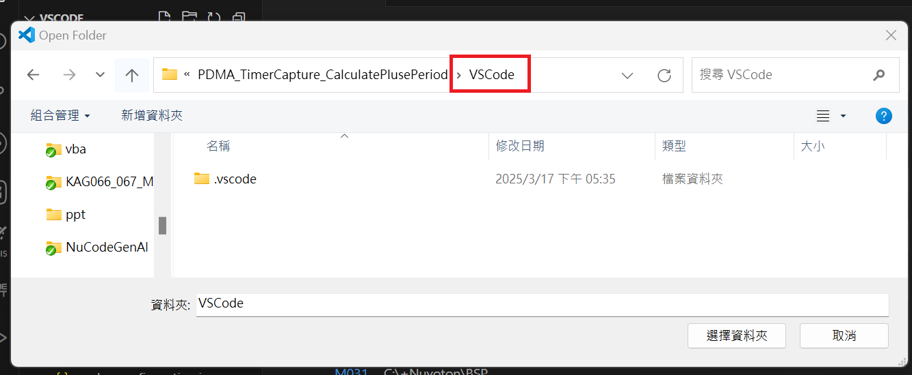
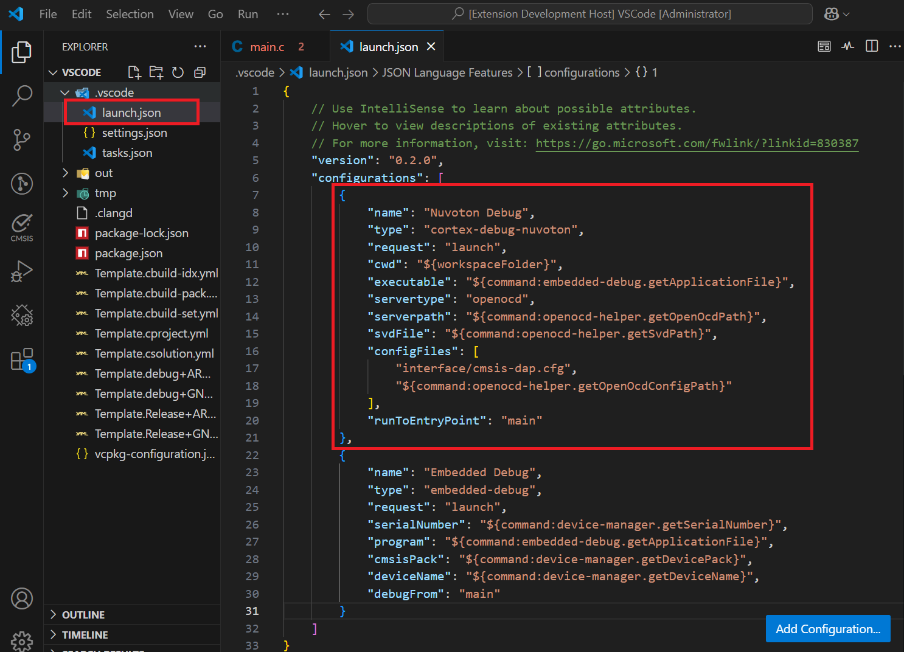
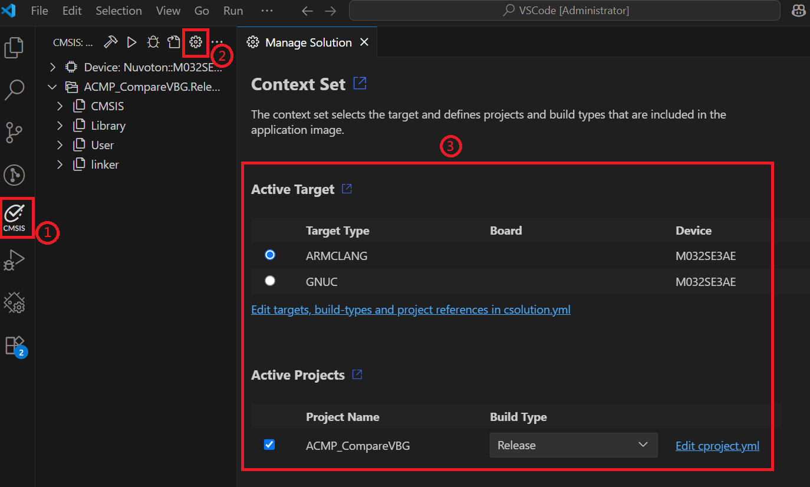
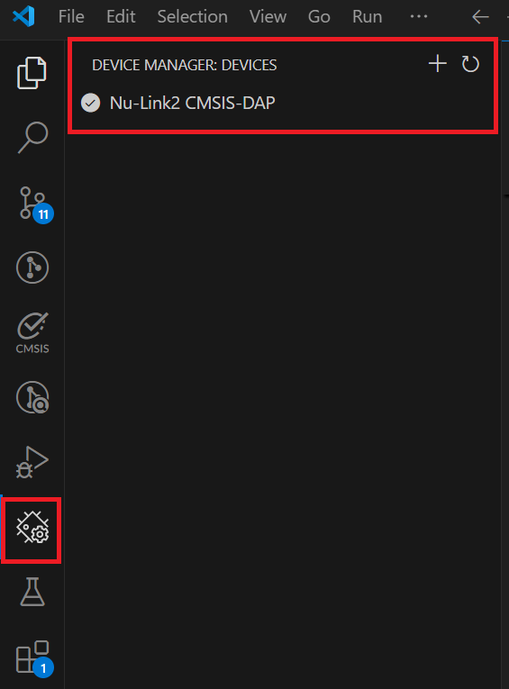
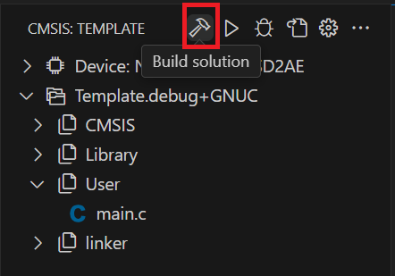
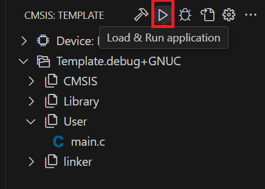
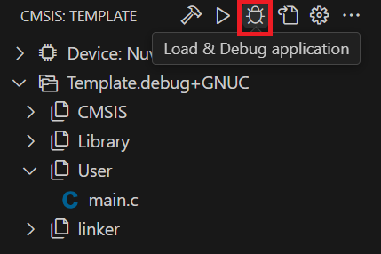

# NuMicro Cortex-M Pack Environment Setup Guide
This guide walks you through setting up a NuMicro Cortex-M Pack project.

---

## Step 1: Install Required Extension Packs
- Nuvoton `NuMicro Cortex-M Pack`  

- Install `Arm CMSIS Solution` version **1.52.0**  



## Step 2: Prepare NuMicro BSP project
- Go to [Nuvoton Technology Corp](https://github.com/opennuvoton), and download NuMicro BSP project.

## Step 3: Open VSCode folder in your project
- Launch Visual Studio Code
- Choose "Open Folder..." and select the VSCode folder in your project.  


## Step 4: Add `Nucoton Debug` configuration
- Open `.vscode/launch.json` file, and insert the debug configuration in configurations
-  insert the debug configuration in configurations
```json
{
    "name": "Nuvoton Debug",
    "type": "cortex-debug-nuvoton",
    "request": "launch",
    "cwd": "${workspaceFolder}",
    "executable": "${command:embedded-debug.getApplicationFile}",
    "servertype": "openocd",
    "serverpath": "${command:openocd-helper.getOpenOcdPath}",
    "svdFile": "${command:openocd-helper.getSvdPath}",
    "configFiles": [
        "interface/cmsis-dap.cfg",
        "${command:openocd-helper.getOpenOcdConfigPath}"
    ],
    "runToEntryPoint": "main"
}
```


## Step 5: Ensure your settings in "Manage Solution" are properly configured.
- Click on `CMSIS` in the active bar and then click on `Manage Solution` to set a context for your solution.  
-  configure the Run & Debug settings.
   -  **Debug Configuration: `Nuvoton Debug`**  


## Step 6: Check Device Status
- Make sure the device is recognized in Device Manager.
- If a new VS Code instance is opened, the device in the Device Manager may be taken over by the newly opened VS Code. **Close all instances of VS Code and restart to ensure proper device recognition.**  


## Step 7: Execute `Build`, `Run` and `Debug`
- `Build`  

- `Run`  

- `Debug`  

