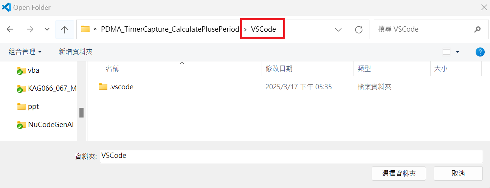
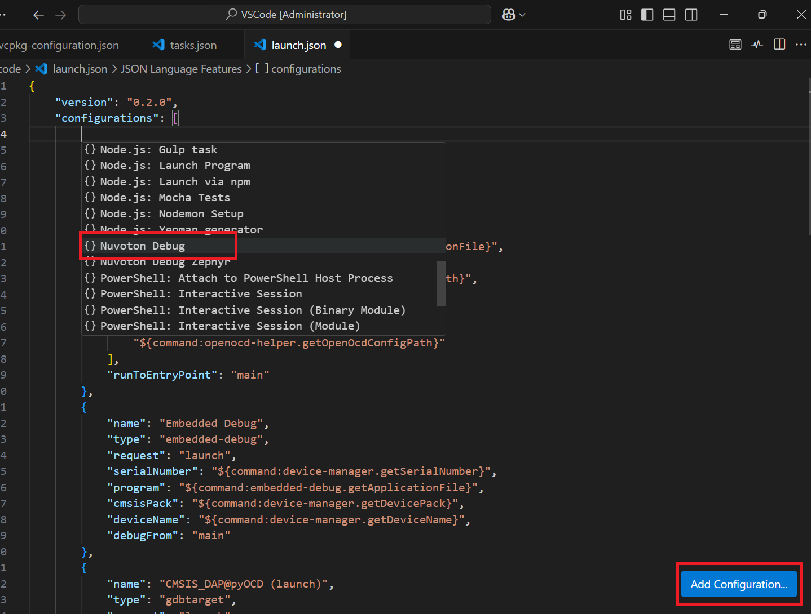

# NuMicro Cortex-M Pack Environment Setup Guide
This guide walks you through setting up a NuMicro Cortex-M Pack project.

---

## Step 1: Install Required Extension Packs
- Nuvoton `NuMicro Cortex-M Pack`  

## Step 2: Prepare NuMicro BSP project
- Go to [Nuvoton Technology Corp](https://github.com/opennuvoton), and download NuMicro BSP project.

## Step 3: Open VSCode folder in your project
- Launch Visual Studio Code
- Choose "Open Folder..." and select the VSCode folder in your project.  

## Step 4: Update `cmsis-toolbox` version
- Update the `cmsis-toolbox` version to **2.9.0** in the `vcpkg-configuration.json` file.  

- Right-click on `vcpkg-configuration.json` and select the `Reactivate Environment` option.  

## Step 5: Add `Nuvoton Debug` in `launch.json`
- Open `.vscode/launch.json` file, and click on `Add Configuration`
- Select `Nuvoton Debug` from the list of configurations.  
- 

## Step 6: Ensure your settings in "Manage Solution" are properly configured.
- Click on `CMSIS` in the active bar and then click on `Manage Solution` to set a context for your solution.  

## Step 7: Check Device Status
- Make sure the device is recognized in Device Manager.
- If a new VS Code instance is opened, the device in the Device Manager may be taken over by the newly opened VS Code. **Close all instances of VS Code and restart to ensure proper device recognition.**  

## Step 8: Execute `Build`, `Run` and `Debug`
- `Build`  

- `Run`  

- `Debug`  

