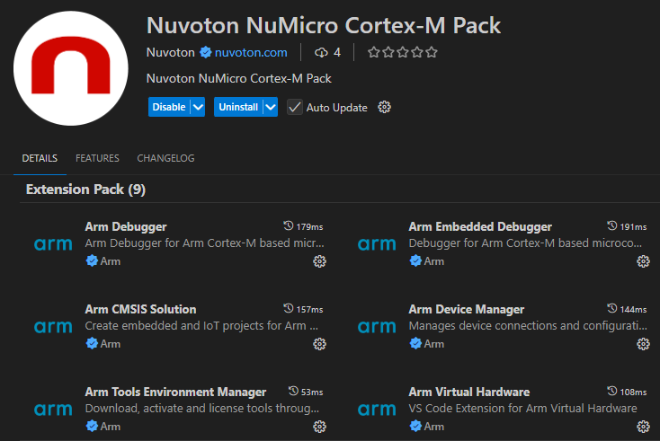
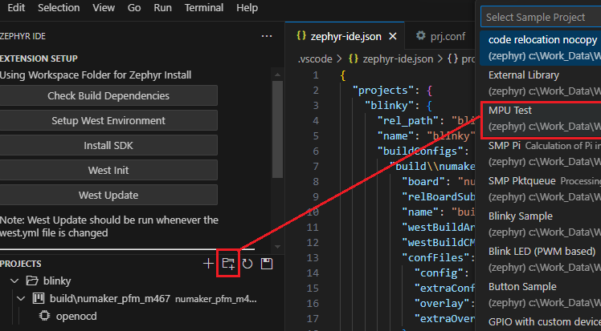
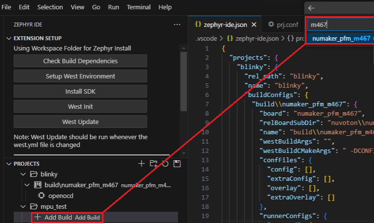
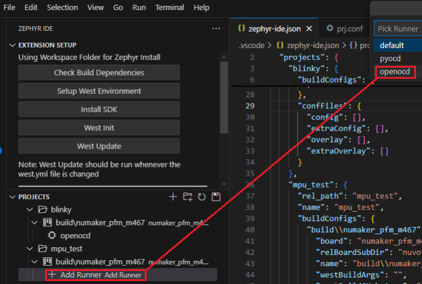
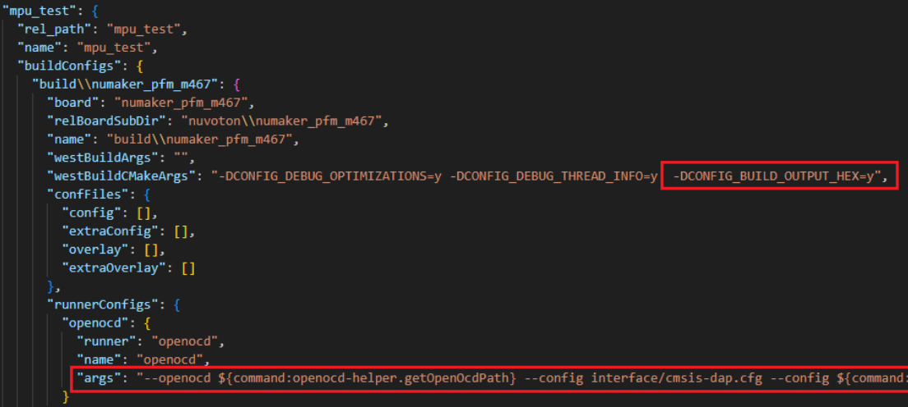
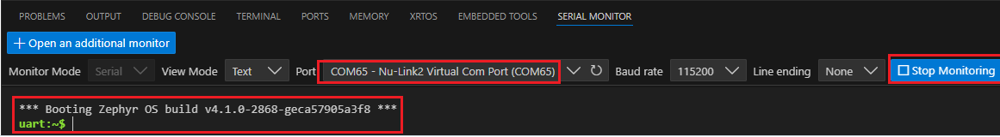

# Zephyr IDE Environment Setup Guide (Nuvoton NuMicro Cortex-M)

This guide walks you through setting up a Zephyr project.

---

## Step 1: Install Required Extension Packs

Install the following extension packs:
- **Nuvoton NuMicro Cortex-M Pack**
- **Zephyr IDE Extension Pack**

---

Use the Zephyr IDE buttons in the following steps to create the environment.

## Step 2: Creating a Zephyr Project from Sample Code

Create a new project using sample code.
Choose a project template provided by the Zephyr IDE.

---

## Step 3: Add Build Option and Select Board

Add a build configuration and choose your target board, e.g., `NuMaker-PFM-M467`.

---

## Step 4: Add Runner Configuration (OpenOCD)

Configure the project runner to use OpenOCD.

---

## Step 5: Update Zephyr Project Runner Settings

Go to `View → Command Palette` and run `Update Zephyr Project Runner`. Select the project to update the runner settings.

---

## Step 6: Build Project and Flash to Target

Use the build button to build and flash the firmware to your target board.

---

## Step 7: Create launch.json

Create the `launch.json` file used for debugging.

---

## Step 8: Select Debug Settings

Select `Nuvoton Debug Zephyr`.

---

## Step 9: Enter Debug Mode and Start Monitor for Output

Launch the debugger and open the monitor or terminal to view runtime output.

