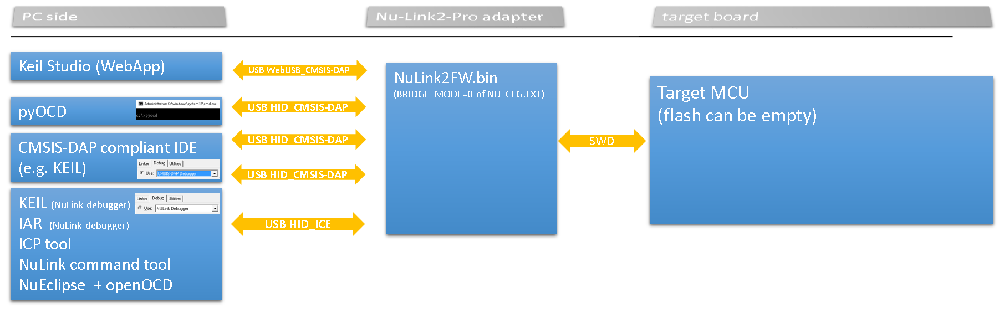
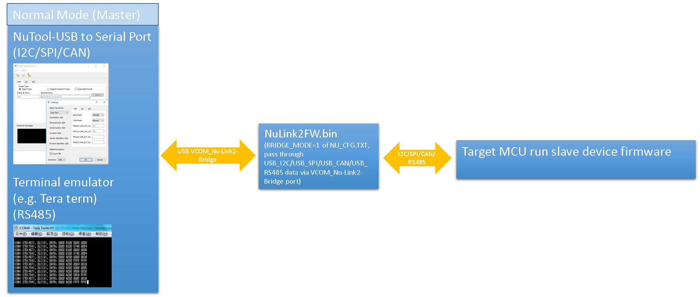
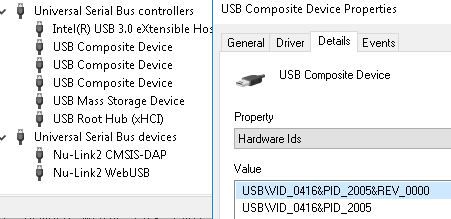
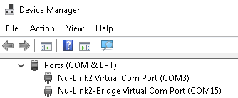

# NuMicro software development tools  
[Nuvoton tools official website](https://www.nuvoton.com/tool-and-software/software-development-tool/nutool/)  
 
IDE and Debugger
- [KEIL Nu-Link debugger driver installer](https://www.nuvoton.com/resource-download.jsp?tp_GUID=SW1120200221180521)
- [IAR Nu-Link debugger driver installer](https://www.nuvoton.com/resource-download.jsp?tp_GUID=SW1120200221180914)
- [NuEclipse installer](https://www.nuvoton.com/resource-download.jsp?tp_GUID=SW132022111608043510)
- [PinView installer](https://www.nuvoton.com/resource-download.jsp?tp_GUID=SW1320200221181935)  
- [Customized pyOCD source code](https://github.com/OpenNuvoton/pyOCD) (using adapter firmware "NuLink2_DAPLink.bin")
- [Customized openOCD source code](https://github.com/OpenNuvoton/OpenOCD-Nuvoton)  (using adapter firmware "NuLink2FW.bin")

Programmer  
- [ICPTool installer](https://www.nuvoton.com/resource-download.jsp?tp_GUID=SW1720200221181328)  
- [ISPTool installer](https://www.nuvoton.com/resource-download.jsp?tp_GUID=SW17SW1720201209134839)  
- [ISPTool source code](https://github.com/OpenNuvoton/ISPTool)    
- [ISPTool command set document](./doc/)    
- [NuLink command tool installer](https://www.nuvoton.com/resource-download.jsp?tp_GUID=SW1720200221181644)  

Coding assistant  
- [NuTool-PinConfigure](https://www.nuvoton.com/resource-download.jsp?tp_GUID=SW1320200319135912)
- [NuTool-ClockConfigure](https://www.nuvoton.com/resource-download.jsp?tp_GUID=SW1320200930114649)

Signal pass-through/monitor (I2C/SPI/CAN of Nu-Link2-Pro): 
- [NuTool-USB_to_Serial_Port](https://www.nuvoton.com/resource-download.jsp?tp_GUID=SW1320201210175128) 

Apps
- [NuBLE-Android](https://github.com/OpenNuvoton/NuBLE-Android/) 
- [NuBLE-iOS](https://github.com/OpenNuvoton/NUBLE-iOS/) 
- [NuISPTool-Android](https://github.com/OpenNuvoton/NuISPTool-Android/) 

 
 

# Nu-Link2-Pro debugging and programming adapter
When using the software development tools above, you may need a USB adapter. 
Here, we introduce a new feature-rich Nu-Link2-Pro adapter to you.   
- [Where to buy](https://direct.nuvoton.com/tw/Nu-Link2-pro)   
- [User manual](https://www.nuvoton.com/resource-download.jsp?tp_GUID=UG1320200319174043)  

An overview picture of software tools, adapter and targets  

### The firmware of the Nu-Link2-Pro adapter
#### All Nu-Link2-Pro firmware binary files can be found [here](./Latest_NuLink_Firmware)  
Users can reprogram Nu-Link2-Pro with another .bin file using the following instructions (Windows OS)  
1. Press the button on Nu-Link2-Pro and plug in the USB cable.
2. The "Nu-Link2-Pro" disk will appear.  (If you see the disk name as "NuMicro MCU", it will upgrade target the device firmware instead of Nu-Link2-Pro itself) 
3. Drag and drop the Nu-Link2-Pro firmware .bin file into the disk.
4. Re-plug the USB cable and it's done.  

#### More options for NuLink2FW (configuration file NU_CFG.TXT)   
#### warning: The meaning of options for v3.09.7380 is different from v3.05.7174r ~ v3.08.7313), for the old settings, please see the old [link](https://github.com/OpenNuvoton/Nuvoton_Tools/blob/70dcc9ce06c7d178160c84b870a49d4e9cbf5d1a/README.md).
1. When you upgrade the NuLink2FW.bin to a version greater than or equal to v3.09.7380, you will see some options in NU_CFG.TXT.
* Open the NU_CFG.TXT file in the pop-up "NuMicro MCU" disk  
<kbd></kbd>

2. For the Nu-Link2-Pro, you will see POWER-MODE and BRIDGE-MODE options. You need to re-plug in the USB cable to activate the setting.
* Set POWER-MODE for SWD output voltage level (mainly for CMSIS-DAP interface use)
    
* Set BRIDGE-MODE=0; this is the default setting. It has a WebUSB interface conforming to the CMSIS-DAP protocol, and you can connect to KEIL Studio Desktop/Cloud via this interface. Note that CMSIS-DAP will be disable in other BRIDGE-MODE (Limited USB endpoints).
<kbd></kbd>

* Set BRIDGE-MODE=1; the pass-through bridge function of Nu-Link2-Pro will be enabled (The word Nu-Link2-Bridge will be used to represent the pass-through bridge application on Nu-Link2-Pro adapter). Nu-Link2-Bridge pass-through the data between the VCOM port and I2C/SPI/RS485/CAN interfaces.
    (You will see a "Nu-Link2-Bridge Virtual Com Port" in device manager.)
<kbd></kbd>

* Set BRIDGE-MODE=2; a USB HID interface that supports ISPTool will be enabled. This USB HID interface doesn't pass through data, it communicates with ISPTool via HID_ISP and offers I2C/SPI/RS485/CAN interfaces for ISPTool.

3. If you use Nu-Link2-ME, it doesn't support BRIDGE functions, and you will only see the CMSIS-DAP option.
* Set CMSIS-DAP=1; this is the default setting. It has a WebUSB interface conforming to the CMSIS-DAP protocol, and you can connect to KEIL Studio Desktop/Cloud via this interface.
* Set CMSIS-DAP=0; it will disable CMSIS-DAP and enable the Nu-Link2 "USB BULK_ICE" interface (it's faster than "USB HID_ICE").

### Comparison of NuLink2FW.bin and NuLink2_DAPLink.bin  
#### [NuLink2FW.bin](./Latest_NuLink_Firmware)
- Proprietary code 
- Support NuMicro 8051, offline programming, user code read-out protection, unlimited flash break points, NuMicro chip-specific features (config0/config1 dataflash setting, KPROM, etc.)
- USB interfaces: MSC/VCOM/HID_ICE(proprietary commands) or CMSIS-DAPv2 WinUSB + WebUSB CMSIS-DAP/VCOM_Nu-Link2-Bridge or HID_ISP (defined by BRIDGE-MODE of NU_CFG.TXT)

#### [NuLink2_DAPLink.bin](./Latest_NuLink_Firmware)
- Open source: [DAPLink on Nu-Link2-Pro](https://github.com/OpenNuvoton/DapLink)  
- Support many third party IDE
- USB interfaces: MSC/CDC/CMSIS-DAPv2 WinUSB/WebUSB CMSIS-DAP  

### Some other example projects for NuLink2  
- [Nu-Link2-Pro_Offline_ISP](https://github.com/OpenNuvoton/Nu-Link2-Pro_Offline_ISP)
- [NuLink2_ICP_Library](https://github.com/OpenNuvoton/NuLink2_ICP_Library)
            
 
 
