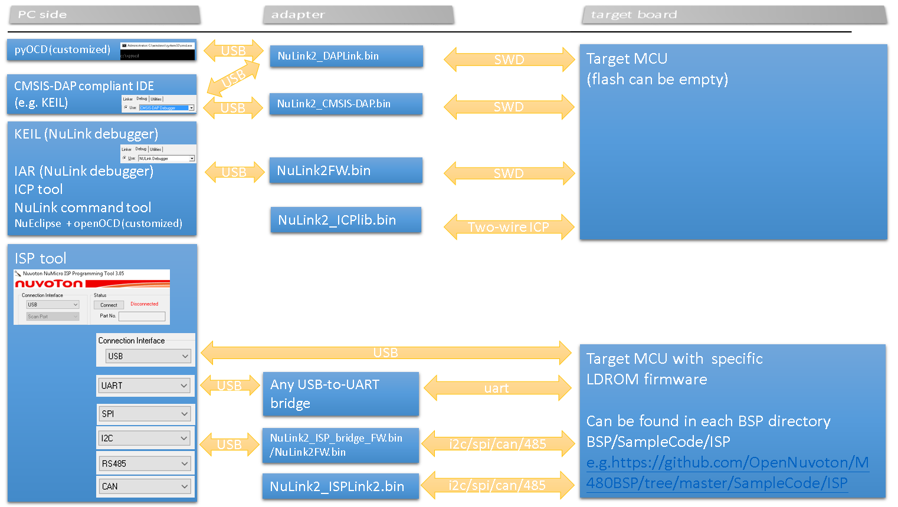

# PC Tool  
[Nuvoton tools official website](https://www.nuvoton.com/tool-and-software/software-development-tool/driver/)
## Development Tool
Debugger
- [KEIL Nu-Link debugger driver installer](https://www.nuvoton.com/resource-download.jsp?tp_GUID=SW1120200221180521)
- [IAR Nu-Link debugger driver installer](https://www.nuvoton.com/resource-download.jsp?tp_GUID=SW1120200221180914)
- [NuEclipse installer](https://www.nuvoton.com/opencms/resource-download.jsp?tp_GUID=SW1020180913190214)
- [PinView installer](https://www.nuvoton.com/resource-download.jsp?tp_GUID=SW1320200221181935)  
- [Customized pyOCD source code](https://github.com/OpenNuvoton/pyOCD) (using adapter firmware "NuLink2_DAPLink.bin")
- [Customized openOCD source code](https://github.com/OpenNuvoton/OpenOCD-Nuvoton)  (using adapter firmware "NuLink2FW.bin")
  
NuTool: Coding assistant  
- [PinConfig installer](https://www.nuvoton.com/opencms/resource-download.jsp?tp_GUID=SW1020150724174251)
- [ClockConfig installer](https://www.nuvoton.com/opencms/resource-download.jsp?tp_GUID=SW1020161014155032)

## Programmer Tool
- [ICPTool installer](https://www.nuvoton.com/resource-download.jsp?tp_GUID=SW1720200221181328)  
- [ISPTool installer](https://www.nuvoton.com/opencms/resource-download.jsp?tp_GUID=SW0320101221101703)  
- [ISPTool source code](https://github.com/OpenNuvoton/ISPTool)    
- [ISPTool command set](./doc/NuMicro_ISP_Flow_And_Command_Set.pdf)    
- [NuLink command tool installer](https://www.nuvoton.com/resource-download.jsp?tp_GUID=SW1720200221181644)  

 
 

# Nu-Link2 debugging and programming adapter
When using debugging and programming tool above, you need an USB adapter. 
We introduce you a new feature-rich Nu-Link2 adapter here.   
- [Where to buy](https://direct.nuvoton.com/tw/nu-link2-pro)   
- [User manual](https://www.nuvoton.com/resource-download.jsp?tp_GUID=UG1320200319174043)  
### The role of Nu-Link2 adapter
User can switch between roles that Nu-Link2 play by re-programming Nu-Link2 to another .bin file  
All Nu-Link2 firmware image (.bin files) can be found [here](./Latest_NuLink_Firmware)  
#### How to update Nu-Link2 firmware?
1. Press the button on Nu-Link2 and plug in USB cable.
2. A "Nu-Link2" disk will show. (If you see disk name is "NuMicro MCU", it will upgrade DUT firmware instead of Nu-Link2 itself) 
3. Drag and drop Nu-Link2 image .bin into the disk.
4. Re-plug the USB cable and it's done.

### Brief description of each adapter bin file  
#### [NuLink2FW.bin](./Latest_NuLink_Firmware)
- Proprietary code (except NuLink2FW.bin, most of Nu-Link2 firmware are open source)
- USB interfaces HID(proprietary commands)/MSC/VCOM 
- Support NuMicro 8051, offline programming, user code read-out protection, unlimited flash break points, NuMicro chips specific features (config0/config1 dataflash setting, KPROM, etc.)

#### [NuLink2_DAPLink.bin](./Latest_NuLink_Firmware)
- This is the latest image built from [DAPLink on Nu-Link2](https://github.com/OpenNuvoton/DapLink)  
- USB interfaces HID(CMSIS-DAP commands)/MSC/VCOM 
- Support many 3rd party IDE

#### [NuLink2_CMSIS_DAP.bin](./Latest_NuLink_Firmware)
- This is the latest image built from [CMSIS-DAP on Nu-Link2](https://github.com/OpenNuvoton/NuLink2_CMSIS_DAP)
- If you don't need rich features of DAPLink, this is the light weight choice of CMSIS-DAP firmware.

#### [NuLink2_ISP_Bridge.bin](./Latest_NuLink_Firmware)
- This is the latest image built from [NuLink2_ISP_Bridge](https://github.com/OpenNuvoton/NuLink2_ISP_Bridge)
- ISP bridge firmware is also integrated into NuLink2FW.bin, so ISP tool can connect with NuLink2FW.bin, too.
- The target ISP loader code can be found at directory "BSP/SampleCode/ISP/" of each BSP. BSP can be found at https://github.com/OpenNuvoton or https://gitee.com/OpenNuvoton.  

#### [NuLink2_ISPLink2.bin](./Latest_NuLink_Firmware)
- This is the latest image built from [NuLink2_ISPLink2](https://github.com/OpenNuvoton/NuLink2_ISPLink2)
- The target ISP loader code can be found at directory "BSP/SampleCode/ISP/" of each BSP. BSP can be found at https://github.com/OpenNuvoton or https://gitee.com/OpenNuvoton.  

#### [NuLink2_ICP_Library.bin](./Latest_NuLink_Firmware)
- This is the latest image built from [ICP library](https://github.com/OpenNuvoton/NuLink2_ICP_Library)
- ICPLib (two-wire ICP interface for NuMicro cortexM & 8051) on Nu-Link2 (M48SKIDAE)

#### [NuLink2_Bus_Monitor.bin](./Latest_NuLink_Firmware)
- This is the latest image built from [NuLink2_Bus_Monitor](https://github.com/OpenNuvoton/NuLink2_Bus_Monitor)

 
 

